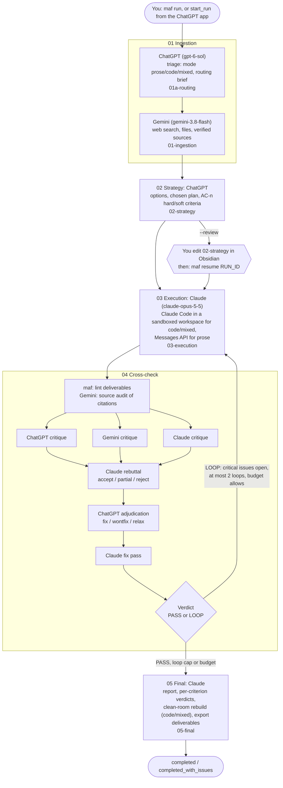

# MultiAgent (`maf`)

**`maf` is a multi-agent pipeline. ChatGPT, Gemini and Claude research, plan, build, critique and verify a piece of work together. Every handoff between them is a Markdown note in an Obsidian vault, every run has a hard dollar cap, and all code runs inside a sandbox with no network.**

You give `maf` a brief in plain language, for example "design, implement and verify a portable O(1) allocator for bare-metal Cortex-M3, FreeRTOS and POSIX", or "write a Master's-thesis-quality study of fusion burn control, with real simulations". Python then drives a fixed five-stage state machine:

1. **Ingestion.** ChatGPT triages the request, and Gemini researches the web and verifies sources.
2. **Strategy.** ChatGPT writes a plan with testable acceptance criteria.
3. **Execution.** Claude does the work in a sandboxed workspace, using headless Claude Code for code.
4. **Cross-check.** All three models critique the result and debate the fixes.
5. **Final.** Claude writes a report with a verdict on every criterion, after a clean-room rebuild of the deliverables (code and mixed runs).

You follow it all in Obsidian. You can pause after the plan to edit it, resume any stopped run, and also start runs from ChatGPT.

- **Single-user, local, from scratch.** A Python 3.12 package with a CLI (`maf`). It has no orchestration framework and no hosted state: run state lives in `run.md` and a cost ledger.
- **Tested on** Ubuntu 24.04, Python 3.12 and Claude Code CLI 2.1.284. The test suite is 1,437 offline tests.
- **Demonstrated** on three real briefs, which are included in [`examples/`](examples/). The allocator one produced the verified [TLSF allocator](examples/tlsf-allocator/) shipped in this repo.

## Contents

- [What it does](#what-it-does)
- [Status: what has been demonstrated](#status-what-has-been-demonstrated)
- [Requirements](#requirements)
- [Installation](#installation)
- [Quick start: a $3 smoke run](#quick-start-a-3-smoke-run)
- [Tutorial 1: the TLSF allocator](#tutorial-1-the-tlsf-allocator)
- [Tutorial 2: a research thesis, with review, resume and export](#tutorial-2-a-research-thesis-with-review-resume-and-export)
- [Connecting the agents](#connecting-the-agents)
- [Command reference](#command-reference)
- [How a run works](#how-a-run-works)
- [Configuration reference](#configuration-reference)
- [Safety and costs](#safety-and-costs)
- [Troubleshooting](#troubleshooting)
- [Development](#development)
- [License](#license)

---

## What it does

### The three agents

| Agent | Provider / default model (`--tier max`) | What it does in a run |
|---|---|---|
| **ChatGPT** | OpenAI Responses API, `gpt-6-sol` (`gpt-6-astra`) | Triage and routing, strategy and acceptance criteria, one of three critiques, and adjudication of disputed issues |
| **Gemini** | google-genai SDK with Google Search grounding, `gemini-3.8-flash` | Web research and ingestion of input files with verified sources, one of three critiques, and the source audit of cited references |
| **Claude** | `claude-opus-5-5` (`claude-fable-5-1`). Messages API for writing; **Claude Code headless (`claude -p`)** for code in a sandbox | Execution, rebuttal, fix passes, the clean-room rebuild and the final report |

Inside the pipeline, "ChatGPT" means the OpenAI API, billed to your `OPENAI_API_KEY`. The optional [ChatGPT app](#chatgpt-as-a-front-end-mcp-over-the-secure-mcp-tunnel) is only a remote control that starts and inspects runs.

### The five stages



ChatGPT's triage picks a **mode**:

| Mode | When | Execution and fixes run on |
|---|---|---|
| `prose` | Documents | the Claude Messages API |
| `code` | Software | Claude Code in a sandboxed workspace |
| `mixed` | Documents backed by code and simulations | Claude Code in a sandboxed workspace |

### Design principles

- **Python owns the control flow.** The stage order is a deterministic state machine that resumes after a crash, a timeout or a budget stop. The models decide the *content* of each stage, never the sequence.
- **The shared memory is an Obsidian vault.**
  - Each stage writes one note with YAML frontmatter and required `##` sections.
  - Python validates every note and gives the agent one repair attempt if it is invalid.
  - Notes link to each other with wikilinks, so the whole run reads as a linked notebook.
- **Hard spend caps.**
  - Before **every** model call, the ledger checks `spent + worst case <= cap`. If the call does not fit, it is not made.
  - Running out of money stops the run as `budget_exceeded`, which you can resume with a higher cap.
  - One gap: a Claude Code session reports its cost only when it ends, so a session cut off by a killed `maf` process is never recorded (see [Safety and costs](#safety-and-costs)).
- **Sandboxed execution.** Claude Code runs in bubblewrap. It can write only to the run's workspace and a private `TMPDIR`. It has no network, and cannot read `~/.ssh`, `~/.gnupg`, `~/.aws`, `~/.config`, shell rc files and histories, or the vault.
- **Quality gates, honestly reported.** A run that does not pass ends as `completed_with_issues` (exit code 2), never as a silent `completed`. The gates are:
  - acceptance criteria with per-criterion verdicts;
  - a clean-room rebuild of the exported deliverables (code and mixed runs);
  - a web-grounded audit of every cited reference;
  - a deliverable lint.

---

## Status: what has been demonstrated

All runs below were started from the CLI between 2026-09-28 and 2026-09-30, on the default tier, without `--review` and without input files. Total development API spend was about **$105**. The six runs in the development vault account for $103.12 of it.

| Run (brief in `examples/briefs/`) | Mode | Budget | Spent | Rounds | Result |
|---|---|---|---|---|---|
| **Smoke**: `smoke-tlsf-vs-buddy.txt` | prose | $2 | **$0.75** (chatgpt $0.05, gemini $0.21, claude $0.49) | 1 | `completed` in about 5 min. 11 notes, including three critiques, a rebuttal and an adjudication. The cross-check raised 7 issues (0 critical) and the verdict was PASS. |
| **Allocator**: `portable-allocator.txt` (run `…-portable-2`) | code | $25 | **$8.29** | 1 | `completed` in about 43 min, verdict PASS: 14 issues (0 critical, 1 major), all confirmed fixed. Delivered a TLSF allocator: 692 B `.text` on Cortex-M3 `-Os`, no libc (`nm -u` empty), O(1) (no loops or recursion in malloc/free), passing on POSIX, the FreeRTOS POSIX simulator and bare-metal Cortex-M3 under QEMU. It was re-exported with `maf export` and is shipped as [`examples/tlsf-allocator/`](examples/tlsf-allocator/). |
| **Thesis**: `fusion-burn-control-thesis.txt` | mixed | raised to $55.76 | **$45.65** | 3 | `completed_with_issues`: 4 criteria partial, 2 relaxed, 0 critical. The thesis has 18k prose words and 14 figures. `reproduce.py` exits 0 in about 7 min with byte-identical results. The source audit verified all 9 cited works. **It still needs a human literature review.** |

What the allocator delivered (measured; details in [Tutorial 1](#tutorial-1-the-tlsf-allocator)):

| Check | Result |
|---|---|
| POSIX unit tests | 1,774,559 checks |
| Stress | 3 × 200k random ops |
| Sanitizers | ASan and UBSan, clean |
| FreeRTOS POSIX simulator | 4 tasks × 50k iterations through the lock hooks |
| Bare-metal Cortex-M3 under `qemu-system-arm` (`lm3s6965evb`, semihosting) | 75,096 checks |
| Independent verification after the run | about 85M adversarial fuzz operations in a separate post-run check (harness not included in this repo); no bugs found |

The thesis run hit two problems, both now handled by the framework:
1. Its first execution was killed by the then 60-minute Claude Code timeout. Now sessions get 5400 s plus one automatic continuation.
2. Its third round was stopped by a budget clamp that ended the run `failed`. Now that ends `budget_exceeded`, which can be resumed.

It was finished with `maf resume --budget … --note "FINISHING PASS. …"`. See [Tutorial 2](#tutorial-2-a-research-thesis-with-review-resume-and-export).

Other incidents from development that the framework now handles:

| Incident | What maf does now |
|---|---|
| The sandbox's Unix socket paths overflowed the 108-byte limit | A short private `TMPDIR` plus a sandbox preflight |
| AppArmor blocked bubblewrap on Ubuntu 24.04 | A [profile](#2-bubblewrap-and-apparmor-ubuntu-2404) is documented |
| Runs said `completed` while critical issues were still open | `completed_with_issues` |
| Deliverables were missing files written in fix rounds | Whole-tree export |
| Citations were not verified | Source audit |
| Timeouts and budget exhaustion | Continuation sessions and resumable `budget_exceeded` |

<details>
<summary>All six development runs (<code>maf list</code>)</summary>

```text
2026-09-29-produce-a-master-s-thesis-quality-research         completed_with_issues  final       $ 45.6478  2026-09-29 13:42
2026-09-28-produce-a-master-s-thesis-quality-research-2       completed              final       $ 22.3897  2026-09-28 19:57
2026-09-28-research-design-implement-and-verify-a-portable-2  completed              final       $  8.2933  2026-09-28 19:57
2026-09-28-produce-a-master-s-thesis-quality-research         completed_with_issues  final       $ 14.7010  2026-09-28 15:24
2026-09-28-research-design-implement-and-verify-a-portable    completed_with_issues  final       $ 11.3415  2026-09-28 15:24
2026-09-28-write-a-one-page-briefing-comparing-the-tlsf-and   completed              final       $  0.7483  2026-09-28 15:15
```

The three runs not described above are earlier iterations, run while the framework was being hardened:

- **The first allocator and thesis runs** recorded `completed` with 20 and 9 unresolved critical issues. This was the "silent completed" incident; current maf reports both as `completed_with_issues`.
- **The 09-28 thesis rerun (`-2`)** finished before the acceptance and clean-room gates existed. The 09-29 run replaced it.

</details>

**Known limitations**

- **ChatGPT front-end:** never tested end to end with a real ChatGPT account and tunnel. The server side was verified locally against a fake control plane ([details](#chatgpt-as-a-front-end-mcp-over-the-secure-mcp-tunnel)).
- **Tested platform:** only Ubuntu 24.04 x86_64, Python 3.12 and Claude Code 2.1.284.
- **Allocator example:** it predates the acceptance and clean-room gates, so its reproducibility was checked by hand (`make all` on a clean copy), not by maf's gate. Its FreeRTOS negative control (the test with the mutex removed) fails to trigger in up to about 8% of runs, so `make all` can occasionally stop at `freertos-negative` ([details](#1a-build-and-test-the-shipped-allocator)).
- **Thesis:** `completed_with_issues`. Treat it as a strong draft, not a finished thesis.
- **Input files:** `--file` exists and uploads the file to Gemini, but no development run used one.
- **Claude Code billing:** it must be billed to `ANTHROPIC_API_KEY`. maf refuses to call Claude Code without that key, so a subscription login is not supported.
- **Non-determinism:** LLM runs vary, so a rerun of a brief produces a different design at a different cost.

---

## Requirements

| Need | Details |
|---|---|
| OS | Linux with user namespaces. Developed on **Ubuntu 24.04** x86_64. |
| Python | **3.12+** (`requires-python = ">=3.12"`) |
| Claude Code CLI | `claude` at `~/.local/bin/claude` (configurable). Tested with **2.1.284**. |
| bubblewrap | `/usr/bin/bwrap`; on Ubuntu 24.04 it also needs an AppArmor profile (below) |
| API keys | `OPENAI_API_KEY`, `GEMINI_API_KEY` (or `GOOGLE_API_KEY`), `ANTHROPIC_API_KEY`, each with billing enabled |
| Obsidian (optional) | Used to read the vault. Any Markdown viewer works, but Obsidian renders the wikilinks, LaTeX, callouts and mermaid. |
| Toolchains your briefs need | Claude Code has **no network**, so every compiler, emulator and Python package a run needs must already be installed on the host. The allocator brief needs gcc, arm-none-eabi-gcc with newlib, qemu-system-arm and a FreeRTOS kernel clone. The thesis brief needs numpy, scipy and matplotlib in the project venv. |

---

## Installation

The defaults assume the checkout is at **`~/MultiAgent`**. For another location, see [the config example](#configuration-reference).

### 1. System packages (Ubuntu 24.04)

```bash
sudo apt install build-essential git python3-venv pandoc \
                 gcc-arm-none-eabi libnewlib-arm-none-eabi qemu-system-arm bubblewrap
```

The ARM, QEMU and pandoc packages are only for the kind of work the demos do. bubblewrap was already present at `/usr/bin/bwrap` on the development machine. `gh` was used for GitHub, and is optional.

### 2. Bubblewrap and AppArmor (Ubuntu 24.04)

Ubuntu 24.04 sets `kernel.apparmor_restrict_unprivileged_userns=1`. Bubblewrap then cannot create the user namespaces that Claude Code's sandbox needs, and maf stops every code run at the sandbox preflight. Check the setting:

```bash
sysctl kernel.apparmor_restrict_unprivileged_userns     # 1 = you need the profile below
```

Install the profile that was used in development:

```bash
sudo tee /etc/apparmor.d/bwrap >/dev/null <<'EOF'
# Allow bubblewrap to create unprivileged user namespaces (Claude Code sandbox for MultiAgent).
abi <abi/4.0>,
include <tunables/global>

profile bwrap /usr/bin/bwrap flags=(unconfined) {
  userns,
  include if exists <local/bwrap>
}
EOF
sudo apparmor_parser -r /etc/apparmor.d/bwrap

# sanity check: should print "bwrap ok"
bwrap --ro-bind / / --dev /dev --unshare-all --die-with-parent true && echo "bwrap ok"
```

This profile lets *any* program run through `/usr/bin/bwrap` create user namespaces. That is the trade-off Ubuntu's restriction exists to prevent, so decide whether it is acceptable on your machine.

### 3. Claude Code CLI

Install Claude Code with Anthropic's installer (see the [Claude Code docs](https://docs.claude.com/en/docs/claude-code)). The native installer puts the binary at `~/.local/bin/claude`, which is maf's default `claude_executable`.

```bash
curl -fsSL https://claude.ai/install.sh | bash
~/.local/bin/claude --version        # development used 2.1.284
```

maf does not use your Claude Code login or configuration. It runs the CLI with `--setting-sources ''`, which ignores your own settings, hooks, plugins and MCP servers, and bills it to `ANTHROPIC_API_KEY` through a per-call key file.

### 4. maf in a virtualenv

```bash
git clone https://github.com/PaulKruchko/MultiAgent.git ~/MultiAgent
cd ~/MultiAgent
python3 -m venv .venv
.venv/bin/pip install -e '.[science,dev]'
.venv/bin/maf --help
.venv/bin/python -m pytest -q          # offline, zero cost: "1437 passed"
```

- **The `science` extra** installs numpy, scipy and matplotlib. maf puts this venv's `bin/` first on Claude Code's `PATH`, so a run's simulations and plots use it.
- **The venv must be at `~/MultiAgent/.venv`**, or `python_executable` must be set. If it is missing, Claude Code silently runs without the venv on its `PATH`.
- **`dev`** adds pytest.

### 5. API keys: use a private env file

maf reads `OPENAI_API_KEY`, `GEMINI_API_KEY` (falling back to `GOOGLE_API_KEY`) and `ANTHROPIC_API_KEY` from its environment, at the first call that needs each one. A missing key therefore fails the run at that call, not at startup.

Rather than exporting the keys from `~/.bashrc`, where every program you start inherits them, keep them in one 0600 file. The ChatGPT app's service reads the same file.

```bash
mkdir -p ~/.config/maf && chmod 700 ~/.config/maf
touch ~/.config/maf/maf.env && chmod 600 ~/.config/maf/maf.env
${EDITOR:-nano} ~/.config/maf/maf.env
```

```ini
# ~/.config/maf/maf.env -- KEY=value, no quotes, no spaces
OPENAI_API_KEY=sk-...
GEMINI_API_KEY=...
ANTHROPIC_API_KEY=sk-ant-...
```

Then load the keys into the `maf` process only, with a shell function in `~/.bashrc` (the function itself contains no secrets):

```bash
maf() { ( set -a; . ~/.config/maf/maf.env; set +a; exec ~/MultiAgent/.venv/bin/maf "$@" ); }
```

Open a new shell, or run `source ~/.bashrc`. The rest of this README calls this function as `maf`. If your checkout is not at `~/MultiAgent`, change the `exec` path in the function to match.

Claude Code's sandbox cannot read `~/.config`, so the agent cannot read the file either. maf never puts `ANTHROPIC_API_KEY` in Claude Code's environment. It hands the key over through a per-call 0600 file that is deleted after the call.

### 6. Obsidian vault

Runs are written to `~/Obsidian/MultiAgent/runs/<run_id>/` by default (`vault_path`). maf creates the folders on the first run. To browse them:

1. Install Obsidian. Development used the snap: `sudo snap install obsidian --classic`.
2. Choose **Open folder as vault** and pick **`~/Obsidian/MultiAgent`** itself, not `~/Obsidian`, because deliverable links use vault-root paths.

Large build trees stay outside the vault, in `~/MultiAgent/workspaces/<run_id>/`. Only `deliverables/` is copied into the vault.

### 7. FreeRTOS kernel (only for FreeRTOS code runs)

Claude Code has no network, so maf copies a local kernel clone into each code-mode workspace, as `<workspace>/FreeRTOS-Kernel`:

```bash
git clone --depth 1 https://github.com/FreeRTOS/FreeRTOS-Kernel ~/.local/share/maf/FreeRTOS-Kernel
```

This is the default `freertos_path`. A shallow clone fetches the kernel's current `main`. Development used commit `8be86d4a24fd` (V11.1.0+). To pin that exact commit, which is optional:

```bash
git -C ~/.local/share/maf/FreeRTOS-Kernel fetch --depth 1 origin 8be86d4a24fd4091f8f4192018423ab590f408db
git -C ~/.local/share/maf/FreeRTOS-Kernel checkout FETCH_HEAD
```

### 8. Check the install

```bash
maf list                 # "no runs" on a fresh vault; reads files only
maf status --help
```

A config file is optional. With none, everything uses the defaults. See [Configuration reference](#configuration-reference).

---

## Quick start: a $3 smoke run

This is the exact smoke brief used in development. It is a prose run. In development it took about 5 minutes and spent **$0.75** of a $2 cap. Use a $3 cap today. That run predates the source audit, which now adds Gemini calls to the cross-check of any document that cites works. It also had under $0.01 of headroom at its final call, so even a small audit cost would now stop a $2 run `budget_exceeded` before the final report.

```bash
cd ~/MultiAgent
maf run "$(cat examples/briefs/smoke-tlsf-vs-buddy.txt)" --budget 3
```

The brief is a positional argument, so `"$(cat FILE)"` passes a brief file. `maf run` prints:
1. the run id;
2. one line per stage, with the running cost;
3. the path of the final report.

The progress lines below are rebuilt from the development run's ledger ($2 cap), in the current output format. In this and every other sample output in this README, paths are shortened to `~`; maf prints them in full.

```text
2026-09-28-write-a-one-page-briefing-comparing-the-tlsf-and
[2026-09-28-write-a-one-page-briefing-comparing-the-tlsf-and] ingestion (round 1) started
[2026-09-28-write-a-one-page-briefing-comparing-the-tlsf-and] ingestion done; next strategy round 1 ($0.1979 of $2.00)
[2026-09-28-write-a-one-page-briefing-comparing-the-tlsf-and] strategy (round 1) started
[2026-09-28-write-a-one-page-briefing-comparing-the-tlsf-and] strategy done; next execution round 1 ($0.2250 of $2.00)
[2026-09-28-write-a-one-page-briefing-comparing-the-tlsf-and] execution (round 1) started
[2026-09-28-write-a-one-page-briefing-comparing-the-tlsf-and] execution done; next crosscheck round 1 ($0.3688 of $2.00)
[2026-09-28-write-a-one-page-briefing-comparing-the-tlsf-and] crosscheck (round 1) started
[2026-09-28-write-a-one-page-briefing-comparing-the-tlsf-and] crosscheck done; next final round 1 ($0.6952 of $2.00)
[2026-09-28-write-a-one-page-briefing-comparing-the-tlsf-and] final (round 1) started
[2026-09-28-write-a-one-page-briefing-comparing-the-tlsf-and] final done; run completed ($0.7483 of $2.00)
~/Obsidian/MultiAgent/runs/2026-09-28-write-a-one-page-briefing-comparing-the-tlsf-and/05-final.md
```

Run ids are `<date>-<slug of the brief>`, with `-2`, `-3` and so on appended when the id is already taken. Inspect the run:

```text
$ maf status 2026-09-28-write-a-one-page-briefing-comparing-the-tlsf-and
run_id:   2026-09-28-write-a-one-page-briefing-comparing-the-tlsf-and
status:   completed
stage:    final (round 1)
mode:     prose
tier:     default
spent:    $0.7483 of $2.00
by agent: chatgpt $0.0465, claude $0.4945, gemini $0.2074
handoffs: 01a-routing, 01-ingestion, 02-strategy, 03-execution, 04a-critique-chatgpt, 04a-critique-gemini, 04a-critique-claude, 04b-rebuttal, 04c-adjudication, 04-crosscheck, 05-final
workspace: ~/MultiAgent/workspaces/2026-09-28-write-a-one-page-briefing-comparing-the-tlsf-and
```

Then open the vault in Obsidian:

1. Go to `runs/<run_id>/run.md`. It has the brief, the status (with a warning callout if anything is open), a link to every note and the cost tables.
2. Read `05-final.md`, the report, which links to `deliverables/document.md`.
3. Read the debate in `04a-critique-*`, `04b-rebuttal`, `04c-adjudication` and `04-crosscheck`. For example, this smoke run's cross-check reads: *"Round 1: 7 issue(s) raised (0 critical, 1 major, 6 minor) … Verdict: PASS"*.

Tips for the vault:

- Search `tag:#maf/completed-with-issues` to find runs that need attention.
- To see `.c`, `.py` and `.jsonl` files in Obsidian, turn on *Settings → Files and links → Detect all file extensions*.

**Budget headroom.** maf reserves each call's worst case before making it. A prose run with a budget below about $3 can stop `budget_exceeded` before the final report, even though it would spend less: the final report alone reserves about $1.30 on Opus. `maf resume RUN_ID --budget 4` continues it.

---

## Tutorial 1: the TLSF allocator

[`examples/tlsf-allocator/`](examples/tlsf-allocator/) is byte-identical to the `deliverables/` of the development run `2026-09-28-research-design-implement-and-verify-a-portable-2`. It is a C99 Two-Level Segregated Fit allocator:

- 16 second-level classes;
- no libc dependency;
- O(1) `malloc`/`free` with no loops or recursion;
- works on caller-supplied regions, with any number of independent heaps;
- optional per-heap lock hooks;
- compile-time alignment, 8 bytes by default.

Only `src/` ships (`tlsf.c`, `tlsf.h`, `tlsf_internal.h`). Everything else is tests and measurement. Its own [README](examples/tlsf-allocator/README.md) covers the design rationale and the measurements in depth.

### 1a. Build and test the shipped allocator

**Work on a copy.** The make targets rewrite the tracked `logs/*.log` and `docs/*.png`. The kernel is not shipped, so pass `FRTOS=`. Pass `PY=` a Python with matplotlib, for the `plots` target; Ubuntu's system `python3` has none.

```bash
rm -rf /tmp/tlsf && cp -r ~/MultiAgent/examples/tlsf-allocator /tmp/tlsf && cd /tmp/tlsf
make -j8 all FRTOS="$HOME/.local/share/maf/FreeRTOS-Kernel" PY="$HOME/MultiAgent/.venv/bin/python"
```

This exits 0 in about 40 s with `-j8`, or about 87 s serially, on the development machine with gcc 13.3, arm-none-eabi-gcc 13.2.1 and QEMU 8.2.2. Key lines to look for:

```text
SIZE CHECK PASS: text=692 < 2048
LOOP/RECURSION AUDIT PASS
1774559 checks, 0 failures            # POSIX unit tests
STRESS PASSED (0 errors)              # 3 seeds x 200,000 ops, inspector after every op
FREERTOS TEST PASS                    # 4 tasks x 50,000 iterations through the lock hooks
NEGATIVE CONTROL OK: failing run with overlapping allocator entries reported
75096 checks, 0 failures              # bare-metal Cortex-M3 under QEMU
BAREMETAL PASS
qemu exit code: 0
wrote docs/fragmentation.png
```

After `make all`, every log and plot reproduces byte-identically except three: `freertos.log` and `freertos_negative.log` (scheduling-dependent counts), and `audit.log`, which records the `PY=` interpreter path. `toolchain.log` and `make_all.log` are written only by `make toolchain` and `make record`, so `make all` leaves them as shipped.

**No ARM toolchain or kernel?** The host-only subset is:

```bash
make host-sizes unit unit-align stress asan
```

| Target | What it checks | Expected |
|---|---|---|
| `size` | Builds `src/tlsf.c` alone for Cortex-M3 `-Os`. Fails if `.text` >= 2048. | `692 0 0 692 2b4 build/tlsf_m3.o`; `arm-none-eabi-nm -u` empty |
| `audit` | Control-flow graph of the ARM object: no cycles reachable from `tlsf_malloc`/`tlsf_free` | `LOOP/RECURSION AUDIT PASS` |
| `unit`, `unit-align` | POSIX unit tests at alignment 8, then 16 and 32 | `UNIT TESTS PASSED` |
| `stress` | 3 seeds × `STRESS_OPS` (default 200000) random ops, plus fragmentation workloads | `STRESS PASSED (0 errors)` |
| `asan` | Unit + stress under `-fsanitize=address,undefined` | 0 errors |
| `freertos` | FreeRTOS POSIX simulator: 4 tasks share one heap through mutex lock hooks | `FREERTOS TEST PASS`, `overlaps=0` |
| `freertos-negative` | Same test without the mutex. Passes only if it crashes **and** reports overlaps. | `NEGATIVE CONTROL OK` (flaky, see below) |
| `baremetal`, `baremetal-a4` | Cortex-M3 image (own startup, `-nostdlib`, semihosting) on QEMU `lm3s6965evb`, at alignment 8 and 4 | `BAREMETAL PASS`, `qemu exit code: 0` |
| `baremetal-negative` | A `-DFORCE_FAIL` image must make QEMU exit 1 | `BAREMETAL NEGATIVE: QEMU exit code 1 as expected` |
| `plots` | Fragmentation and op-count plots into `docs/` | `wrote docs/*.png` |

**The flaky negative control.** `freertos-negative` relies on a race, which needs preemption to land inside the allocator. It misses in up to about 8% of runs (about 8% in development; 1–3% in later 300-run measurements on an idle machine) and prints `NEGATIVE CONTROL NOT TRIGGERED`. A serial `make all` then stops before the bare-metal targets. To work around it, re-run the target with the same `FRTOS=` (without it, the target recompiles against a missing `./FreeRTOS-Kernel` and fails with `FreeRTOS.h: No such file or directory`):

```bash
make freertos-negative FRTOS="$HOME/.local/share/maf/FreeRTOS-Kernel"
```

Or use `make -k … all` and check that only that target failed. A miss is not an allocator bug: the positive `freertos` test, which keeps the mutex, reports `overlaps=0` in the recorded runs.

**Run the bare-metal test under QEMU directly** (after `make baremetal`):

```bash
timeout 60 qemu-system-arm -M lm3s6965evb -nographic -monitor none -serial none \
    -semihosting-config enable=on,target=native -kernel build/baremetal.elf
echo "qemu exit code: $?"     # 0 = BAREMETAL PASS, 1 = BAREMETAL FAIL
```

QEMU exits by itself through semihosting. The first output line, `Timer with period zero, disabling`, is harmless.

### 1b. Use the allocator in your own C code

Copy `src/tlsf.c`, `src/tlsf.h` and `src/tlsf_internal.h` into your project. The API is:

```c
#include "tlsf.h"
typedef void (*tlsf_lock_fn)(void *ctx);
tlsf_t *tlsf_init(void *mem, size_t bytes);        /* NULL on a bad region */
void    tlsf_set_lock(tlsf_t *h, tlsf_lock_fn lock, tlsf_lock_fn unlock, void *ctx);
void   *tlsf_malloc(tlsf_t *h, size_t size);       /* TLSF_ALIGN-aligned, or NULL */
void    tlsf_free(tlsf_t *h, void *ptr);           /* free(h, NULL) is a no-op */
```

**The region**

- You own the region, and the control structure lives inside it: 968 B on Cortex-M3, 1880 B on x86-64 at alignment 8.
- There is no deinit.
- The region may start at any address.
- `tlsf_init` returns NULL if the region is too small, or larger than `TLSF_MAX_REGION` (1 MiB by default).

**Allocation**

- `tlsf_malloc` returns NULL, leaving the heap unchanged, for size 0, for sizes above `TLSF_MAX_ALLOC`, or when no class guarantees a fit.
- It is good fit, not best fit.
- `tlsf_free` is not validated: a double free or a foreign pointer is undefined behaviour.

**Lock hooks**

- Install them before the heap is shared.
- They run exactly once around every call that touches heap state.
- They must not re-enter the heap.
- Time spent waiting in `lock()` is outside the O(1) bound.
- For ISR use the hooks must be ISR-safe. A FreeRTOS mutex is not.

**Configuration**

Define these macros identically for every translation unit:

| Macro | Default | Meaning |
|---|---|---|
| `TLSF_ALIGN_LOG2` | 3 (8-byte alignment) | Allowed range 2–5. `TLSF_ALIGN` must be at least `sizeof(void*)`, so 2 is valid only on 32-bit targets. |
| `TLSF_MAX_REGION_LOG2` | 20 (1 MiB) | Only 20 is exercised by the test suite. |
| `TLSF_CLZ` / `TLSF_CTZ` | `__builtin_clz` / `__builtin_ctz` | Override them for compilers that are not GCC or Clang. |

Invalid configurations fail to compile.

**Example: four POSIX threads sharing one heap**

Save it in the example root, next to `src/`. Verified: it builds warning-free with `-Werror` and runs clean under ASan, UBSan and TSan. On kernel 6.17, TSan needs ASLR off: `setarch -R ./example`. Without the `tlsf_set_lock` line, TSan reports a data race in `tlsf_malloc`.

<details>
<summary><code>example.c</code> (click to expand)</summary>

```c
/* example.c - TLSF on a caller-supplied heap shared by POSIX threads.
 *   gcc -std=c99 -O2 -Wall -Wextra -Wpedantic -Werror -Isrc example.c src/tlsf.c -pthread -o example && ./example */
#define _POSIX_C_SOURCE 200809L
#include <pthread.h>
#include <stdint.h>
#include <stdio.h>
#include <string.h>
#include "tlsf.h"

static unsigned char heap_mem[64 * 1024];   /* caller-owned region; the control block lives inside it */
static tlsf_t *heap;

static void lock_cb(void *ctx)   { pthread_mutex_lock(ctx); }    /* once before every heap-touching call */
static void unlock_cb(void *ctx) { pthread_mutex_unlock(ctx); }  /* once after; must not re-enter the heap */

static void *worker(void *arg)
{
    unsigned seed = (unsigned)(uintptr_t)arg, i, k;
    unsigned char *slot[32] = {0};

    for (i = 0; i < 100000; i++) {
        seed = seed * 1103515245u + 12345u;
        k = (seed >> 16) % 32;
        if (slot[k]) {
            tlsf_free(heap, slot[k]);
            slot[k] = NULL;
        } else {
            size_t n = 1 + (seed >> 8) % 1024;
            slot[k] = tlsf_malloc(heap, n);          /* NULL if no fit: OK */
            if (slot[k]) {
                if ((uintptr_t)slot[k] % TLSF_ALIGN)
                    return (void *)"misaligned pointer";
                memset(slot[k], 0xA5, n);
            }
        }
    }
    for (k = 0; k < 32; k++)
        tlsf_free(heap, slot[k]);                    /* free(NULL) is a no-op */
    return NULL;
}

int main(void)
{
    static pthread_mutex_t mtx = PTHREAD_MUTEX_INITIALIZER;
    pthread_t t[4];
    void *ret;
    char *s;
    unsigned i;
    int ok = 1;

    heap = tlsf_init(heap_mem, sizeof heap_mem);
    if (!heap) {                                     /* too small, or > TLSF_MAX_REGION */
        fprintf(stderr, "tlsf_init failed\n");
        return 1;
    }
    tlsf_set_lock(heap, lock_cb, unlock_cb, &mtx);   /* before the heap is shared */

    s = tlsf_malloc(heap, 32);
    if (!s)
        return 1;
    strcpy(s, "hello from TLSF");
    printf("%s (TLSF_ALIGN=%u, aligned=%s)\n", s, (unsigned)TLSF_ALIGN,
           (uintptr_t)s % TLSF_ALIGN ? "no" : "yes");
    tlsf_free(heap, s);

    printf("malloc(0) = %p, malloc(1 MiB) = %p\n", tlsf_malloc(heap, 0),
           tlsf_malloc(heap, (size_t)1 << 20));      /* both NULL */

    for (i = 0; i < 4; i++)
        pthread_create(&t[i], NULL, worker, (void *)(uintptr_t)(i + 1));
    for (i = 0; i < 4; i++) {
        pthread_join(t[i], &ret);
        if (ret) {
            printf("thread %u: %s\n", i, (const char *)ret);
            ok = 0;
        }
    }

    s = tlsf_malloc(heap, 60000);                    /* everything freed: coalesced back to one block */
    printf("4 threads x 100000 ops done; malloc(60000) after drain = %s\n", s ? "ok" : "FAILED");
    tlsf_free(heap, s);
    return ok && s ? 0 : 1;
}
```

</details>

```text
hello from TLSF (TLSF_ALIGN=8, aligned=yes)
malloc(0) = (nil), malloc(1 MiB) = (nil)
4 threads x 100000 ops done; malloc(60000) after drain = ok
```

**Example: bare-metal Cortex-M3 with ISR-safe hooks, under QEMU**

Verified. The lock hooks mask interrupts with PRIMASK. The example reuses the allocator's own `baremetal/startup.c`, which exits QEMU with `main`'s result, plus `semihost.c` and the `lm3s6965.ld` linker script.

<details>
<summary><code>example_m3.c</code> (click to expand)</summary>

```c
/* example_m3.c - place in the example root (next to src/ and baremetal/) */
#include <stdint.h>
#include "tlsf.h"
#include "semihost.h"

static uint8_t heap_mem[16 * 1024];
static uint32_t saved_primask;             /* hooks never nest for one heap */

static void irq_lock(void *ctx)
{
    uint32_t pm;
    __asm volatile("mrs %0, primask\n\tcpsid i" : "=r"(pm) : : "memory");
    *(uint32_t *)ctx = pm;
}

static void irq_unlock(void *ctx)
{
    __asm volatile("msr primask, %0" : : "r"(*(uint32_t *)ctx) : "memory");
}

int main(void)
{
    tlsf_t *heap = tlsf_init(heap_mem, sizeof heap_mem);
    void *a, *b, *c;

    if (!heap)
        return 1;
    tlsf_set_lock(heap, irq_lock, irq_unlock, &saved_primask);

    a = tlsf_malloc(heap, 100);
    b = tlsf_malloc(heap, 2000);
    c = tlsf_malloc(heap, 1);
    sh_puts("a=");  sh_puthex((unsigned long)(uintptr_t)a);
    sh_puts(" b="); sh_puthex((unsigned long)(uintptr_t)b);
    sh_puts(" c="); sh_puthex((unsigned long)(uintptr_t)c);
    sh_puts("\n");
    tlsf_free(heap, b);
    tlsf_free(heap, a);
    tlsf_free(heap, c);

    b = tlsf_malloc(heap, 15000);          /* fits again after full coalescing */
    sh_puts(b ? "EXAMPLE PASS\n" : "EXAMPLE FAIL\n");
    tlsf_free(heap, b);
    return (a && c && b) ? 0 : 1;
}
```

</details>

```bash
mkdir -p build
arm-none-eabi-gcc -std=c99 -mcpu=cortex-m3 -mthumb -Os -ffreestanding -Wall -Wextra -Wpedantic -Werror -g \
  -Isrc -Ibaremetal -nostdlib -ffunction-sections -Wl,--gc-sections -Wl,-T,baremetal/lm3s6965.ld \
  baremetal/startup.c baremetal/semihost.c example_m3.c src/tlsf.c -lgcc -o build/example_m3.elf
timeout 30 qemu-system-arm -M lm3s6965evb -nographic -monitor none -serial none \
  -semihosting-config enable=on,target=native -kernel build/example_m3.elf; echo "qemu exit code: $?"
```

```text
Timer with period zero, disabling
a=0x200003d8 b=0x20000448 c=0x20000c20
EXAMPLE PASS
qemu exit code: 0
```

**FreeRTOS hooks.** This is the pattern `freertos/main.c` uses. The test version adds counters; this stripped-down form was not compiled on its own.

```c
static void rtos_lock(void *ctx)   { xSemaphoreTake((SemaphoreHandle_t)ctx, portMAX_DELAY); }
static void rtos_unlock(void *ctx) { xSemaphoreGive((SemaphoreHandle_t)ctx); }
/* ... */
tlsf_t *heap = tlsf_init(heap_mem, sizeof heap_mem);
SemaphoreHandle_t m = xSemaphoreCreateMutex();
tlsf_set_lock(heap, rtos_lock, rtos_unlock, m);   /* before starting the tasks that share it */
```

### 1c. Regenerate it yourself with the pipeline

This spends real money: about **$8.29** in development, with a $25 cap. You need:

- the toolchain from [Installation](#1-system-packages-ubuntu-2404), because Claude Code cannot install anything;
- the FreeRTOS kernel clone at `~/.local/share/maf/FreeRTOS-Kernel`;
- the venv with the `science` extra.

```bash
cd ~/MultiAgent
maf run "$(cat examples/briefs/portable-allocator.txt)" --budget 25
```

What happens:

1. **Ingestion.** ChatGPT routes the request. Gemini researches TLSF, buddy, segregated fits and pools, with verified sources.
2. **Strategy.** ChatGPT compares the designs, picks one and writes the acceptance criteria.
3. **Execution.** maf copies the FreeRTOS kernel into the workspace and runs a cheap sandbox preflight. Claude Code then implements and tests everything in `~/MultiAgent/workspaces/<run_id>/`, using gcc, arm-none-eabi-gcc and QEMU.
4. **Cross-check.** Three critiques, a rebuttal, an adjudication and a fix pass.
5. **Final.** maf exports the workspace tree into `deliverables/`, has Claude Code rebuild it in an empty clean-room copy, and writes the report.

In development:

- Execution took about 21.5 minutes ($3.78) and the fix pass about 13 minutes.
- Progress, rebuilt from the ledger, with the run id shortened:

```text
[…-portable-2] ingestion done; next strategy round 1 ($0.1994 of $25.00)
[…-portable-2] strategy done; next execution round 1 ($0.2506 of $25.00)
[…-portable-2] execution done; next crosscheck round 1 ($4.0592 of $25.00)
[…-portable-2] crosscheck done; next final round 1 ($8.1001 of $25.00)
[…-portable-2] final done; run completed ($8.2933 of $25.00)
```

- An example issue from that cross-check, which was fixed in the same round:

```markdown
- [major] GPT-1: `Makefile` defaults `PY` to `/home/…/MultiAgent/.venv/bin/python`. The documented `make all`
  command will fail at `audit` and `plots` on a machine without that private path …
- [minor] CLA-5: The inspector (`tlsf_check`) checks only `sl_bitmap` bits 0..15 of each row. …
```

Afterwards:

- **Deliverables** are in `~/Obsidian/MultiAgent/runs/<run_id>/deliverables/`. Test them as in [1a](#1a-build-and-test-the-shipped-allocator), on a copy, with `FRTOS=` and `PY=`.
- **After a manual change in the workspace**, refresh the vault copy without model calls:
  ```text
  $ maf export 2026-09-28-research-design-implement-and-verify-a-portable-2
  exported 41 file(s), 888.9 kB, to ~/Obsidian/MultiAgent/runs/2026-09-28-research-design-implement-and-verify-a-portable-2/deliverables
  excluded: build/ (export_include brings a file back)
  ```
- **Your run will differ.** It designs and tests its own allocator, and the cost varies. The development run predates the clean-room and acceptance gates, so a run today also pays for the clean-room rebuild. The first allocator attempt, on an early framework version, ended after 3 rounds with unresolved critical issues ($11.34).

---

## Tutorial 2: a research thesis, with review, resume and export

The thesis brief ([`examples/briefs/fusion-burn-control-thesis.txt`](examples/briefs/fusion-burn-control-thesis.txt)) asks for:

- 40–60 pages of Obsidian Markdown on 0-D burn control of an ITER-like D-T plasma;
- LaTeX derivations;
- a nonlinear controller compared with a PID baseline;
- simulations that are actually executed, with PNG plots.

It is a `mixed` run. Claude Code writes and runs the Python simulations in the sandbox, and the document is built from their output. This is the most expensive demo: the development run spent **$45.65**, including $10.28 charged for a session that hit the old 60-minute timeout. It finished at a cap of $55.76.

### Step 1: start with a review gate

The development run did not use `--review`; this tutorial adds it so you can steer the plan.

```bash
maf run "$(cat ~/MultiAgent/examples/briefs/fusion-burn-control-thesis.txt)" --budget 50 --review
```

The run stops after strategy (exit 0):

```text
[<run_id>] strategy done; awaiting review of 02-strategy ($… of $50.00)
awaiting review: edit ~/Obsidian/MultiAgent/runs/<run_id>/02-strategy.md then run: maf resume <run_id>
```

### Step 2: edit the plan in Obsidian, then resume

`02-strategy.md` has the sections `Summary`, `Options Considered`, `Chosen Strategy`, `Execution Brief`, `Acceptance Criteria` and `Risks`. The acceptance criteria are what the final report must give a verdict on. They follow a strict grammar:

```markdown
- AC-1 [hard]: From a fresh copy containing only the exported deliverables, … the README's **single** command
  `python3 reproduce.py` rebuilds `thesis.md`, all reported result files and every embedded PNG, and exits 0 …
- AC-3 [hard]: The exported word-count check reports 14,000–21,000 prose words in `thesis.md`, …
- AC-11 [soft]: A separately inspected print rendering of the exported thesis occupies 40–60 pages …
```

- An unmet **hard** criterion is a critical issue: it loops the cross-check, and if it is still unmet at the end it makes the run `completed_with_issues`.
- An unmet **soft** criterion is reported but does not decide the status.
- Generated strategies may have at most 6 hard criteria. Your hand edits at the review gate are not held to that cap. The development thesis run predates that cap: it had 10 hard criteria, and they drove the loops that used up its budget.

You can also adjust the `Execution Brief`. Save, then:

```bash
maf resume <run_id>
```

maf re-reads and re-validates the note. If your edit breaks the format, the run becomes `failed` with the validation errors; fix the note and resume again.

### Step 3: let it run, and watch

A thesis run takes hours, so run `maf resume` inside `tmux` or `screen`. A run without a review gate can instead be started detached with `maf run … --no-wait`, which prints `started in the background; log: <workspace>/.maf/run.log`. Watch it with `maf status <run_id>` and in Obsidian, where each note appears as it is written. Claude Code sessions run for up to 90 minutes, with one automatic continuation after a timeout.

### Step 4: handle stops

| You see | Meaning | Do |
|---|---|---|
| `budget exceeded: …` then `raise the cap with: maf resume <run_id> --budget USD` (exit 1) | The next call's worst case would pass the cap | `maf resume <run_id> --budget 60` (a new absolute cap) |
| `failed: <stage>: <error> (spent $X of $Y)` (exit 1), for example `failed: execution: ClaudeCodeTimeout: …` | A provider error, two timeouts in a row, an invalid note after one repair, or a sandbox failure | Fix the cause, then `maf resume <run_id>`. Stages are idempotent. |
| A run whose process died | Still recorded as `running`. If you run the ChatGPT service, `maf-mcp.service` marks it `failed` (`interrupted: left running by a process that exited; maf resume continues it`) when it starts. | `maf resume <run_id>`, either way |

Steer the remaining stages with `--note`. The text is saved to `<workspace>/.maf/review-note.md` and included in every later execution prompt (and the strategy prompt, if strategy has not run yet). The cross-check fix pass and final do not see it. The development run was finished by a resume that raised the cap (run.md records $55.76) and passed a long, specific note. It is abbreviated below: after the opening line, the real note (3.4 KB) listed seven numbered fixes (a reproduction bug, provenance wording, the controller analysis, a second PID baseline, a confinement-scaling convention, small text fixes, presentation) and ended by limiting the scope:

```bash
maf resume <run_id> --budget 55.76 \
  --note "FINISHING PASS. The workspace holds a nearly complete thesis. Do not restart; make these targeted fixes, rerun, and re-render. Keep each shell command under 10 minutes (split long simulation batches). 1. REPRODUCTION BUG: … 7. PRESENTATION: …"
```

Like the development note, name concrete defects, taken from the latest `04-crosscheck` and `05-final`, rather than giving general direction.

For very long sessions, development also used a one-line config, `~/.config/maf/thesis-long.yaml`, containing `claude_code_timeout_s: 7200`:

```bash
maf --config ~/.config/maf/thesis-long.yaml resume <run_id>
```

`--config` replaces `~/.config/maf/config.yaml` for that command; it is not layered on top. Copy any other settings you rely on (for example `workspaces_path` and `python_executable` for a checkout outside `~/MultiAgent`) into `thesis-long.yaml`.

<details>
<summary>What actually happened in the development thesis run (from its ledger)</summary>

| When (UTC) | Event |
|---|---|
| 09-29 17:47 | Execution round 1 starts |
| 18:47 | `ProviderError: Claude Code timed out after 3600s`. The session was charged its worst case, $10.28. |
| 18:49–19:14 | After `maf resume`, the execution finished for $1.13 |
| Round 1 cross-check | 43 issues (20 critical): 37 confirmed fixed, 2 critical unresolved → **LOOP** |
| Round 2 cross-check | 30 issues (13 critical): 18 confirmed fixed, 2 critical unresolved → **LOOP** |
| 21:29 | The round 3 execution, clamped by the remaining budget, ran out at $1.43. At the time this ended the run `failed`; now it is a resumable `budget_exceeded`. |
| 09-30 11:22 | Resumed with a raised cap and the `--note` above |
| Round 3 cross-check | 30 issues (1 critical): 0 critical unresolved → **PASS**. Two criteria relaxed. |
| Final | The clean room passed ($0.16). Status `completed_with_issues`. |

</details>

### Step 5: read the result honestly

The last invocation ended with exit code 2 and these lines on stderr (paths shortened):

```text
completed with issues: 4 acceptance criteria not met (AC-3, AC-4, AC-5, AC-10); see …/05-final.md (spent $45.6478 of $55.76; one more pass: maf resume 2026-09-29-produce-a-master-s-thesis-quality-research --extra-round)
criteria relaxed to soft as over-specified (not verified as written): AC-9, AC-7; see ## Relaxed Criteria in …/05-final.md
```

In `05-final.md`, read these sections:

- **`## Acceptance`** gives every criterion `[met|partial|unmet]` with an evidence line. maf adds its own gates `clean-room`, `source-audit` and `lint` as criteria. For example:
  ```markdown
  - AC-3 [partial]: The exported word-count check reports 14,000–21,000 prose words in `thesis.md`, ...
    - Evidence: The clean-room log reports 18,067 prose words, inside 14,000–21,000 ... No note shows that the
      introduction and literature review sections were checked.
  - clean-room [met]: Clean-room reproduction: the reproduction command the deliverables document succeeds in a
    fresh copy of the exported deliverables.
  ```
- **`## Relaxed Criteria`** lists hard criteria that the adjudicator ruled over-specified relative to the brief, with a reason. For example, AC-9: "The user asks that all numbers and plots come from simulations actually executed, not that every recalibrated sweep table cell be independently recomputed …". Relaxed criteria were **not verified as written**.
- **`## Clean-room Reproduction`** shows the command, the exit code and the log tail (`REPRODUCTION PASSED`).
- **`## Source Audit`** (in `04-crosscheck-r3.md`) says, for example: "Gemini checked 9 reference(s) … 9 verified, 0 metadata error(s), 0 unsupported claim(s), 0 not found".

`maf status <run_id>` lists the same unmet and relaxed criteria. Then decide:

- **Accept the result** and review it yourself. This thesis still needs a human literature review.
- **Run one more pass:** `maf resume <run_id> --extra-round` runs exactly one more execution and cross-check, then final. Add `--budget USD` if the run is near its cap.

### Step 6: reproduce and export

The deliverables include `thesis.md`, `reproduce.py`, `requirements.txt`, `src/`, `tests/`, `plots/` and a README. Reproduce them on a copy, never inside the vault. In development this took about 7 minutes and printed `REPRODUCTION PASSED`.

```bash
rm -rf /tmp/thesis && cp -r ~/Obsidian/MultiAgent/runs/<run_id>/deliverables /tmp/thesis && cd /tmp/thesis
~/MultiAgent/.venv/bin/python reproduce.py     # the clean room used the project venv's python
```

`reports/` and `plots/` come out byte-identical. `thesis.md` and `document.md` differ from the vault copy only in image-embed paths: maf's export rewrites `![[x.png]]` to vault-root links such as `![[runs/<run_id>/deliverables/plots/x.png]]`, and `reproduce.py` writes the short form again. The test logs differ only in their timing lines.

If you fix something by hand in `~/MultiAgent/workspaces/<run_id>/`, run `maf export <run_id>` to rewrite `deliverables/`. It makes no model calls and works at any status. The development thesis export was 100 files, 17.9 MB. Obsidian renders the LaTeX (`$…$`, `$$…$$`) and the 14 embedded PNGs natively.

---

## Connecting the agents

### Provider keys

| Variable | Used by | Notes |
|---|---|---|
| `OPENAI_API_KEY` | ChatGPT role (OpenAI Responses API) | |
| `GEMINI_API_KEY` (fallback `GOOGLE_API_KEY`) | Gemini role (google-genai, with Google Search grounding) | Error messages name only `GEMINI_API_KEY`. The fallback was not live-tested. |
| `ANTHROPIC_API_KEY` | Claude Messages API **and** Claude Code | **Required for Claude Code.** maf refuses without it: "ANTHROPIC_API_KEY is not set (required for Claude Code API billing)". |

Load them from `~/.config/maf/maf.env` as shown in [Installation](#5-api-keys-use-a-private-env-file).

### Models, tiers and per-stage overrides

| Role | `default` tier | `max` tier (`maf run --tier max`) |
|---|---|---|
| chatgpt | gpt-6-sol | gpt-6-astra |
| gemini | gemini-3.8-flash | gemini-3.8-flash |
| claude (Messages API) | claude-opus-5-5 | claude-fable-5-1 |
| claude_code (`claude -p`) | claude-opus-5-5 | claude-fable-5-1 |

Roles each stage calls (the keys for `stage_model_overrides`):

| Stage | Roles |
|---|---|
| ingestion | chatgpt (triage), gemini (research, source verification) |
| strategy | chatgpt |
| execution | claude_code for code/mixed (plus the sandbox preflight); claude for prose |
| crosscheck | chatgpt, gemini and claude (critiques); gemini (source audit); claude (rebuttal); chatgpt (adjudication); claude_code or claude (fix pass) |
| final | claude (report); claude_code (clean-room rebuild, code/mixed only) |

```yaml
# ~/.config/maf/config.yaml
stage_model_overrides:
  crosscheck: {chatgpt: gpt-6-astra}
  final: {claude: claude-fable-5-1}
```

An override beats the tier. Prices are built in, in USD per million tokens:

| Model | Input | Output | Cached input | Cache write | Other |
|---|---|---|---|---|---|
| claude-opus-5-5 | 4 | 20 | 0.20 | 5.00 | |
| claude-fable-5-1 | 10 | 50 | 0.25 | 12.50 | |
| gpt-6-sol | 2 | 10 | 0.20 | 2.50 | |
| gpt-6-astra | 10 | 50 | 1.00 | 12.50 | |
| gemini-3.8-flash | 0.75 | 3.75 | 0.075 | — | $0.035 per search query. Prices double from 2027-01-01. |

A model that is not in the table is refused. Override model ids are only checked at the first call that uses them, so a typo fails mid-run, after earlier stages were paid for. A `resume` keeps the run's tier, but takes overrides and other settings from the config in force at resume time.

### How maf drives Claude Code

Code and mixed runs use the Claude Code CLI headless, in a bubblewrap sandbox with no network, after a cheap sandbox preflight. The details are below; [docs/ARCHITECTURE.md](docs/ARCHITECTURE.md) has the full contract.

<details>
<summary>Argv, sandbox settings, environment, preflight and session budget</summary>

The prompt goes on stdin, and the argv looks like this:

```text
~/.local/bin/claude -p --output-format json --model claude-opus-5-5 --effort high --max-budget-usd 8.0000 \
  --permission-mode dontAsk --permission-prompts none --no-session-persistence --setting-sources '' \
  --strict-mcp-config --tools Read,Edit,Glob,Grep,Bash,Write --settings '<JSON>' \
  --allowedTools 'Read(./**)' 'Edit(./**)' Glob Grep Bash --disallowedTools WebFetch WebSearch
```

**Working directory.** The cwd is `~/MultiAgent/workspaces/<run_id>/`.

**`--settings` JSON.** It turns on the bubblewrap sandbox with `failIfUnavailable: true`. Writes are allowed only to the workspace and a private `TMPDIR=/tmp/maf-<12 hex>`. There is no network: `allowedDomains` is empty. Read and Edit are denied on `~/.ssh`, `~/.gnupg`, `~/.aws`, `~/.config`, `~/.claude`, shell rc files and histories, and the vault.

**Environment.** The child gets a whitelisted environment (`PATH`, `HOME`, locale and so on), with the venv's `bin/` first on `PATH`. A single Bash command may run for up to 75% of the session timeout (`BASH_MAX_TIMEOUT_MS`).

**Sandbox preflight.** Before the first Claude Code call in a process, maf runs a cheap preflight session (capped at about $0.44 on Opus; it cost $0.03–0.06 in development), which hashes a nonce in sandboxed Bash. If that fails, the run stops `failed` immediately instead of paying for sessions whose commands cannot run.

**Budget per session.** One work session asks for `--max-budget-usd 8`. That is clamped to the run's remaining budget minus one turn of headroom ($2.28 on Opus). Claude Code calls are never retried automatically.

</details>

### ChatGPT as a front-end (MCP over the Secure MCP Tunnel)

maf can appear in ChatGPT as a private Developer-mode app called **MultiAgent**, with four tools. The pipeline still runs on your machine. Nothing listens on a network port:

```text
ChatGPT (web) ──> OpenAI tunnel service <── outbound HTTPS long-poll ── tunnel-client  (maf-tunnel.service)
                                                                             │ HTTP over $XDG_RUNTIME_DIR/maf/mcp.sock (0600)
                                                                             v
                                                                         maf serve  (maf-mcp.service) ──> vault + workspaces
```

> **Verification status.** The server side was verified locally with tunnel-client v0.0.15 and mcp 2.2.0:
> - the four tools, the spend limits and the refusals (offline tests);
> - the Host and Origin checks against a real `maf serve`;
> - `tunnel-client` under the units' systemd hardening, against a fake control plane.
>
> **A full round trip with a real ChatGPT account and a real tunnel has not been done yet.** All development runs were started from the CLI. ChatGPT and Platform UI labels come from OpenAI's docs and may have moved. Full guide: [docs/CHATGPT.md](docs/CHATGPT.md).

**You need:**

- a working maf CLI with the three provider keys;
- a ChatGPT plan with Developer mode on the web. Write tools such as `start_run` may be limited to Business, Enterprise and Edu plans;
- an OpenAI Platform org where you have **Tunnels** permissions;
- Linux x86_64 with a systemd user session, `curl`, `unzip` and `sha256sum`.

**Setup.** The interactive wizard walks through all 11 steps and stores secrets only in 0600 files:

```bash
cd ~/MultiAgent && scripts/chatgpt-setup-wizard.sh
```

What it does, which you can also do by hand:

1. **Install tunnel-client.** `scripts/install-tunnel-client.sh` installs a pinned v0.0.15 with a SHA-256 check to `~/.local/bin/tunnel-client`.
2. **Install the units.** `maf chatgpt setup` installs `maf-mcp.service` and `maf-tunnel.service` as systemd user units. It writes 0600 templates `~/.config/maf/maf.env` and `~/.config/maf/tunnel.env`, but never overwrites filled-in files. It creates the input inbox `~/MultiAgent/inbox` with mode 0700. An existing inbox is left as it is, so run `chmod 700 ~/MultiAgent/inbox` yourself.
3. **Create a tunnel.** On platform.openai.com go to *Settings → Organization → Tunnels → Create tunnel*. Copy the `tunnel_…` id.
4. **Create a runtime key.** Make a **Restricted** API key with only *Tunnels: Read + Use*. Never use your `OPENAI_API_KEY` here.
5. **Fill in the env files.** `tunnel.env` gets `CONTROL_PLANE_TUNNEL_ID` and `CONTROL_PLANE_API_KEY`. `maf.env` gets the three provider keys; services do not read `~/.bashrc`.
6. **Start the units:**
   ```bash
   systemctl --user enable maf-mcp.service maf-tunnel.service
   systemctl --user restart maf-mcp.service maf-tunnel.service
   loginctl enable-linger
   maf chatgpt status
   ```
   Use `restart`, not `start`, because a running unit keeps the env files it started with. `maf chatgpt status` exits 0 and ends with `ready: ChatGPT can reach maf through the tunnel` when everything works.
7. **Turn on Developer mode** in ChatGPT: *Settings → Security and login → Developer mode*.
8. **Create the app.** Name it `MultiAgent`, choose Connection **Tunnel** with your tunnel, and Authentication **No Authentication**. tunnel-client must be running while you create it.

**Use it.** Open a new chat, then **+** → **Developer mode** → **MultiAgent**. Runs are asynchronous, because ChatGPT gives each tool call about one minute. `start_run` returns a `run_id` at once, and you poll:

| Tool | Kind | Returns |
|---|---|---|
| `start_run(brief, files?, budget_usd?, tier?)` | write (ChatGPT asks you to confirm) | `{run_id, status}` immediately |
| `get_run_status(run_id)` | read-only | status, stage, round, spend, unresolved critical, unmet and relaxed criteria, error, notes so far |
| `get_run_result(run_id)` | read-only | the `05-final` report (up to 60,000 characters), deliverable paths, vault path |
| `list_runs(limit?)` | read-only | the newest runs |

Example prompts:

1. `Use the MultiAgent app's list_runs tool to list my maf runs.` This is read-only, with no cost.
2. `Use MultiAgent start_run with brief "Write a one-page briefing comparing the TLSF and buddy memory allocators for small embedded systems. Keep it short." and budget_usd 3.` This is the smoke brief, which spends real money. ChatGPT asks for confirmation and returns `{"run_id": "…", "status": "pending"}`.
3. `Check that run with get_run_status.` Repeat every minute or two; the smoke run took about 5 minutes.
4. `Get the result of that run with get_run_result and summarize it.`

For the smoke run, `get_run_status` returns `"status": "completed", "spent_usd": 0.7483, "unresolved_critical": 0, "criteria_unmet": 0` and the list of notes. That response was produced in-process against a copy of the vault, not through ChatGPT.

**Limits for runs started from ChatGPT** (set in `config.yaml`, then `systemctl --user restart maf-mcp`):

| Limit | Default | Setting |
|---|---|---|
| Highest budget a client may request; also the default MCP budget | $5 | `mcp_max_budget_usd` |
| Rolling 24 h spend of MCP-started runs (CLI runs don't count) | $25 | `mcp_daily_budget_usd` |
| MCP runs queued or running at once (they run one at a time) | 2 | `mcp_max_pending_runs` |
| Input files | only from `~/MultiAgent/inbox` | `mcp_inbox` |
| `Origin` headers accepted | none | `mcp_allowed_origins`, e.g. `["https://chatgpt.com"]` |

The `--review` gate is always off for MCP runs. A $5 code run gets its execution session, but usually no fix pass. For bigger work, use the CLI, or continue the run with `maf resume RUN_ID --budget 25`. A resumed MCP run still counts toward the daily cap for 24 hours after it was created.

**Security, in short:**

- maf serves HTTP on a 0600 Unix socket, with Host and Origin checks.
- Only your private tunnel reaches it.
- `start_run` asks for confirmation.
- Hard spend caps apply.
- Run ids and input files are strictly validated.
- The tunnel unit strips all provider keys from its environment.

None of this protects against processes running as you, or against a compromised ChatGPT account. Either can start runs within the limits and read every report. See [docs/CHATGPT.md](docs/CHATGPT.md) for the full security model, operations and troubleshooting.

## Command reference

The global options `--vault PATH`, `--workspaces PATH` and `--config PATH` work before or after the subcommand. `maf <command> --help` shows each command's flags.

| Command | Flags | What it does |
|---|---|---|
| `maf run "BRIEF"` | `--file PATH` (repeatable), `--budget USD`, `--tier default\|max`, `--review`, `--no-wait` | Creates a run and executes it. A missing `--file` fails before anything is created (exit 2). |
| `maf resume RUN_ID` | `--note TEXT`, `--budget USD` (a new absolute cap), `--extra-round` | Continues a paused, failed, stopped or crashed run. `--extra-round` is for `completed_with_issues` runs only. |
| `maf status RUN_ID` | `--json` | One run. `--json` prints the whole `run.md` frontmatter as JSON. |
| `maf list` | `--json`, `--limit N` (default 20) | Runs, newest first. `--json` gives `run_id`, `status`, `stage`, `spent_usd`, `created`. |
| `maf export RUN_ID` | | Rewrites `deliverables/` from the workspace. No model calls; any status. |
| `maf serve` | `--host`, `--port`, `--uds PATH`, `--env-file PATH`; or `--stdio [--env-file PATH]` | The MCP endpoint for the ChatGPT app. `--uds` serves HTTP on a 0600 Unix socket instead of the TCP port. `--stdio` serves MCP over stdin/stdout. `--env-file` loads provider keys from a private 0600 `KEY=value` file. Normally run by `maf-mcp.service`. |
| `maf chatgpt setup` | `--no-reload`, `--tunnel-client PATH`, `--health-port N` | Installs the systemd user units and 0600 env templates. |
| `maf chatgpt status` | `--lines N` (default 10), `--tunnel-client PATH` | Checks the units, logs, MCP health and tunnel readiness. Shows no secrets. |

**Input files.** `--file` copies each file into the run's `<workspace>/inputs/`, and Gemini reads it during ingestion. No development run used it, so treat it as untested:

```bash
maf run "Summarize the measurements in these notes and check them against the data" \
  --file ~/notes.pdf --file ~/data.csv --budget 10
```

---

## How a run works

### Stages and notes

| # | Stage | Who | Notes written |
|---|---|---|---|
| 01 | Ingestion | ChatGPT triages the brief: it picks the mode and writes Gemini's instructions and search queries. Gemini researches, reads `--file` inputs and records **verified sources** with quotable passages. | `01a-routing`, `01-ingestion` |
| 02 | Strategy | ChatGPT: the options considered, the chosen strategy, the execution brief and `AC-n` acceptance criteria. The optional `--review` pause comes here. | `02-strategy` |
| 03 | Execution | Claude Code in the sandboxed workspace (code/mixed), or the Claude Messages API (prose). Python then lints the deliverables. | `03-execution` |
| 04 | Cross-check | Lint and the Gemini source audit; three independent critiques; Claude's rebuttal; ChatGPT's adjudication; Claude's fix pass; a Python-computed verdict | `04a-critique-{chatgpt,gemini,claude}`, `04b-rebuttal`, `04c-adjudication`, `04-crosscheck` |
| 05 | Final | maf exports the deliverables and runs the clean-room rebuild (code/mixed). Claude writes the report with per-criterion verdicts. | `05-final` |

Later rounds add a `-rN` suffix, for example `03-execution-r2` and `04-crosscheck-r3`. Later stages have no web access and may cite only the sources that ingestion verified. Web content is kept in notes as quoted data, never as instructions.

### Run folder

```text
~/Obsidian/MultiAgent/runs/<run_id>/
├── run.md              index: frontmatter (status, stage, spend) + links + cost tables
├── ledger.jsonl        one JSON line per model call
├── 01a-routing.md … 05-final.md
├── source-audit.json   cleanroom.json     (when those gates ran)
├── assets/
└── deliverables/       exported artifacts (for code/mixed: the whole workspace tree minus pipeline state and build output)

~/MultiAgent/workspaces/<run_id>/     Claude Code's working tree: inputs/, .maf/ (prompts, review-note.md, run.log), FreeRTOS-Kernel/
```

### Handoff contract

Agents write only the `##` body of a note. Python writes the frontmatter and validates the sections. An invalid note gets one repair attempt. If the repair also fails, the run stops `failed`.

<details>
<summary>Frontmatter fields and required sections per note kind</summary>

Python writes the frontmatter (`run_id`, `stage`, `from`, `to`, `status`, `inputs`, `created`, `model`, `cost_usd`, `round`, `tags`). Each kind of note must contain its sections in order:

| Kind | Required `##` sections |
|---|---|
| routing | Summary, Execution Mode, Instructions for Gemini, Search Queries, Deliverable |
| ingestion | Summary, Sources, Key Facts, Data Tables, Open Questions |
| strategy | Summary, Options Considered, Chosen Strategy, Execution Brief, Acceptance Criteria, Risks |
| execution | Summary, Artifacts, Implementation Notes, Verification, Known Limitations |
| critique / rebuttal / adjudication | Summary + Issues / Responses / Rulings |
| crosscheck | Summary, Issues, Rulings, Applied Fixes, Unresolved Critical, Verdict |
| final | Summary, Deliverables, Verification, Provenance, Limitations |

</details>

### The cross-check debate

One bullet per item, with the grammar enforced by Python:

```markdown
## Issues     - [critical|major|minor] <GPT|GEM|CLA>-<n>: text      (maf's own: SRC-n source audit, LINT-n lint)
## Responses  - <ID> [accept|reject|partial]: text                   (Claude's rebuttal)
## Rulings    - <ID> [fix|wontfix|relax]: text                       (ChatGPT; relax = an over-specified criterion becomes soft)
## Verdict    PASS | LOOP                                            (computed by Python)
```

One real issue from the thesis run, round 1, followed through the debate:

```markdown
04a-critique-claude.md  - [major] CLA-10: Several modelling choices that carry conclusions are never perturbed.
04b-rebuttal.md         - CLA-10 [partial]: I will add $k_{DT}$, $k_z$ and $P_{\rm aux,max}$ as mismatch parameters at ±5% and ±10% …
04c-adjudication.md     - CLA-10 [fix]: The documented mismatch study varies only five parameters, omitting $k_{DT}$, $k_z$ … Add the proposed perturbations …
```

**Adjudication.** It rules `fix`/`wontfix` on issues answered `reject` or `partial`, and may rule an unmet hard criterion `relax`, whether the author accepted the issue or not. When nothing is disputed and nothing can be relaxed, maf writes the note itself: "Nothing was disputed, so no adjudication was needed."

**Unmet criteria.** An acceptance criterion that is not demonstrably met is raised as a critical issue (major if the criterion is soft).

**Looping.** If critical issues remain open, the verdict is `LOOP` and the run goes back to execution. It does so at most `max_crosscheck_loops` times (2 by default, so at most 3 rounds), and only if Python estimates the run can afford another round plus final. Otherwise the run goes to final with `loop skipped: budget`.

### Statuses and resume

| Status | Meaning | `maf resume RUN_ID` |
|---|---|---|
| `pending` / `running` | Queued or in progress. A run whose process died stays `running`, until `maf-mcp.service` (the ChatGPT service) starts and marks it `failed: interrupted …`. | Continues from the recorded stage. It is refused (exit 1) if another process holds the run's `.lock`. |
| `awaiting_review` | Paused by `--review` after strategy | Re-validates your edited `02-strategy.md`, then continues |
| `completed` | Final ran and nothing is open | No-op; prints the `05-final` path |
| `completed_with_issues` | Final ran, but critical issues stayed open after the loop cap (or a loop was skipped for budget), and/or a hard criterion is unmet, including the clean-room, source-audit and lint gates. **Treat the deliverables as unverified.** | Refused (exit 2) unless you pass `--extra-round`, which runs one execution + cross-check pass, then final again |
| `failed` | A provider error, an invalid note after a repair, a sandbox failure, two timeouts in a row, or an interruption | Continues from the failed stage |
| `budget_exceeded` | The next call would not fit under the cap | `--budget USD` sets a new cap, then the run continues |

A code or mixed run that stops `failed` or `budget_exceeded` after execution wrote files still exports them. maf prints `partial deliverables (unverified): <path>`.

### Exit codes

| Situation | Exit |
|---|---|
| `run`/`resume` ended `completed` or `awaiting_review`, or `run --no-wait` started | 0 |
| `run`/`resume` ended `completed_with_issues` (stderr starts with `completed with issues:`) | 2 |
| `run`/`resume` ended `failed` or `budget_exceeded` | 1 |
| A usage error, an unknown run, or a bad config (stderr starts with `usage:` from argparse, or with `maf:`). Nothing runs. | 2 |
| `status` / `list` | 0 (an unknown run gives 2) |
| `export` | 0 exported, 1 refused, 2 unknown run |
| `chatgpt setup` | 0 installed, 1 `systemctl --user daemon-reload` failed, 2 usage error |
| `chatgpt status` | 0 ready, 1 not ready, 2 usage error |

### Ledger and budget

Every call appends one line to `runs/<id>/ledger.jsonl`. This is a real line from the smoke run:

```json
{"ts":"2026-09-28T19:15:22.148983Z","run_id":"2026-09-28-write-a-one-page-briefing-comparing-the-tlsf-and","stage":"ingestion","agent":"chatgpt","provider":"openai","model":"gpt-6-sol","usage":{"input_tokens":431,"output_tokens":255,"cached_input_tokens":0,"cache_write_tokens":0,"reasoning_tokens":82,"search_queries":0},"cost_usd":0.003412,"worst_case_usd":0.1616675,"purpose":"triage","error":""}
```

**Per-run cap.**
- It is set by `budget_usd` ($25 by default), `--budget`, or `MAF_BUDGET_USD`.
- Before each call, maf checks spent + `worst_case_usd` against the cap. If the call does not fit, it is not made and the run becomes `budget_exceeded`.
- Spend by agent and by provider is mirrored into `run.md` after every stage.

**Claude Code work session.**
- Each session asks for $8 (`output_limits.claude_code_budget_usd`).
- That is clamped to the remaining budget minus one turn of headroom ($2.28 on Opus, $5.70 on Fable), because the CLI checks its cap only between turns. A full $8 Opus session therefore needs about $10.28 left.
- A session is not started below a minimum: min($3, 25% of the run cap). That works out to $0.50 for a $2 run, $1.25 for $5, and $3 from $12 up.
- If an execution session cannot get its minimum, the run stops `budget_exceeded`. A fix pass is skipped instead.

**Timeouts.** A session that times out (90 min) is charged its worst case. It gets one continuation session; a second timeout fails the run.

**Clean room.** It costs at most $1.50, and is skipped with less than $0.25 left. A judged result is cached in `cleanroom.json`, so a resumed final does not pay twice.

---

## Configuration reference

**Precedence**, where later wins:

1. built-in defaults;
2. the YAML file: `--config`, else `$MAF_CONFIG`, else `~/.config/maf/config.yaml`;
3. the environment variables `MAF_VAULT`, `MAF_WORKSPACES` and `MAF_BUDGET_USD`;
4. the CLI flags `--vault`, `--workspaces`, and `--budget`/`--tier`/`--review` on `run`.

**Rules:**

- Only one YAML file is read. `--config` or `$MAF_CONFIG` replaces `~/.config/maf/config.yaml`; files are not merged.
- A missing config file means all defaults.
- Unknown top-level keys are an error (exit 2, `maf: bad configuration: …`).
- Path values expand `~`.

The most used keys:

| Key | Default | Meaning |
|---|---|---|
| `vault_path` | `~/Obsidian/MultiAgent` | Obsidian vault; runs go to `<vault>/runs/<run_id>/` |
| `workspaces_path` | `~/MultiAgent/workspaces` | Build trees. Must be outside the vault. |
| `python_executable` | `~/MultiAgent/.venv/bin/python` | Its `bin/` goes first on Claude Code's `PATH` |
| `budget_usd` | `25` | Default per-run cap (used at creation) |
| `claude_code_timeout_s` | `5400` | Wall clock of one Claude Code session (one continuation after a timeout) |
| `freertos_path` | `~/.local/share/maf/FreeRTOS-Kernel` | Kernel copied into code-mode workspaces (`null` = none) |

<details>
<summary>All configuration keys</summary>

| Key | Default | Meaning |
|---|---|---|
| `vault_path` | `~/Obsidian/MultiAgent` | Obsidian vault; runs go to `<vault>/runs/<run_id>/` |
| `workspaces_path` | `~/MultiAgent/workspaces` | Build trees. Must be outside the vault. |
| `python_executable` | `~/MultiAgent/.venv/bin/python` | Its `bin/` goes first on Claude Code's `PATH` |
| `claude_executable` | `~/.local/bin/claude` | Claude Code CLI |
| `budget_usd` | `25` | Default per-run cap (used at creation) |
| `tier` | `default` | `default` or `max` |
| `review` | `false` | Pause after strategy. There is no `--no-review` flag to undo `true` for a single run. |
| `max_crosscheck_loops` | `2` | Extra execution + cross-check rounds after round 1 |
| `stage_model_overrides` | `{}` | `{stage: {role: model}}` |
| `output_limits` | chatgpt 16000, gemini 32000, claude 64000, `claude_code_budget_usd` 8.0 | Max output tokens per call; budget of one Claude Code session. **Typos in these sub-keys are silently ignored.** |
| `claude_code_timeout_s` | `5400` | Wall clock of one Claude Code session (one continuation after a timeout) |
| `claude_code_bash_timeout_s` | `null` (75% of the session timeout) | Longest single Bash command |
| `claude_code_min_session_usd` / `_share` | `3.0` / `0.25` | Minimum session budget |
| `claude_code_preflight_budget_usd` | `null` (a cap of about $0.44 on Opus) | Sandbox preflight budget cap. The preflight cost $0.03–0.06 in development. |
| `claude_code_tmp_base` | `/tmp` | Parent of the private `TMPDIR`. At most 15 bytes, so the sandbox's socket paths fit. |
| `claude_code_tools` | `Read(./**)`, `Edit(./**)`, `Glob`, `Grep`, `Bash` | Allowed tools. A bare `Read`/`Edit`/`Write` is rejected. |
| `provider_timeout_s` | `600` | HTTP timeout of the OpenAI, Gemini and Anthropic calls |
| `freertos_path` | `~/.local/share/maf/FreeRTOS-Kernel` | Kernel copied into code-mode workspaces (`null` = none) |
| `export_exclude` | `.maf .git FreeRTOS-Kernel __pycache__ *.pyc .pytest_cache .mypy_cache .ruff_cache .venv venv node_modules .DS_Store` | Extra patterns left out of the export (and skipped by lint and the source audit). Setting it replaces this list. Pipeline state (`.maf`, `.claude`), version control, the kernel, `inputs/` and build output (`build/*`, `*.o`, `*.elf`, …) are always excluded. |
| `export_include` / `export_max_mb` | `[]` / `200` | Patterns brought back after the excludes / the export size cap |
| `cleanroom_budget_usd` | `1.5` | Clean-room rebuild budget |
| `source_audit` / `source_audit_max_refs` | `true` / `60` | Gemini audit of cited references |
| `mcp_host` / `mcp_port` | `127.0.0.1` / `8765` | `maf serve` address (loopback only) |
| `mcp_inbox` | `~/MultiAgent/inbox` | The only place `start_run` files may come from |
| `mcp_max_budget_usd` / `mcp_daily_budget_usd` / `mcp_max_pending_runs` | `5` / `25` / `2` | Limits for ChatGPT-started runs |
| `mcp_allowed_origins` | `[]` | Exact Origins accepted by `maf serve` |

</details>

**Example configs.** A minimal one (all keys optional):

```yaml
# ~/.config/maf/config.yaml -- every key is optional
vault_path: ~/Obsidian/MultiAgent
workspaces_path: ~/MultiAgent/workspaces
budget_usd: 10
```

For a checkout outside `~/MultiAgent` (here `~/src/MultiAgent`):

```yaml
workspaces_path: ~/src/MultiAgent/workspaces
python_executable: ~/src/MultiAgent/.venv/bin/python
mcp_inbox: ~/src/MultiAgent/inbox
```

Also change the path in the [`maf()` shell function](#5-api-keys-use-a-private-env-file) to `~/src/MultiAgent/.venv/bin/maf`.

**Default file locations:**

| What | Where |
|---|---|
| Config | `~/.config/maf/config.yaml` |
| Provider keys (your env file, and the ChatGPT service's) | `~/.config/maf/maf.env` (0600) |
| Tunnel id and runtime key | `~/.config/maf/tunnel.env` (0600) |
| Per-call Anthropic key files | `~/.config/maf/secrets/` (0700; deleted after each call) |
| Clean-room copies | `~/MultiAgent/workspaces/.maf-cleanroom/<run_id>/` |
| systemd user units | `~/.config/systemd/user/maf-{mcp,tunnel}.service` (templates in `contrib/systemd/`) |

---

## Safety and costs

**What the coding agent can and cannot do**

- Claude Code runs in bubblewrap. It can write only to the run's workspace and a private 0700 `TMPDIR`. It has no network: `allowedDomains` is empty, and WebFetch and WebSearch are disallowed.
- It cannot read `~/.ssh`, `~/.gnupg`, `~/.aws`, `~/.config`, `~/.claude`, shell rc files and histories, or the vault.
- Your own Claude Code settings, hooks, plugins and MCP servers are not loaded.
- `ANTHROPIC_API_KEY` never enters its environment.
- If the sandbox cannot start, the run stops at the preflight. maf never falls back to unsandboxed commands.

**What is not protected**

- Files outside the deny list are readable. A brief could make a run read such files and put them into a report. Keep secrets under a denied path such as `~/.config`.
- Web pages and audit results are kept as quoted data in notes, never as instructions. Even so, treat run output as untrusted: review code before you run it outside the sandbox.

**Costs**

- Every call is priced and capped by the ledger, so a run cannot spend more than its cap while maf is running.
- One gap: Claude Code reports a session's cost only when the session ends. Ctrl-C is handled (the session is charged its worst case), but if the `maf` process itself is killed during a session (`kill -9`, a reboot, the OOM killer, a plain `kill` of a CLI run, or systemd's stop timeout), that session's spend is never recorded, and a resume can spend up to the cap again. Check the provider dashboards after a crash.
- The cap needs headroom above actual spend, because calls reserve their worst case.
- Development reference points:

  | Run | Cap | Spent |
  |---|---|---|
  | Prose smoke run | $2 | $0.75 |
  | Code allocator | $25 | $8.29 |
  | Mixed thesis | raised to $55.76 | $45.65 |
  | Whole development effort | — | about $105 |

- `--tier max` uses models that cost 2.5–5× more.
- Gemini prices double from 2027-01-01. When providers change prices, update `PRICE_TABLE` in `src/maf/config.py`.

---

## Troubleshooting

| Symptom | Cause and fix |
|---|---|
| `failed: … Claude Code's Bash sandbox is unavailable (bwrap: …)` or `sandbox preflight failed` | Bubblewrap cannot create namespaces. On Ubuntu 24.04, install the [AppArmor profile](#2-bubblewrap-and-apparmor-ubuntu-2404) and check with `bwrap --ro-bind / / --dev /dev --unshare-all true && echo ok`. Then `maf resume RUN_ID`. |
| `failed to create bridge sockets` / socket path errors | The sandbox's Unix socket paths are too long. maf uses a short `TMPDIR` under `claude_code_tmp_base` (`/tmp`). Keep that at 15 bytes or fewer; maf refuses longer values before calling Claude Code. |
| `ANTHROPIC_API_KEY is not set …`, `OPENAI_API_KEY is not set` or `GEMINI_API_KEY is not set` | Keys are read lazily, so the run failed at its first call needing that key. Load `~/.config/maf/maf.env` (see [keys](#5-api-keys-use-a-private-env-file)), then `maf resume RUN_ID`. |
| `budget exceeded: …` / `raise the cap with: maf resume RUN_ID --budget USD` | Expected behaviour: the next call's worst case did not fit. Resume with a higher absolute cap. Small prose runs need about $3; code runs need about $10 left for a full Claude Code session. |
| `failed: <stage>: ClaudeCodeTimeout: the Claude Code <purpose> session and its one continuation both timed out …`, for example `failed: execution: ClaudeCodeTimeout: the Claude Code execution session …` or `failed: crosscheck: ClaudeCodeTimeout: the Claude Code fixes session …` | Two 90-minute sessions in a row timed out. Their work stays in the workspace. Resume with a `--note` asking for shorter commands, and/or a config with a longer `claude_code_timeout_s`. |
| Exit 2 with `completed with issues: …` | Not a crash. Read `## Acceptance`, `## Relaxed Criteria` and `## Limitations` in `05-final.md`. Accept the result, or run `maf resume RUN_ID --extra-round [--budget USD]`. |
| Exit 2 with `usage: …` or `maf: …` | A usage or config error (argparse errors print `usage: maf …` then `maf <command>: error: …`), for example an unknown YAML key, workspaces inside the vault, or `resume` of a `completed_with_issues` run without `--extra-round`. Nothing ran. |
| `resume`: `already running in another process` | Another `maf` process holds `runs/<id>/.lock`. Wait for it, or stop it first. |
| `failed` after a strategy edit at the review gate | Your `02-strategy.md` no longer validates. The error lists the problems (missing sections, bad `AC-n` lines). Fix them and `maf resume`. |
| Run went to `~/MultiAgent/workspaces` though the repo is elsewhere | The defaults assume `~/MultiAgent`. Set `workspaces_path`, `python_executable` and `mcp_inbox` ([example](#configuration-reference)). |
| Simulations fail with `No module named numpy` in the workspace | `python_executable`'s venv is missing or lacks the `science` extra: `.venv/bin/pip install -e '.[science]'`. |
| Allocator `make` fails at `freertos` with `FreeRTOS-Kernel/... No such file or directory` | Pass `FRTOS="$HOME/.local/share/maf/FreeRTOS-Kernel"`. |
| Allocator `make` fails at `plots` with `No module named 'matplotlib'` | Pass `PY="$HOME/MultiAgent/.venv/bin/python"`. |
| Allocator `make` stops at `NEGATIVE CONTROL NOT TRIGGERED` | The known flaky race (up to about 8% of runs). Re-run `make freertos-negative FRTOS="$HOME/.local/share/maf/FreeRTOS-Kernel"`; without `FRTOS=` it fails to compile. |
| ChatGPT app problems | Run `maf chatgpt status`, which names the failing piece and a fix. See the troubleshooting table in [docs/CHATGPT.md](docs/CHATGPT.md). |

---

## Development

```bash
cd ~/MultiAgent
.venv/bin/python -m pytest -q        # 1437 passed in ~30 s: offline, no API keys needed, zero cost
```

```text
src/maf/
├── cli.py            maf command line (run, resume, status, list, export, serve, chatgpt)
├── pipeline.py       the stage state machine, locking, resume
├── stages/           ingestion, strategy, execution, crosscheck, final
├── providers/        OpenAI, Gemini, Claude Messages, Claude Code (sandbox, preflight)
├── prompts/          stage and role prompts (Markdown)
├── handoff.py        note contract: required sections, criteria and debate grammar
├── vault.py          run folders, run.md, atomic writes, export
├── ledger.py         per-call cost ledger and budget checks
├── lint.py           deliverable lint
├── config.py         Settings, tiers, price table
├── mcp_server.py     MCP tools for the ChatGPT app
└── chatgpt.py        systemd units, setup and status for the tunnel
tests/                offline test suite (scripted fake providers, end-to-end CLI test)
scripts/              chatgpt-setup-wizard.sh, install-tunnel-client.sh
contrib/systemd/      maf-mcp.service, maf-tunnel.service templates
examples/             the development briefs and the TLSF allocator deliverable
docs/                 DESIGN.md, ARCHITECTURE.md, CHATGPT.md
```

Further reading:

- [docs/DESIGN.md](docs/DESIGN.md): the spec and the reasons behind each design decision.
- [docs/ARCHITECTURE.md](docs/ARCHITECTURE.md): module contracts, data flow, ledger semantics and testing rules.
- [docs/CHATGPT.md](docs/CHATGPT.md): the ChatGPT app in full, including security, systemd hardening and verification.
- [examples/README.md](examples/README.md): the development briefs and the allocator example.

## License

[MIT](LICENSE) © 2026 Paul Kruchko
