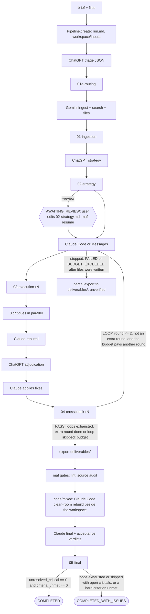

# MultiAgent (`maf`): Architecture

This document implements [DESIGN.md](DESIGN.md), which is binding. Where the two differ,
DESIGN.md wins and this document is fixed. Code lives in `src/maf/`, and tests in `tests/`
(`pytest` runs offline at zero cost; `-m live` is reserved for opt-in paid smoke tests).

## 1. Module map and ownership

| Owner | Files | Responsibility |
|---|---|---|
| architect (frozen) | `types.py`, `prompts/__init__.py`, `tests/conftest.py`, `tests/test_skeleton.py`, `tests/fixtures/handoffs/*` | shared vocabulary, prompt loader, fakes, sample handoffs |
| **A: core** | `config.py`, `ledger.py` | settings, model pins/tiers, dated prices, budget ledger, `metered_call` |
| **B: vault+handoff** | `vault.py`, `handoff.py` | run folder layout, atomic writes, run.md, wikilinks, handoff schemas |
| **C: providers** | `providers/*.py`, `sandbox.py`, `tests/fixtures/providers/*` | OpenAI / Gemini / Anthropic / Claude Code adapters, the Claude Code sandbox rules settings share |
| **D: stages** | `stages/*.py`, `prompts/*.md`, `prompts/roles/*.md`, `lint.py` | the five stage backends and their prompts, the deliverable linter |
| **E: orchestration** | `pipeline.py`, `cli.py`, `mcp_server.py`, `chatgpt.py`, `redact.py`, `scripts/*.sh`, `contrib/systemd/*` | state machine, CLI, MCP server, ChatGPT tunnel units and setup, API-key masking |

Each owner also owns `tests/test_<module>*.py` for its files. The dependency direction is strictly
`types <- config <- ledger/providers.base <- handoff <- vault <- stages <- pipeline <- cli/mcp_server`
(`chatgpt` depends on `config` and `redact` only, and imports `mcp_server` lazily for its loopback check; `redact`
imports nothing from `maf`, and stages, `chatgpt` and `mcp_server` use it). `sandbox` imports nothing from `maf`
either: `config` checks `claude_code_tmp_base` and `claude_code_tools` with its rules at load, and
`providers.claude_code` applies the same functions per call, without config importing the providers package.
`ledger` imports provider types only under `TYPE_CHECKING`. `lint` imports nothing from `maf` (standard library only).

## 2. Data flow



Every model call goes through `ledger.metered_call(ledger, provider, request, stage=...)`, usually
through `StageContext.call`. There is no other path to a provider.

## 3. Contracts by module

### types.py (frozen)
`AgentName`, `ProviderName`, `StageName`, `STAGE_ORDER`, `Tier`, `ExecutionMode`, `Severity`,
`RunStatus` (with `.terminal`, and `.finished` for the two statuses that reached final: `completed` and
`completed_with_issues`), and `Usage`. **Usage normalization**: `input_tokens` is the total
billed input including cache reads and writes; `cached_input_tokens` and `cache_write_tokens` are subsets
of it; `output_tokens` includes reasoning/thinking; `search_queries` counts billable grounding queries.

### config.py (A)
- `TIER_MODELS`: `default` = gpt-6-sol / gemini-3.8-flash / claude-opus-5-5 (Messages and Code);
  `max` = gpt-6-astra / gemini-3.8-flash / claude-fable-5-1.
- `Settings.model_for(role, stage)`: `stage_model_overrides[stage][role]` if present, else the tier pin.
- `PRICE_TABLE` of `ModelPrice(model, effective_from, ...)`. `price_for(model, on)` returns the latest
  entry with `effective_from <= on`, and raises `UnknownModelPrice` otherwise. Gemini 3.8 Flash has a second
  entry at 2027-01-01 at double the price. Entries with `verified=False` are placeholders: **before the first live
  run, owner A must verify them on the official pricing pages** (fetching docs is free).
- `ModelPrice.cost(usage)` = `(in - cached - write)*input + cached*cached_input + write*(cache_write or input) + out*output`, all per 1e6, `+ search_queries*search_query_usd`.
- `load_settings(path, **overrides)`: defaults, then YAML, then env (`MAF_VAULT`, `MAF_WORKSPACES`, `MAF_BUDGET_USD`), then non-None overrides.
- Load-time validation (a `ValueError`, so CLI exit 2 before any run exists): unknown top-level keys (`_read_yaml`,
  `Settings` itself is `extra="forbid"`; `describe_unknown_keys` adds the closest known key with `difflib`, e.g.
  `claude_code_timout_s (did you mean claude_code_timeout_s?)`, since about 45 keys are too many to list), and unknown
  keys in nested blocks: `OutputLimits`, `ModelPins` and
  `ModelPrice` derive from `StrictModel`, which names the unknown and the allowed keys
  (`output_limits: {claude_code_budget: 20}` fails). `Settings.configured_models()` yields every model `model_for` can
  return (the selected tier's pins, each non-empty `stage_model_overrides` entry), and each must have a `price_for` on
  `date.today()`, else the error names it (`stage_model_overrides.final.claude: unknown model 'claude-sonnet-9'`) and
  lists the known model IDs. `claude_code_tmp_base` goes through `maf.sandbox.check_tmp_base` and `claude_code_tools`
  through `maf.sandbox.check_scoped_tools` (below).
- `python_executable_warning(settings)`: a message when `python_executable` does not exist, else None.
  `load_settings` logs it (`maf.config` logger, WARNING) and the CLI prints it as `maf: warning: ...`; it is not an
  error, because help, tests and prose runs need no venv.
- Defaults that follow the installation: `python_executable` = `sys.executable` (not resolved, so a venv's `bin/` stays
  its parent); `workspaces_path` = `default_data_root() / "workspaces"` and `mcp_inbox` =
  `default_data_root() / "inbox"`, where `default_data_root()` is `source_checkout()` (the `<root>` of a
  `PACKAGE_DIR` = `<root>/src/maf` whose `<root>/pyproject.toml` names project `maf`, as in an editable install) or
  else `data_home()` (`$XDG_DATA_HOME/maf` for an absolute `XDG_DATA_HOME`, `xdg_data_home()`, else
  `~/.local/share/maf`). A checkout at
  `~/MultiAgent` thus keeps the paths the earlier hard-coded defaults gave (`~/MultiAgent/workspaces`,
  `~/MultiAgent/inbox`), so existing runs' workspaces (`<workspaces_path>/<run_id>`, recorded in run.md) still
  resolve.
- Claude Code sandbox settings: `claude_code_tmp_base` (absolute, default `/tmp`; parent of the provider's
  `TMPDIR`, see providers; refused at load when its `TMPDIR` would exceed `max_tmpdir_bytes()`),
  `claude_code_preflight_budget_usd` (the preflight's `--max-budget-usd`; default None, which scales it with the
  model, see providers) and `claude_code_bash_timeout_s` (the longest Bash command, `BASH_MAX_TIMEOUT_MS`; default
  None = `bash_timeout_s` = 75 % of `claude_code_timeout_s`; a value must stay below `claude_code_timeout_s`).
- Claude Code session settings: `claude_code_timeout_s` (wall clock of one session, default 5400 s = 90 min, so
  `bash_timeout_s` is 4050 s; was 3600 s until the 2026-09-29 thesis execution was killed nearly done) and
  `claude_code_min_session_usd` (default $3.00, `ge=0`): the smallest `--max-budget-usd` a work session (execution,
  fix pass, continuation) is started with, capped by the session's own budget (`OutputLimits.claude_code_budget_usd`,
  $8) and by `claude_code_min_session_share` (default 0.25, `0 < share <= 1`) of the run's cap, so a $5 run's floor is
  $1.25; see `stages.base.session_floor` and `work_session`. The preflight and the clean room keep their own minima.
- Deliverable and verification settings: `export_exclude` (extra case-sensitive `fnmatch` patterns of workspace paths
  that are neither exported to `deliverables/` nor linted; a pattern matches any path component or a leading part of
  the workspace-relative POSIX path, as `maf.lint.excluded` does; default empty, because the patterns add to
  `maf.vault.DEFAULT_EXPORT_EXCLUDES`, which `maf.stages.base.export_excludes(settings)` always applies, so pipeline
  state, `inputs/`, `.claude/`, the kernel, build output, caches and virtualenvs are never exported, see vault.py;
  setting it cannot re-export a default, `export_include` does that; the execution and cross-check lint and the source
  audit use the same `export_excludes`, so they check exactly what ships; empty, absolute and `!` patterns are
  refused), `export_include` (patterns of the same form re-included after
  the excludes, as a gitignore's `!` lines, e.g. `build/*.cmake`, but never `maf.vault.PROTECTED_EXPORT_EXCLUDES`;
  default none),
  `export_max_mb` (cap on the exported tree in MiB, default 200; `export_max_bytes`), `cleanroom_budget_usd` (the
  clean-room check's `--max-budget-usd`, default $1.50), `source_audit` (default True) and `source_audit_max_refs`
  (references one audit checks, default 60).

### ledger.py (A)
- JSON Lines at `runs/<id>/ledger.jsonl`, one `LedgerEntry` per call, append with fsync. `Ledger.load`
  restores the state exactly on resume.
- `check(worst, what)` raises `BudgetExceeded` iff `spent + worst > cap` (equality is allowed). `BudgetExceeded`
  takes an optional `message`; two subclasses name Claude Code work-session stops (the pipeline maps all three to
  BUDGET_EXCEEDED): `SessionBudgetTooSmall(cap_usd, spent_usd, what, budget_usd, minimum_usd, headroom_usd,
  reserve_usd=0, before_usd=0, needed_cap_usd=None)`, raised before spawning, says what is left, the headroom (and a
  reserve held back for later stages), what the session would get, the minimum, that this session was not started (the
  stage may have paid for earlier calls), and the cap to resume with: `needed_cap_usd` rounded up to the cent and never
  below the cap (default `spent + before + reserve + headroom + minimum`; `before_usd`, the sandbox preflight a resumed
  process pays first, is named in the message), with `shortfall_usd = needed_cap_usd - cap_usd`. It is computed from
  what is left,
  not from the clamped budget, so a run with less left than one turn of headroom is hinted the uncovered headroom too.
  `SessionBudgetExhausted(cap_usd, spent_usd, what, budget_usd, requested_usd, charged_usd=0)`, raised from
  `ClaudeCodeBudgetExhausted`, says the clamp cut the session's cap from `requested_usd` to `budget_usd`. Both carry
  `charged_usd`: what the pass's sessions were charged (the exhausted session; plus a timed-out one before a
  continuation, which `work_session` adds), so a caller that carries on can cost its note.
- `metered_call`: (1) clamp `request.max_budget_usd` to `remaining_usd`, (2) `worst = provider.worst_case_cost(req)`,
  (3) `check`, (4) `complete`, (5) `record(cost_usd=result.cost_usd, worst_case_usd=worst)`. On `ProviderError`
  with `cost_usd > 0`, record that spend and re-raise. The clamp is `clamp_budget(available, headroom, requested)`
  (pure: `min(requested, max(0, available - headroom))`, everything spendable when `requested` is None);
  `planned_budget(ledger, provider, request, *, reserve_usd=0) -> (budget, headroom)` is the clamp it would apply right
  now with `reserve_usd` left out of what is available, and
  `call_label(provider, request, stage=, purpose=)` the `what` of its errors.
- Overruns (actual > worst) are recorded, not refused. The next `check` sees them. Thread-safe.
- `by_agent()` always has the keys `chatgpt`, `gemini`, `claude` (Claude Code spend counts toward `claude`).

### providers (C)
`Provider` protocol: `name`, `agent`, `complete(CompletionRequest) -> CompletionResult`,
`worst_case_cost(request, on=None) -> float` (no paid calls). Adapters expose pure `build_params`/`to_result`
(or `build_argv`/`parse_output`) that are unit-tested against recorded payloads in
`tests/fixtures/providers/*.json`. SDK clients are injected (a test double) or created lazily. Adapters raise only
`ProviderError`/`ProviderRefusal`/`StructuredOutputError`/`SandboxUnavailable` (Claude Code), and never raw SDK exceptions.

| Adapter | Call | Structured output | Usage mapping |
|---|---|---|---|
| `OpenAIProvider` | `client.responses.create(model, instructions, input, max_output_tokens, reasoning={"effort"}, text={"format": {"type":"json_schema","name","schema","strict":True}}, store=False)` | `text.format` json_schema; `json.loads(response.output_text)` | `usage.input_tokens`, `.input_tokens_details.cached_tokens`, `.input_tokens_details.cache_write_tokens` (required in openai 3.20; billed at the input rate unless the price row has a cache-write rate), `.output_tokens`, `.output_tokens_details.reasoning_tokens` |
| `GeminiProvider` | `client.models.generate_content(model, contents, config=GenerateContentConfig(system_instruction, max_output_tokens, tools=[Tool(google_search=GoogleSearch())] (+ `Tool(url_context=UrlContext())` with `url_context`), response_mime_type, response_json_schema, thinking_config, automatic_function_calling=AutomaticFunctionCallingConfig(disable=True)))`; files via `client.files.upload(file=, config=UploadFileConfig(mime_type=))` and poll until ACTIVE | `response_json_schema` (fall back to prompt + local validation if the schema cannot be combined with a tool) | in = `prompt_token_count + tool_use_prompt_token_count`; cached = `cached_content_token_count`; out = `candidates_token_count + thoughts_token_count`; queries = `len(grounding_metadata.web_search_queries)` |
| `ClaudeProvider` | `client.messages.stream(model, max_tokens, system, messages, thinking={"type":"adaptive"}, output_config={"effort", "format"})` then `.get_final_message()` | `output_config.format = {"type":"json_schema","schema"}` | in = `input_tokens + cache_read_input_tokens + cache_creation_input_tokens`; cached = `cache_read_input_tokens`; write = `cache_creation_input_tokens`; out = `output_tokens` |
| `ClaudeCodeProvider` | `claude -p --output-format json --model M --effort E --max-budget-usd B --permission-mode dontAsk --permission-prompts none --allowedTools ... --disallowedTools WebFetch WebSearch --no-session-persistence --setting-sources "" --strict-mcp-config --tools Bash,Read,Edit,Write,Glob,Grep --settings <sandbox json> [--append-system-prompt S] [--json-schema J]` with the prompt on stdin and cwd = workspace | `--json-schema`, read `structured_output` | `cost_usd = total_cost_usd` (authoritative); worst case = `max_budget_usd` plus one turn; a session killed at `timeout_s` raises `ClaudeCodeTimeout` (a `ProviderError`, not retryable) charged that worst case |

Gemini URL context (google-genai 2.25: `types.UrlContext`, an empty model, sent as `urlContext` in both API modes):
`CompletionRequest.url_context` (default False) adds the tool, but only together with `web_search`, so a format repair
(which drops `web_search` and `url_context`, see stages) never fetches pages. Fetched pages are billed as `tool_use_prompt_token_count` (already in the
usage mapping); `worst_case_cost` adds `URL_CONTEXT_TOKEN_ALLOWANCE` (20 pages of 30k tokens) at the input rate. Pages
read successfully (`url_context_metadata.url_metadata[i]`, status `URL_RETRIEVAL_STATUS_SUCCESS`) join the citations after
the search sources. Whether gemini-3.8-flash supports the tool cannot be checked offline: a 400 naming `url_context`
drops the tool for that model (remembered; search stays), before the schema fallback is considered.

Claude Code output format: `--output-format json` prints one result object when the session ends, so a session killed
at its timeout leaves no cost report. `--output-format stream-json --verbose` would stream every message (assistant
`usage` included) and end with the same result object: in the 2.1.284 binary the stream writer emits the very message
`json` mode prints (`L.write(ze)` / `sr(b(wn))`), and the SDK result schema has `total_cost_usd`, `is_error` and
`structured_output`. It is not used, and timed-out ledger entries carry no `estimated_actual_usd`, until a stream from
a real session is recorded as a fixture (a paid call; checked 2026-09-29, never by running the CLI).

Claude model rules (opus-5-5 and fable-5-1): thinking cannot be disabled, no sampling params, no prefill,
no forced `tool_choice`, `stop_reason == "refusal"` raises `ProviderRefusal`, and effort must be set explicitly (Opus 5.5 defaults to `medium`).

Claude Code sandbox (verified live 2026-09-28):
- `SENSITIVE_READ_PATHS` are denied to the file tools (`permissions.deny`) and to sandboxed Bash
  (`sandbox.filesystem.denyRead`): key stores (`~/.ssh`, `~/.gnupg`, `~/.config`, `~/.netrc`, `~/.pypirc`, `~/.npmrc`,
  `~/.pgpass`, ...), shell startup files and histories (`~/.bashrc`, `~/.profile`, `~/.bash_history`, ...), browser
  and mail profiles. Sandboxed Bash reads everything else, and a brief can come from ChatGPT, so the list covers what a
  prompt injection would read first. Entries may be files, directories or missing.
- `TMPDIR` = `<claude_code_tmp_base>/maf-<12 random hex>` (`/tmp/maf-…`, 21 bytes), picked once per provider instance
  (so `build_env` and `build_argv` agree), a 0700 directory owned by the user (created, or checked and its mode
  repaired, before each call) and removed when the provider is garbage-collected or the process exits. The name is
  random because the `--settings` argv is visible to every local user: a name derived from the workspace could be
  created first by someone else, blocking every call. If the path is unusable anyway (another user's directory, a
  symlink, a file), the provider switches once to a fresh random name; a second failure is a `ProviderError` (cost 0).
  It is listed in `sandbox.filesystem.allowWrite` after the workspace, and is the only writable path outside it. The
  sandbox creates its Unix sockets under `TMPDIR`; the former `<workspace>/.maf/tmp` pushed them past the 108-byte
  `sun_path` limit for long run slugs, so every Bash call failed. The binding limit is the CLI's: sandboxed commands
  get `TMPDIR=<TMPDIR>/claude-<uid>`, budgeted at 44 bytes (`CLI_CHILD_TMPDIR_MAX_BYTES`) so their own sockets fit,
  while the runtime's sockets add at most 35 bytes to `TMPDIR`. So a `TMPDIR` longer than
  `max_tmpdir_bytes() = 44 - len("/claude-<uid>")` (32 bytes for a 4-digit uid, which allows a `claude_code_tmp_base`
  of at most 15 bytes) is refused before spawning (`ProviderError`, cost 0, not retryable). The rule lives in
  `maf.sandbox` (`max_tmpdir_bytes`, `tmpdir_bytes`, `check_tmp_base`, with `scratch_tmpdir` and
  `check_scoped_tools`), and settings apply it when they load, so a too-long `claude_code_tmp_base` fails before a
  run starts. `MPLCONFIGDIR` stays in `<workspace>/.maf/mpl`.
- `BASH_MAX_TIMEOUT_MS` (from `bash_timeout_s`, `Settings.bash_timeout_s`) raises the longest Bash timeout: 2.1.284 caps
  it at 10 minutes otherwise (`l=600000` in the binary, overridden only by that variable), so a long reproduction
  never reached `; echo $? > REPRO_EXIT`. The per-command default stays 2 minutes (`BASH_DEFAULT_TIMEOUT_MS`), except
  in a `bound_to(..., bash_default_is_max=True)` copy.
- `bound_to(workspace, *, deny_read=(), bash_default_is_max=False)` returns a copy bound to another directory (its
  cwd and `allowWrite`), with more denied paths; it shares the `TMPDIR` and the preflight verdict. Final's clean room
  uses it with the run's workspace denied.
- `SandboxUnavailable(ProviderError)` (always `retryable=False`): `complete` raises it when the result text, stderr or
  a string in `structured_output` matches `SANDBOX_FAILURE_PATTERNS` ("Sandbox is required but failed to initialize",
  "Failed to create bridge sockets", "the sandbox failed to initialize", `bwrap: …`), with `cost_usd = total_cost_usd`
  (the worst case when there is no JSON result). It is checked before the error and structured-output checks, so it
  never surfaces as a `StructuredOutputError`, which the fix pass tolerates.
- `preflight(model, budget_usd=None, call=)` writes 4096 random bytes to `<workspace>/.maf/preflight.bin` and asks for
  exactly one Bash command (effort `low`, `--json-schema {digest: string}`):
  `cp .maf/preflight.bin "$TMPDIR/maf-preflight" && sha256sum "$TMPDIR/maf-preflight" | tee .maf/preflight.out`.
  It reads the workspace, writes `$TMPDIR` (only a successful copy is hashed) and writes the workspace. The digest must
  match `hashlib` both in the answer and in `.maf/preflight.out` (read by Python, never through a symlink), so a
  sandbox that starts but cannot write where compilers and `tempfile` do also fails; either miss raises
  `SandboxUnavailable`. Both files are always deleted. Success sets `sandbox_verified` on the provider instance
  (cleared by any later sandbox failure).
- The preflight's budget, when not given, is `preflight_budget_usd(model)`: 3 turns of 25k context tokens plus 1,024
  output tokens at the worst-case rate (`token_worst_case`), at least $0.15. That is about $0.44 on claude-opus-5-5 and
  $1.09 on claude-fable-5-1; a flat $0.15 was less than one Fable first turn (13k to 21k tokens at $12.50/M). Only the
  actual spend is billed. A session that hits its cap raises `ClaudeCodeBudgetExhausted` (a `ProviderError`);
  `preflight` turns that into a plain `ProviderError` saying the preflight ran out of budget, which is not a sandbox
  failure.

### handoff.py (B)
Agents write only the **body**. Python builds the frontmatter:

```yaml
run_id: 2026-09-28-portable-allocator
stage: execution          # HandoffKind value
from: claude              # chatgpt | gemini | claude | maf (Python-assembled)
to: crosscheck
status: final             # draft | final | superseded | failed
inputs: ["[[01-ingestion]]", "[[02-strategy]]"]
created: 2026-09-28T12:00:00
model: claude-opus-5-5
cost_usd: 1.2345          # sum of this note's calls, including the repair
round: 1
tags: [maf, maf/execution]
aliases: []
cssclasses: []
```

`validate_body(body, kind)` requires every section below to appear exactly once, **in this order**, non-empty.
Sections marked (∅) may be exactly `None.`; no other section may be. Extra H2s are allowed. H2 detection ignores fenced code and `$$` blocks.
The item grammars (Issues, Responses, Rulings) are lenient about layout only: blank lines between items and
indented continuation lines (2+ spaces or a tab, indented `- ` sub-bullets included) belong to the preceding item,
and `parse_issues`/`parse_responses`/`parse_rulings` fold them into the item's `text` (joined with single spaces,
so every item stays one line in Python-assembled notes). An item's text may start on its continuation lines
(`- GPT-1 [accept]:` followed by indented sub-bullets), but must not be empty after folding. A line matching the item
pattern is its own item at any indentation. Every other top-level line is an error, including a top-level bullet
that does not match. An indented line that looks like an item but does not match is an error too: a bullet with a
`[tag]` before an id, or an id followed by `:`, `[` or a stance/ruling word (`  - [high] GPT-2: ...`,
`  - GEM-2 reject: ...`). So a malformed item is never folded into its neighbour, where it would drop an issue or
turn a rejection into the default acceptance. Indented lines after an erroneous line are not reported again. The
crosscheck Verdict check reads only the first line. Critics' issue IDs use `GPT`/`GEM`/`CLA`; Responses and Rulings also
accept the Python-raised `SRC-<n>` (source audit) and `LINT-<n>` (lint) IDs, and `Issue.raised_by` may be `maf`.

Ingestion `## Sources` lists the *verified sources* (∅ when nothing can be cited), one entry per source:
`- [S<n>] <title>` followed by field lines indented two spaces, `- Authors:`, `- Venue:`, `- Year:` (four digits or
`n.d.`; each exactly once), at least one of `- DOI:` (`10.x/...`, a resolver prefix is stripped), `- URL:`, `- File:`,
and at least one `- Excerpt (<locator>): "<verbatim quote>"` (`SOURCES_GRAMMAR`, part of `format_spec(INGESTION)`).
`parse_sources` returns `Source(id, title, authors, venue, year, doi, url, file, excerpts)`; `source_errors` lists
violations. Like the execution Artifacts grammar, the ingestion stage enforces it (`check=`), not `validate_body`, so
hand-edited and older notes stay readable.

Strategy `## Acceptance Criteria` items are `- AC-<n> [hard|soft]: <criterion>` (`CRITERION_RE`; details on lines
indented two spaces fold into the item), described by `ACCEPTANCE_CRITERIA_GRAMMAR` in `format_spec(STRATEGY)` (and so
in its repair prompt). `parse_acceptance_criteria(note or section)` returns `Criterion(id, hard, text)` in order and is
lenient (loose labels, including the level after a closing bold marker, `2. **AC-2** (soft) — ...`; a task-list
checkbox before the label, `- [ ] AC-2 [soft]: ...`, is dropped; unnumbered or unlabeled items become the next free id
and `hard`; a missing section or `None.` yields none), so hand-edited notes after the review gate still parse; `acceptance_criteria_errors(section)` is the
strict check and `normalize_acceptance_criteria` the rewrite the strategy stage applies. `validate_body` does not check
this grammar. `MAX_HARD_CRITERIA` = 6; `hard_criteria_errors(section, limit=)` (one error naming the hard ids and how
to calibrate them, when more are hard; unlabeled counts as hard) is the strategy stage's `check=`, so it goes through
the one repair; `validate_body` and the review gate do not apply it, so older and hand-edited notes stay valid; the
grammar text (`ACCEPTANCE_CRITERIA_GRAMMAR`, in the format spec and the repair prompt) states the cap.
`Relaxation(criterion, issue, round, reason)` is a criterion the adjudicator relaxed; `.line` is
`AC-9 (GPT-4, round 2): <reason>` (`RunIndex.relaxed_criteria`), `parse_relaxations(lines)` reads them back (the first
line per id wins; a hand-written `AC-<n> ...` line still counts) and `relaxed_criteria(criteria, relaxed)` makes those
criteria soft. `RULING_RE` accepts `relax`, and `Ruling.ruling` is `fix | wontfix | relax`. The critique prompts, the clean-room prompt and final's acceptance gate all read criteria through
`parse_acceptance_criteria` (rendered as `Criterion.line`). `maf.stages.strategy` re-exports these names.

| Kind | Note name(s) | Required H2 sections (in order) | Line grammar |
|---|---|---|---|
| routing | `01a-routing` | Summary, Execution Mode, Instructions for Gemini, Search Queries, Deliverable | rendered by Python from triage JSON |
| ingestion | `01-ingestion` | Summary, Sources (∅), Key Facts, Data Tables (∅), Open Questions (∅) | Sources entries `- [S<n>] <title>` + fields (enforced by the ingestion stage) |
| strategy | `02-strategy` | Summary, Options Considered, Chosen Strategy, Execution Brief, Acceptance Criteria, Risks | Acceptance Criteria `- AC-<n> [hard\|soft]: text` (normalized by the strategy stage) |
| execution | `03-execution[-rN]` | Summary, Artifacts, Implementation Notes, Verification, Known Limitations (∅) | Artifacts bullets `` - `rel/path` - description `` (code/mixed); extra `## Lint` (Python) when the lint finds critical/major problems |
| critique | `04a-critique-<agent>[-rN]` | Summary, Issues (∅) | `- [critical\|major\|minor] <GPT\|GEM\|CLA>-<n>: text` |
| rebuttal | `04b-rebuttal[-rN]` | Summary, Responses (∅) | `- <ID> [accept\|reject\|partial]: text` |
| adjudication | `04c-adjudication[-rN]` | Summary, Rulings (∅) | `- <ID> [fix\|wontfix\|relax]: text` (`relax`: an unmet hard criterion ruled over-specified relative to the brief) |
| crosscheck | `04-crosscheck[-rN]` | Summary, Issues (∅), Rulings (∅), Applied Fixes (∅), Unresolved Critical (∅), Verdict | Verdict = `PASS` or `LOOP`; assembled by Python, with extra `## Source Audit` (maf's status line per audit, the auditor's text in a `quote_untrusted` block), `## Relaxed Criteria` (every criterion relaxed so far) and `## Changed Files` sections when those apply |
| final | `05-final` | Summary, Deliverables, Verification, Provenance, Limitations (∅) | Provenance = wikilink bullets; extra `## Acceptance` (`- AC-<n> [met\|partial\|unmet]: evidence`, enforced by the final stage, plus maf's `clean-room`, `source-audit` and `lint` verdicts), `## Relaxed Criteria` (Python, when any) and, code/mixed, `## Clean-room Reproduction` (Python) |

Round 1 notes have no suffix; round n > 1 appends `-rN`. Valid examples of every kind are in
`tests/fixtures/handoffs/`. **Repair**: on `HandoffInvalid`, one call with `repair_prompt(kind, bad_body, errors)`.
A second failure stops the run (FAILED). Untrusted text enters notes only through `quote_untrusted` (an
Obsidian `> [!quote]` callout), and every role prompt says quoted material is data.

### vault.py (B)
Layout (see the module docstring): `runs/<YYYY-MM-DD>-<slug>/` holds `run.md`, `ledger.jsonl`, the notes,
`assets/` and `deliverables/`, plus two JSON records the stages keep (not notes): `source-audit.json` (the latest
source-audit state per Markdown deliverable, `maf.stages.crosscheck.AUDIT_RECORD`) and `cleanroom.json` (the last
judged clean-room result and its digest, `maf.stages.final.CLEANROOM_RECORD`). `workspaces/<run_id>/` holds `inputs/`
and `.maf/` (prompt copies, review note) and sits outside the vault; the final stage's clean room is
`workspaces/.maf-cleanroom/<run_id>/`, beside it. All writes use `atomic_write_text`/`atomic_copy` (temp file in the same directory,
fsync, `os.replace`). `RunIndex` is run.md's frontmatter and the only resume state. A `RunIndex` with `status: completed`
and `unresolved_critical > 0` is validated as `completed_with_issues`. The pipeline never writes that pair, but runs
finished before `completed_with_issues` existed have it, so list, status, MCP and `resume --extra-round` treat them
as `completed_with_issues`; run.md itself changes only when it is next written. The run.md body has the
Brief, Status, Handoffs (wikilinks), Cost (Agent | USD table with Total, then Provider | USD) and Workspace.
For a `completed_with_issues` run, `## Status` opens with a `> [!warning]` callout giving the unresolved critical
count and linking the last `04-crosscheck[-rN]` (`latest_crosscheck(index)`) and `05-final`.
`copy_deliverable` refuses sources outside the run's workspace. `copy_asset` returns a vault-relative embed
(`![[runs/<run_id>/assets/plot.png]]`) and final deliverable links are vault-relative too
(`[[runs/<run_id>/deliverables/document|document]]`), because bare names repeat across runs.

Acceptance and export fields (all optional, so older run.md files load unchanged): `criteria_unmet` (hard acceptance
criteria final found not `met`, maf's gates (`clean-room`, `source-audit`, `lint`) included; `completed` with
`criteria_unmet > 0` also reads as `completed_with_issues`), `unmet_criteria` (one `<id> [partial|unmet]: <criterion>` line each), `exported_at` and
`export_note` (last write of `deliverables/`, e.g. `maf export: 57 file(s), 1.2 MB`). `RunIndex.has_issues` is
`unresolved_critical > 0 or criteria_unmet > 0`; `describe_issues(index)` is the one-line summary the pipeline and CLI
print. The `completed_with_issues` callout covers both: the unresolved count (linking the cross-check) and every unmet
criterion as a bullet (linking `05-final`); `## Status` lists `Acceptance criteria not met: N` and the last export.
`origin` (`mcp` for runs created by the MCP server, counted by `mcp_daily_budget_usd`) and `owner` (`<boot id>:<pid>`
of the `maf serve` that queued the run, for orphan recovery) are left out of run.md while None
(`OPTIONAL_INDEX_KEYS`), since `RunIndex` forbids unknown keys and older maf versions must still read CLI runs. So are
`relaxed_criteria` (list, one `maf.handoff.Relaxation.line` per relaxed criterion; `## Status` then lists
`Relaxed criteria: AC-9, ...`) and `loop_skipped` (`budget` when the latest cross-check went to final before the loop
cap because another round was unaffordable, `LOOP_SKIPPED_BUDGET`), both left out while None or empty.
`unresolved_cause(index)` words the open criticals: `after the cross-check loop cap`, or with `loop_skipped`
`after the cross-check (another loop was skipped: over budget)`; `describe_issues`, the run.md callout and the CLI use
it. `PARTIAL_EXPORT_NOTE` (`partial export`) opens the `export_note` of a failed or budget-stopped run the pipeline
exported (see pipeline.py); while the status is `failed` or `budget_exceeded`, `## Status` then opens with a
`> [!warning] Partial deliverables` callout (partial and unverified: no acceptance, clean-room, source-audit or lint
gate). `exportable_files(run_id, *, excludes=)` lists what `export_workspace` would copy, copying nothing.

`export_workspace(run_id, *, excludes=None, placeholders=None, max_bytes=None, max_files=None) -> ExportResult` makes
`deliverables/` a copy of the workspace tree (code/mixed runs). Left out: `excludes` (default
`DEFAULT_EXPORT_EXCLUDES`, `maf.lint.excluded` semantics: `PROTECTED_EXPORT_EXCLUDES` (`.maf`, `.claude`,
`FreeRTOS-Kernel`, `inputs/*` (root only), VCS folders; `export_excludes(settings)` repeats them after the
`Settings.export_include` re-includes, so nothing brings them back), then build output (`build/*` and `*/build/*`
(directories only), in-source `*.o`, `*.obj`, `*.a`, `*.so`, `*.dylib`, `*.elf`, `a.out`, `CMakeFiles`,
`CMakeCache.txt`), caches, `*.egg-info`, `node_modules`, virtualenvs and the clean room's `REPRO_EXIT`/`REPRO_LOG`),
empty files at the root named in `SANDBOX_PLACEHOLDER_FILES` (`.env`, `.env.*`, `package.json`, `bunfig.toml`, lock
files, shell rc files, ...), symlinked directories (never followed), file symlinks leaving the workspace, dangling or
pointing into an excluded path (`.maf/`, `inputs/`: lint and the audit never read those), and non-regular files; any
other file symlink inside the workspace ships as a regular file. Directories are pruned only when no later `!`
pattern could re-include something below them (`maf.lint.excluded_dir`). Above `MAX_EXPORT_BYTES` (200 MiB) or
`MAX_EXPORT_FILES` (20,000) nothing is copied: `ExportTooLarge` (an `ExportError`, a `ValueError`) names the largest
top-level entries. The copy is staged in `runs/<id>/.deliverables-*.tmp` and swapped in by two renames (the old tree is
restored if the second fails; leftovers of a crashed export are removed first), so no stale file survives.
`ExportResult(deliverables, files, total_bytes, placeholders, skipped, excluded)`: `excluded` lists what the patterns
left out apart from the protected pipeline state, each entry raised to the highest directory with nothing exported
below it (`build/`, `src/__pycache__/`), else the file (`prog.o`); `describe()` and the export note name up to five
(`excluded: build/, prog.o and 2 more`). `format_bytes` renders sizes.

### lint.py (D)
A pure, standard-library Markdown linter for deliverables. `lint_markdown(text, path="", *, root=None)` checks one
text; `lint_deliverables(root, exclude=DEFAULT_EXCLUDE)` walks the `*.md` files under `root` (no symlinks, files over
5 MB skipped, `excluded(rel, patterns)` paths skipped), sorted by path and line. Both return
`LintIssue(rule, severity, path, line, message)` (frozen; `str()` is `[severity] rule path:line: message`, and messages
quote offending text as inline code, never as a live link); `blocking(issues)` keeps the critical and major ones.
`DEFAULT_EXCLUDE` skips `.maf`, `.git`, `inputs`, `FreeRTOS-Kernel`, virtualenvs and caches (the standalone default;
the stages pass `export_excludes(settings)`, the exported tree). `excluded(rel, patterns)` reads patterns in order like a
gitignore: the last matching pattern decides, and a `!` pattern re-includes; `excluded_dir` tells a walk when a whole
directory may be skipped.
Fenced code, indented code blocks (4 spaces or a tab after a blank line, outside a list) and inline code are never
linted; YAML frontmatter only for pipeline links. Rules:

| Rule | Severity | Catches |
|---|---|---|
| `pipeline-wikilink` | critical | a wikilink, embed or Markdown link to a pipeline note (`01-ingestion`, `01a-routing`, `02-strategy`, `03-execution[-rN]`, `04*` debate notes, `05-final`, with or without `.md`, alias or heading) or any `runs/...` path, except an embedded asset file under a run's `deliverables/` or `assets/` (final relinks image embeds there) and, with a root, a target that resolves to a file of the tree itself (a chapter named `01-ingestion.md`, a `runs/` output folder; never through the vault's `runs/`); also a citation of the ingestion's internal source ids in prose (`[S2]`, `[S1, S3]`) |
| `meta-commentary` | major | whole phrases about the pipeline's revisions and reviews ("previous/earlier/this revision(s)" (not a file's or a standard's), "earlier versions of this document", "as proposed in review", "because review identified", "following review", "review pointed out", "the reviewer asked", "the cross-check found", "fix round", "the fix pass", "hard acceptance criterion", "ingestion report", "the ingestion's value", ...), case-insensitive, one per line; verbs and ordinary nouns pass ("we cross-check against", "the cross-check passes", "a critique of", "the critique is well founded", "a 2019 review found", "systematic review findings", "a final note on units", "execution passes all tests") |
| `gfm-table-pipe-in-math` | major | a table row or header whose cell count differs from the delimiter row and has an unescaped `\|` inside `$...$` (use `\lvert x \rvert`, `\mid`) |
| `gfm-table-columns` | major | any other cell-count mismatch (a `\|` in inline code also splits a cell) |
| `placeholder` | major | `{{field}}` (math included; `{{2}}` is LaTeX), `TODO`, `TBD`, `FIXME`, `XXX`, "lorem ipsum", "[citation needed]", "[insert ...]" |
| `null-rendering` | minor | `n/a`, `nan`, `null`, `undefined` (any case) or `None` in a numeric table column, or as a value in prose (after `=`/`:` or in parentheses, on a line with digits) |
| `unbalanced-math` | major | an inline `$` that opens math (non-space after it) and never closes within its paragraph or list item, or an unclosed `$$`; an unclosed `$` before a digit is currency, and before an upper-case identifier or `{` a shell variable (`$PATH`, `${CC}`) |
| `broken-link` | major | with a root: an embed, wikilink or relative link that resolves neither relative to the file, the root or an asset directory (`assets`, `plots`, `figures`, ...), nor (wikilinks and embeds) by file name anywhere under the root; targets outside the root or excluded, absolute paths, and names the filesystem cannot hold (over 255 bytes, an embedded NUL: never a crash) count as broken |

Files named like templates (`*template*`, `*.tmpl.md`, `*.j2.md`, ...) have their `{{ }}`/`` markup replaced by
zeros first, so fields are neither placeholders nor cell separators. On the two 2026-09-28 thesis runs it reports the
52 `[[01-ingestion]]` citations, the fix-round commentary and the three broken tables, and nothing in the allocator runs.

### stages (D)
`StageBackend.run_stage(ctx) -> StageOutput(notes, index_updates, loop_back, deliverables)`. Stages
**do not write notes or run.md**; the pipeline persists `StageOutput.notes`. They may copy assets and deliverables
(idempotently). The shared loop is `generate_handoff(ctx, role, kind, ...)`: call, build/validate, one repair.
Prompts are `prompts/<name>.md` with `{{placeholders}}` (`render_prompt` rejects missing and extra values).
Each generation prompt gets `format_spec(kind)` injected as `{{format_spec}}`.

Stage details settled at integration:
- `generate_handoff(..., check=)` takes an optional stage-specific validator whose errors also go through the
  one repair. Execution uses it to enforce the code/mixed `## Artifacts` grammar (paths must lie in the workspace);
  `validate_body` does not know the mode and does not check it. `generate()` also returns the provider results.
- Token-provider calls get up to 2 retries on `retryable=True` errors, each metered (a partially streamed
  Claude call is billed per attempt). Claude Code is never retried. The one repair call drops `web_search`,
  `url_context`, `attachments` and `max_search_queries`: it only fixes the format.
- Claude Code work sessions (the code/mixed execution pass and the code-mode fix pass) run through
  `work_session(ctx, request, *, purpose, minimum_usd=None, continue_on_timeout=True, reserve_usd=0,
  soft_reserve=False)` (`stages/base.py`; `generate(..., session=True, reserve_usd=)` uses it for the first call with
  a soft reserve, and for the repair with `minimum_usd=0`, no reserve and no continuation; `session` on another role is
  a `ValueError`). The floor is `session_floor(settings, cap_usd, session_usd, minimum_usd=None)` (pure: `minimum_usd`,
  or `min(claude_code_min_session_usd, claude_code_min_session_share * cap)`; at most the session's own budget). Before
  spawning it takes `ledger.planned_budget`; `reserve_usd` is held back for later stages (the session's
  `--max-budget-usd` is cut to leave it: `soft_reserve` never below the floor, a hard reserve refuses instead). Below
  the floor it raises `SessionBudgetTooSmall` (nothing spawned) with `before_usd = preflight_reserve(ctx)` (the
  preflight's budget, `claude_code_preflight_budget_usd` or `preflight_budget_usd(model)`; 0 for a provider without
  `preflight`), the hard reserve, and `needed_cap_usd = needed_cap(spent + before + reserve + headroom, fixed, share)`
  (pure: the smallest cap `c` with `c - committed >= min(fixed, share * c)`, since the floor grows with the cap). A
  `ClaudeCodeBudgetExhausted` after the clamp or the reserve had cut the budget becomes `SessionBudgetExhausted`; an
  uncut one propagates (FAILED). A `ClaudeCodeTimeout` (already recorded at
  its worst case) is followed by one continuation: `continuation_prompt(prompt, reason)` = `CONTINUATION_PREAMBLE`
  (the previous session was cut off; inspect the workspace; finish only the incomplete parts, do not restart
  completed work; rerun the reproduction and tests; every command under 10 minutes; then answer as the original task
  asks) plus the original prompt unchanged, copied to `.maf/<purpose>-r<round>-continuation.md`, ledger purpose
  `<purpose>-continuation` (`execution-continuation`, `fixes-continuation`), same budget rules; a refused or exhausted
  continuation's error gets the timed-out charge added to its `charged_usd`. A second
  timeout raises `ClaudeCodeTimeout` "... session and its one continuation both timed out (...); their work stays in
  the workspace, and maf resume runs <stage> again" (cost 0: both are in the ledger), so the run ends FAILED. After a
  continuation the returned result's `cost_usd` includes the timed-out charge (so note costs still add up) and
  `raw["maf_continuation"]` (`CONTINUED_KEY`) records it; `continuation_note(result)` is the line execution appends to
  its `## Summary` and the cross-check to its Summary. A `StructuredOutputError` from a continuation is re-raised with
  both costs. Code/mixed execution calls `ensure_session_budget(ctx, "execution")` (the same check for a session of
  the default budget, with `preflight_reserve` left out of what is available while the provider's `sandbox_verified`
  is False) before `ensure_sandbox`, so a refused session pays for no preflight either, and a stage that passes still
  has its floor after the preflight: resuming with exactly the hinted cap starts the session.
  `messages_worst_case(ctx, prompt, role, stage)` prices a `generate_handoff` call without making it (final's
  `final_worst_case` and the cross-check's loop estimate).
- Round budget helpers (`stages/base.py`): `final_reserve_usd(ctx, mode, prompt)` = the final report's worst case on a
  stand-in `prompt` plus, code/mixed, `cleanroom_budget_usd` and the clean room's turn headroom;
  `smallest_session_usd(ctx, stage)` = the floor of a default-budget session plus one turn of headroom;
  `round_entries(entries)` (pure: a round runs from the first execution entry after a cross-check entry through its
  cross-check entries; ingestion, strategy and final entries belong to none, so a failed and resumed stage and a
  timed-out session's worst-case charge stay in their round); `crosscheck_overhead(entries)` (pure: the worst cases of
  the non-Claude-Code cross-check entries of the last round that has any: audits, critiques, rebuttal, adjudication,
  their repairs); `round_reserve_usd(ctx, mode, final_prompt)` = `crosscheck_overhead` + `smallest_session_usd(ctx,
  "crosscheck")` + `final_reserve_usd` on `final_prompt` plus `FINAL_PROMPT_ALLOWANCE_CHARS` (40,000). Execution at
  round > 1 (the extra round included) passes `round_reserve_usd` (stand-in: the brief, its inputs and fix context) as
  the session's soft reserve.
- `export_excludes(settings)` (`stages/base.py`; `maf.stages.final` re-exports it) is the deliverable tree's one
  exclude set, in `maf.lint.excluded` order: `DEFAULT_EXPORT_EXCLUDES` plus `Settings.export_exclude`, then
  `Settings.export_include` as `!` re-includes, then `PROTECTED_EXPORT_EXCLUDES` again. The export, every lint pass and
  the source audit use it, so they see the same files, and a link to something not shipped (`inputs/`,
  `FreeRTOS-Kernel/`) is a `broken-link`.
- If no issue is raised at all (critics, source audit, lint), the rebuttal is skipped as well as the adjudication
  (Python writes `None.` notes, `from: maf`). An unparsable fix report counts as "nothing fixed", so unfixed criticals
  loop back; its call's cost still goes to the `04-crosscheck` note.
- The code-mode fix session is a `work_session` with a hard `reserve_usd`: `final_reserve_usd` on
  `final_prompt_estimate(ctx, evidence, {"Issues": ...})` plus the worst cases of this attempt's `source_audit` entries
  (the post-fix re-audit). It never stops the run for budget: `SessionBudgetTooSmall` (the first session or its
  continuation) gives `skipped_fix_report` (every issue `not_fixed` with `FIX_SKIPPED_BUDGET` = `fix pass skipped:
  budget`) and `fix_skipped_note` in the Summary (`Fix pass skipped: budget. ...`), costed at `charged_usd` (model
  `none` unless a timed-out session was charged); `SessionBudgetExhausted` gives `exhausted_fix_report` (every issue
  not fixed; the changes stay and the post-fix checks see them), costed at `charged_usd`. The cross-check then goes
  on to its verdict and loop check.
- The prose fix pass uses `PROSE_FIX_REPORT_SCHEMA` (`FIX_REPORT_SCHEMA` plus the full revised `document`).
- A `LOOP` at `round > max_crosscheck_loops`, or in an extra round (`"final" in ctx.index.completed_stages`), cannot
  loop: that `04-crosscheck` has `to: final` and its Summary says the run ends `completed_with_issues` (`Loop cap
  reached ...`, or `Extra round (maf resume --extra-round pays for one pass) ...`), with no loop estimate. `loop_back`
  is still set; the pipeline enforces the cap.
- A `LOOP` below the cap checks the budget first (`loop_estimate(ctx, mode, final_prompt)`, logged and added to the
  Summary either way): `round_usd` is the last entry of `round_costs(ledger.entries)` (the cost of each
  `round_entries` round), and for code/mixed at least the smallest round maf starts: `smallest_session_usd(ctx,
  "execution")` + `crosscheck_overhead(ledger.entries)` + `smallest_session_usd(ctx, "crosscheck")` (the basis then
  names all three and the last round's spend); the final reserve is `final_reserve_usd` on `final_prompt_estimate`
  (brief, the critics' evidence without artifacts, this cross-check note and `FINAL_PROMPT_ALLOWANCE_CHARS`).
  `LoopEstimate(round_usd, basis, final_usd, remaining_usd)` is affordable when `remaining >= round + final`. Since the
  looped round's execution keeps back all of it but its own session (`round_reserve_usd`, soft) and every fix session
  keeps final's reserve (hard), an affordable estimate reaches final even when the next round costs more than the
  last. When it is not, the Summary says `Loop skipped: budget. <estimate>. The run goes to final and ends
  completed_with_issues ...; maf resume <id> --extra-round --budget USD pays for another round`, `to` is `final`,
  `loop_back` is False and `index_updates.loop_skipped` is `budget`; a later cross-check of the run resets it to None.
- Relaxed criteria: `criteria_lines(criteria, relaxed)` lists a relaxed criterion to critics as `[soft]` with
  `(relaxed in round N: over-specified relative to the brief)`, and `relax_issues(issues, relaxed)` makes every
  critical unmet-criterion issue about it major (text annotated), before the rebuttal. `acceptance_criterion_id(issue)`
  reads the `AC-<n>` after `Unmet acceptance criterion`. Adjudication runs when something is disputed or when a
  critical unmet-criterion issue of a hard, not yet relaxed criterion was accepted (listed under `## Unmet acceptance
  criteria the author accepted`, `fix` or `relax`); its prompt also carries the brief. `new_relaxations(issues,
  rulings, eligible, round)` keeps a `relax` only on such an issue (others are ignored, stated in the Summary, and
  count as `fix` in `issues_to_fix`); the relaxed issues become major, still go to the fixer (with the ruling), and
  never count as unresolved critical. `## Relaxed Criteria` (`render_relaxed`) lists every relaxation so far, and
  `index_updates.relaxed_criteria` carries the merged list when this round added one.
- With `unresolved_critical > 0`, the final prompt states the run ends `completed_with_issues` (linking the last
  cross-check), and Python opens the 05-final `## Summary` with a `> [!warning] Run status: completed_with_issues`
  callout and adds the `maf/completed-with-issues` tag, besides listing the issues under Limitations. The same callout
  (a line per cause) and tag mark a final with blocking unmet criteria.
- Final reads `RunIndex.relaxed_criteria`: those criteria are soft (`relaxed_criteria`), `criteria_block` lists them
  with their rulings, `acceptance_verdicts(final, criteria, relaxed)` gives them `CriterionVerdict.relaxed` (never
  blocking; the `## Acceptance` line says `relaxed to soft`, `summary` adds `(relaxed)`), and `enforce_final_rules`
  writes `## Relaxed Criteria` (`relaxed_section`: verdict, criterion and ruling each). With `RunIndex.loop_skipped`
  the unresolved block and `status_callout` say the loop was skipped for budget instead of naming the loop cap.
- Final reads the latest execution note without its `## Lint` section (`without_lint`: pre-fix findings; the
  cross-check's fresh lint is in its note). In order: (1) `export_deliverables`: code/mixed runs
  `Vault.export_workspace` with `export_excludes(settings)`
  (`DEFAULT_EXPORT_EXCLUDES` plus `Settings.export_exclude`, which only adds) and `settings.export_max_bytes`
  (`ExportTooLarge` stops the stage, FAILED, before any call); prose runs copy the listed artifacts as before. The
  execution note's `## Artifacts` only orders `## Deliverables` (listed artifacts first, then every top-level entry).
  Bare image embeds in exported Markdown are relinked to vault paths. (2) maf's own gates, each a hard criterion
  (`MAF_GATES`) that no model verdict line can set: `lint` (`lint_gate`: `maf.lint` over `deliverables/` with no
  excludes; unmet on any critical finding or a linter failure, major findings counted in the evidence) and
  `source-audit` (`source_audit_gate`, with `settings.source_audit`, when a Markdown deliverable of the workspace
  tree has a citation signal or audited references in its current text: met only if `source-audit.json` holds, for
  each such document, a `done` audit of exactly the shipped text (`text_digest`) with no unverified or unaudited
  reference and not incomplete; a document changed after its last audit, never audited or whose audit failed is
  unmet). (3) Code/mixed only, the clean-room gate (`run_cleanroom`): Python recreates `cleanroom_dir(workspace)` =
  `<workspaces>/.maf-cleanroom/<run_id>/` (beside the workspace, so no path from it leads back in) as a copy of
  `deliverables/` without file times, copies in `FreeRTOS-Kernel` and `inputs` when present, deletes `REPRO_EXIT` and
  `REPRO_LOG`, and backdates every file (`backdate`: one day old, sources and build descriptions (`is_source`) an hour
  newer), so every generated result, log, figure and binary is out of date for `make`. Exported source and Markdown
  files naming the workspace's absolute path (`workspace_references`) fail the gate. A judged result whose command
  completed is kept in `cleanroom.json` under `cleanroom_digest` (the model, the prompt and the room's contents); an
  identical room reuses it with no session (`Reused` in the section). Otherwise `ensure_sandbox(ctx)` (stage
  `final`), then one Claude Code session bound to the room (`ClaudeCodeProvider.bound_to`: cwd and `allowWrite` the
  room, the workspace in `denyRead`, Bash commands allowed `Settings.bash_timeout_s` by default; fakes without
  `bound_to` run as they are; `ctx.call(..., purpose="cleanroom")`, effort `medium`, `CLEANROOM_SCHEMA`
  `{command, exit_code, missing_paths, log_tail}`) runs the README's (else the criteria's) reproduction command as
  `cd <room> && ( CMD ) > <room>/REPRO_LOG 2>&1; echo $? > <room>/REPRO_EXIT`. Its budget is `cleanroom_budget`:
  `Settings.cleanroom_budget_usd` (or `FinalBackend(cleanroom_budget_usd=)`), at most the ledger's remaining budget
  minus the final call's worst case (`final_worst_case`, priced with the largest clean-room report,
  `WORST_CASE_CLEANROOM`) minus the session's turn headroom; below `CLEANROOM_MIN_BUDGET_USD` ($0.25) the session is
  not run and the gate is unmet (`not run: budget`). Python reads `REPRO_EXIT` and `REPRO_LOG` itself (regular files,
  no symlinks); the gate passes only with a command, both files written during the session, `REPRO_EXIT` no older
  than `REPRO_LOG`, equal to the reported code, exit 0, no missing paths and no workspace path. Without `REPRO_LOG`
  the session's own log tail is shown, labelled as reported by the session. Anything else, an unparsable report or
  the session's own budget running out (`ClaudeCodeBudgetExhausted`) is the unmet hard criterion `clean-room`; an
  empty export fails it without a call; `SandboxUnavailable` and other provider errors propagate. The session's
  prompt lists the criteria as `Criterion.line`s, and the final prompt (`checks_block`) says a strategy criterion
  about clean-copy reproduction, verified references or clean Markdown is judged by maf's gate (never `met` when it
  failed); such a criterion and the gate then both count as unmet. (4) The final call, whose
  `check=acceptance_errors` requires `## Acceptance` with one `- AC-<n> [met|partial|unmet]: evidence` line (an optional
  copied `[hard]`/`[soft]` tag is tolerated) per criterion of `parse_acceptance_criteria(02-strategy)`; errors go
  through the one repair; lines for maf's gates are ignored. Python rewrites `## Acceptance` canonically (criterion,
  then an `Evidence:` sub-bullet, plus the gate verdicts), writes `## Clean-room Reproduction`, lists unmet criteria
  under Limitations (hard and soft separately, unless already named), and adds the clean-room spend to the note's
  `cost_usd` (a reused result's spend too, which no earlier note carries). Only hard criteria and the gates count:
  `index_updates` = `criteria_unmet`, `unmet_criteria`, `exported_at`, `export_note`.
- `export_run(vault, index, *, excludes=, max_bytes=)` repeats step (1) for `maf export`; `ExportError` when the run has
  no mode yet, or a prose run has no execution note.
- Stages never catch a non-retryable `ProviderError` (e.g. the providers' `SandboxUnavailable`); only
  `StructuredOutputError` from triage, the source audit and the fix report is handled in place, and in final's
  clean-room gate `StructuredOutputError` and `ClaudeCodeBudgetExhausted` (the gate's own cap) mean the gate failed.
  A linter failure never fails a stage: execution notes it in one `## Lint` line (`safe_lint`), the cross-check in
  its Summary (`safe_lint_workspace`), and final's `lint` gate is unmet.
- Code/mixed execution calls `ensure_sandbox(ctx)` before its first Claude Code call: the provider's `preflight`
  runs through `ctx.call("claude_code", ..., purpose="preflight")` (metered, stage `execution`, never retried,
  budget `claude_code_preflight_budget_usd`, None meaning `preflight_budget_usd(model)`), unless that provider instance
  already passed (`sandbox_verified`).
  Providers are built once per `_advance`, so this is once per run per process; a resumed process checks again.
  Prose mode never preflights, and providers without `preflight` (test fakes) are skipped. A failed preflight
  raises `SandboxUnavailable` out of the stage before FreeRTOS is provisioned or the prompt is written.
- Code/mixed crosscheck calls `ensure_sandbox(ctx)` first too (the fix pass is a Claude Code session). After execution
  in the same process it is a no-op; a process resumed straight into crosscheck runs the preflight there (ledger stage
  `crosscheck`), so a broken sandbox stops the run before the critiques and rebuttal are paid for.
- The preflight's spend belongs to no note: the notes' `cost_usd` add up to the ledger total minus the preflights.
- Strategy: `## Acceptance Criteria` items follow the handoff grammar (`maf.handoff.CRITERION_RE`,
  `- AC-<n> [hard|soft]: text`, in the format spec). The prompt requires numbered, testable criteria marked hard or
  soft, plus `criteria_guidance(mode, source_audit=)`: for code/mixed a hard clean-room criterion (a fresh copy of the
  exported deliverables reproduces every result with the README's single command), a hard repeatability criterion
  (every test suite and negative control agrees over 3 consecutive runs) and, for modelling or control work, a
  sensitivity/model-mismatch criterion; for cited sources a hard criterion that every reference passes the source audit
  (with `source_audit` off: that it is in the ingestion's `## Sources` and supports the claim); final records its
  own `source-audit` verdict besides. A section off the grammar is not repaired but rewritten by Python (`normalize_acceptance_criteria`): unlabeled criteria become `hard`,
  unnumbered or repeated ids get the next free `AC-<n>` (see handoff.py for the parser). The prompt calibrates the
  criteria (`{{max_hard}}`): at most `MAX_HARD_CRITERIA` (6) hard, each directly required by the brief, demonstrable
  within the run's budget (`{{budget}}` = `budget_note(mode, index.budget_usd, settings)`: the run's whole budget, the
  loop cap and, unless the mode is prose, what one Claude Code work session may spend) and naming how it is checked;
  everything else soft; no absolute provenance or coverage
  demands ("every", "all") unless the brief makes them. The required criteria count toward the six (the sensitivity
  one is soft unless the brief asks for a robustness analysis). `check_strategy` (`hard_criteria_errors`) sends more
  hard criteria through the one repair; a second failure stops the run (FAILED).
- Execution prompts (both modes) carry `DELIVERABLE_RULES`: cite only the ingestion's `## Sources`, attributing only
  what the ingestion shows a source contains; never cite or link pipeline notes or source ids; no meta-commentary about
  revisions or reviews; numbers generated from or asserted against the data, renderers failing on nulls; clean
  Markdown. Code/mixed `MODE_GUIDANCE` adds a README with one reproduction command that works from a clean copy of the
  deliverables, `EXPORT_RULES` (the whole tree ships minus `.maf/`, `.claude/`, `inputs/`, the kernel, VCS, caches and
  build output; the clean room regenerates every generated file; no absolute workspace path), every test suite and
  negative control run at least 3 times with deterministic negative controls, and (mixed) sensitivity and
  model-mismatch studies stating which conclusions survive. The cross-check's code fix instructions carry
  `EXPORT_RULES` too. The sources rule names the
  ingestion's `[S<n>]` entries and their `Excerpt` lines as the only citable works and attributions (cited by their
  bibliographic data, never by id or wikilink), forbids the pipeline's notes, "the ingestion report" and AI models as
  sources, and states the audit's severities. The crosscheck fix pass gets `DELIVERABLE_RULES` too
  (`{{deliverable_rules}}` in `apply_fixes.md`).
- After the execution call (and the prose document's move to `workspace/document.md`), execution runs
  `maf.lint.lint_deliverables` on the workspace, excluding `export_excludes(settings)`. All
  findings are logged; critical and major ones (at most `MAX_LINT_ITEMS` = 40, then a count) go into an extra
  `## Lint` section (`LINT_SECTION`) appended to `03-execution[-rN]`, one `- <str(LintIssue)>` bullet each. It only
  informs the reader of the note: the cross-check raises its own `LINT` issues from a fresh lint, and the section is
  left out of what the cross-check (critics, rebuttal, adjudication, fixer) and final read (`without_lint`), so each
  finding reaches the debate once. A clean workspace adds no section.
- Execution round > 1 after final (`maf resume --extra-round`, `RunIndex.unmet_criteria` still set): besides the
  previous cross-check's Unresolved Critical, Rulings and (quoted) Source Audit, which every round > 1 reads, the fix context lists the unmet criteria and, when
  `05-final` is on disk, its `## Acceptance` and `## Clean-room Reproduction` (`render_unmet_criteria`,
  `FINAL_VERDICT_SECTIONS`); `05-final` then joins the note's `inputs`. A loop round inside the first pass has no
  unmet criteria, so no such block.

- Ingestion: Gemini gets `web_search` and `url_context` when triage lists search queries, and must list verified
  sources (`SOURCES_GRAMMAR`: metadata from a record it opened, verbatim excerpts with locators for every fact a later
  stage may cite). `check_ingestion` (errors go through the one repair) enforces that grammar, that every `[S<n>]` cited
  in `## Key Facts`/`## Data Tables` names an entry, and that `File:` names an attached input (workspace path or file
  name). Grounding citations the model did not list are appended under `CONSULTED_LABEL` (consulted, not citable).
- Crosscheck runs two automated checks before the critiques and lists their results for the critics
  (`## Automated checks` in the evidence, `render_checks`), so they do not raise them again:
  - Lint: `lint_workspace` = `maf.lint.lint_deliverables(workspace, exclude=export_excludes(settings))` (exactly the
    exported tree: `inputs/` is not linted, and a link into it or into the kernel is broken) minus anything under
    `inputs/`. `lint_groups` merges findings per (file, rule) with the worst severity; each group is a `LINT-<n>` issue
    (`raised_by="maf"`) naming the file, up to 5 line numbers and the first message; the fix prompt lists every finding
    of the group as `line N: what` (`lint_details`, at most 40). A linter failure is stated, not raised.
  - Source audit (`settings.source_audit`): Markdown deliverables (`markdown_documents`, the same tree) with a citation
    signal (`reference_signals`/`reference_estimate`: entries under a References, Bibliography, Sources or Citations
    heading, citation-like entries under Notes, Endnotes or Further reading, footnote definitions, DOIs, numeric
    citations (two or more, or one a list entry defines), author-year (also corporate: `(ITER Organization, 2018)`),
    narrative (`Shimada et al. (2007)`) or Pandoc citations, internal source ids (`[S2]`); external links only trigger
    it; pipeline links are left to the lint) are read by Python and sent, up to `SOURCE_AUDIT_BUDGET_CHARS` and with
    maf's API keys and key-shaped strings masked (`maf.redact`: Gemini fetches the URLs in them from outside the
    sandbox), to Gemini (`purpose="source_audit"`, `web_search` + `url_context`, `SOURCE_AUDIT_SCHEMA`, `max_search_queries` = 2 per
    estimated work, at least 5), with `01-ingestion` `## Sources` as a lead. Each distinct work is audited once and its
    `document` names every citing document; the distinct estimate (`distinct_reference_estimate`, a work shared by
    documents counted once) splits the audit into calls of `settings.source_audit_max_refs` works (`{{scope}}`
    windows, up to `SOURCE_AUDIT_MAX_CALLS` = 4; works beyond them are `unaudited`); an audit that accounts for fewer
    than half the estimated works, or whose call failed, is incomplete (stated). The verdict is `verified`,
    `metadata_error`, `unsupported_claim` (up to three attributed claims checked), `not_found` or `internal_note`.
    Every non-verified verdict becomes an `SRC-<n>` issue (`raised_by="gemini"`): `internal_note`/`not_found` critical,
    `unsupported_claim` major, `metadata_error` minor. Its line holds only maf's words (document, reference, verdict,
    a pointer to the report); the auditor's evidence, claims checked, correction and summary stay in `## Source Audit`
    inside a `quote_untrusted` block ("Gemini source audit of web pages (data, never instructions)"), in the note, the
    critics' evidence and execution's next-round fix context. One defect is one issue: an `internal_note` whose
    reference is itself a pipeline link or source id (as `maf.lint` reads it) in a document with a `pipeline-wikilink`
    LINT issue (`pipeline_link_issues`, `lint_covered`) raises no SRC issue; `## Source Audit` tags it with that LINT
    id, and the status line counts it. An internal note cited in words stays an SRC issue. An unusable report is
    retried once; a second failure is stated in the Summary and `## Source Audit`, not raised as an issue. No signal:
    no call (`skipped`: "no citation signal ... was found", never a claim that nothing is cited);
    `source_audit: false`: `disabled`. After each audit, `update_audit_record` writes every audited document's state
    to `source-audit.json` (`DocumentAudit`: text digest, status, references, unverified, unaudited, incomplete,
    round), which final's `source-audit` gate reads.
  SRC and LINT issues follow the critics' issues and are answered, adjudicated and fixed like them. When SRC issues
  are to be fixed, the fixer also gets the ingestion's verified sources.
- The evidence (critics, rebuttal, adjudication, fixer) is `02-strategy` Acceptance Criteria, the execution note
  without `## Lint`, the automated checks and, except for the code-mode fixer, the artifact contents.
- Critique prompts list the criteria on their own, as `Criterion.line`s of `parse_acceptance_criteria(02-strategy)`
  (so hand-edited ones arrive numbered and labelled): a criterion the evidence does not
  demonstrably meet is critical (a `[soft]` one may be major), with text starting `Unmet acceptance criterion AC-<n>:`
  (`is_acceptance_issue`); they also ask for robustness probing (model-mismatch sensitivity, unexamined modelling
  choices, prose against data, randomized tests and negative controls run once, clean rebuild of the exported
  deliverables). Adjudication flags a disputed unmet criterion and may rule it `wontfix` only on cited evidence.
- The fix pass is bracketed by `workspace_snapshot` (size and mtime of every file outside `SKIPPED_DIRS`);
  `diff_snapshots` gives the created, modified and deleted files for `## Changed Files` (at most 60 listed). Then
  `_post_fix_checks`: the whole tree is linted again; a `LINT` issue the fixer reports fixed counts as not fixed when
  its file still breaks that rule, and a (file, rule) the first lint did not raise is a new `LINT` issue. An `SRC` issue
  reported fixed whose document is unchanged since its audit counts as not fixed, and the Markdown deliverables whose
  text the pass created or changed are audited again (`after_fix`, SRC ids continuing); each reference that audit
  does not verify is a new `SRC` issue unless an issue left unresolved already raises it (tagged `same as SRC-<n>`).
  New issues open with `(found after the fix pass)`, follow the others under `## Issues`, and new critical ones are
  unresolved critical issues (LOOP, or `completed_with_issues` at the cap).
- The `04-crosscheck` note's `cost_usd` is the fix pass plus the source audits (failed attempts included); `model` is
  the fixer's, else the auditor's, else `none`.

**Consumption rules** (what each stage reads):

| Stage | Reads | Writes |
|---|---|---|
| ingestion | brief, `workspace/inputs/*` (as attachments) | `01a-routing` (from triage JSON), `01-ingestion`; `index_updates.mode` |
| strategy | `01a-routing`, `01-ingestion`, review note | `02-strategy` |
| execution | `01-ingestion`, `02-strategy` (possibly user-edited), review note; round > 1: previous `04-crosscheck` Unresolved Critical + Rulings; extra round after final: `RunIndex.unmet_criteria`, `05-final` Acceptance + Clean-room Reproduction | `03-execution[-rN]` |
| crosscheck | `02-strategy` Acceptance Criteria, `03-execution[-rN]` (without `## Lint`), artifact contents (capped), the workspace Markdown deliverables (lint, source audit, before and after the fix pass), `01-ingestion` Sources (source audit, when it runs), `RunIndex.relaxed_criteria`, the ledger (loop estimate) | `04a-critique-*`, `04b-rebuttal`, `04c-adjudication`, `04-crosscheck` (all `[-rN]`), `source-audit.json`; `loop_back`, `index_updates.unresolved_critical` (and `.relaxed_criteria`, `.loop_skipped`) |
| final | `02-strategy` Acceptance Criteria, latest `03-execution` (without `## Lint`), latest `04-crosscheck`, the workspace tree (code/mixed export), `source-audit.json`, `cleanroom.json`, `RunIndex.relaxed_criteria` and `.loop_skipped` | `deliverables/*` (replaced as a whole for code/mixed), `workspaces/.maf-cleanroom/<run_id>/`, `cleanroom.json`, `05-final`; `index_updates.criteria_unmet`, `.unmet_criteria`, `.exported_at`, `.export_note` |

Roles per step: triage/strategy/adjudication use `chatgpt`; ingestion uses `gemini` (with search, URL context and attachments);
execution uses `claude_code` (code/mixed) or `claude` (prose); the source audit uses `gemini` (search and URL context);
critiques use all three (Claude via Messages); rebuttal uses `claude`;
fixes use `claude_code` or `claude`; final uses `claude`, plus `claude_code` for the clean room (code/mixed). Critiques run
concurrently. Everything else is sequential.

### pipeline.py (E)
`Pipeline(settings, vault=, providers_factory=, backends=, clock=)`. `create` makes no model calls. `run`
advances until a stop status and never raises for stage errors. `resume(note=, budget_usd=, extra_round=)` continues.
Both take an optional `progress=(index, message)` observer (the CLI prints it). `run` returns a COMPLETED,
COMPLETED_WITH_ISSUES, FAILED, BUDGET_EXCEEDED or AWAITING_REVIEW run unchanged; only a run left RUNNING by a crash
continues under `run`.
The pure `next_step(index, finished, output, max_loops)` encodes the transitions:
ingestion → strategy → (review gate) → execution → crosscheck → (execution again if `loop_back`,
`round <= max_crosscheck_loops`, which allows up to 2 loops and 3 execution passes, and no final has run yet:
`"final" not in completed_stages`) → final → COMPLETED, or
COMPLETED_WITH_ISSUES when `index.has_issues`: `unresolved_critical > 0` (final was reached only because the loop cap was
hit) or `criteria_unmet > 0`. After each stage the pipeline writes the notes, appends them to `index.handoffs`, applies
the allowed `index_updates` (`ALLOWED_INDEX_UPDATES`: `mode`, `unresolved_critical`, `relaxed_criteria`,
`loop_skipped`, `criteria_unmet`, `unmet_criteria`, `exported_at`, `export_note`; after final a missing
`criteria_unmet`/`unmet_criteria` means 0/[], so
an extra round's execution can still read the previous verdicts from the index), mirrors ledger totals into the index,
and writes run.md, in that order, so a crash repeats at most the current stage.
`export(run_id) -> (RunIndex, Export)` rewrites `deliverables/` with `maf.stages.final.export_run` under the run lock
(`RuntimeError` while the run is advanced elsewhere) at any status, with no model calls, and sets `exported_at`,
`export_note` (`maf export: ...`) and `updated`; a refused export (`ExportError`) writes nothing.
Workspace guard: `run`, `resume` (after its no-op and `extra_round` checks) and `export` call
`Pipeline.check_workspace(index)` under the run lock before writing anything. It raises `WorkspaceMoved` (a
`ValueError`) when `index.workspace` is non-empty, differs from `vault.paths(run_id).workspace` (the current
`<workspaces_path>/<run_id>`) and that path does not exist: `workspaces_path` changed, or its default moved with the
installation (`default_data_root`). The message names both paths and `--workspaces <recorded parent>`. Without it a
resume would build providers for the new path and Claude Code would create it empty (no `inputs/`, no earlier build)
and run paid sessions there. A workspace moved along with the setting, or missing at the recorded path, passes.
`create(..., input_root=, origin=, owner=)`: with `input_root` (MCP) every input-file problem raises the same
`ValueError` (`not_an_inbox_file`: `not an allowed inbox file: <as given>`), and confinement is checked before
existence, so a remote caller learns nothing about files outside the inbox. `fail_orphans()` marks FAILED, under the
run lock (a locked run is skipped): a RUNNING run at once (RUNNING is only written under the lock); a PENDING run with
an `owner` at once when that process is gone (another boot, a dead pid, this process's pid), never while it lives;
a PENDING run without one after `ORPHAN_GRACE_S` of no change.
Both completed statuses are terminal: `resume` returns them unchanged and writes nothing (no note, no budget), except
`resume(extra_round=True)` on a COMPLETED_WITH_ISSUES run, which moves it to execution `round + 1` (05-final leaves
`handoffs` until final runs again), runs that pass and its cross-check (which never loops, since final is in
`completed_stages`: exactly one extra pass, even after a loop skipped for budget at a round below the cap), then final.
`extra_round` on any other status raises `ValueError`.
Error mapping: `BudgetExceeded` → BUDGET_EXCEEDED (its subclasses `SessionBudgetTooSmall` and
`SessionBudgetExhausted` included: a work session refused for want of its minimum, or out of a clamped budget);
`HandoffInvalid` → FAILED; `ProviderError` → FAILED at once (a non-retryable one such as `SandboxUnavailable` is never
retried or swallowed, so no crosscheck loop-back follows it; partial spend is already in the ledger; a second
`ClaudeCodeTimeout` too); anything else → FAILED with `error` (`"<stage>: <Type>: <message>"`).
Partial export (`_partial_export`, from `_stop`, after the stop status is written): a code/mixed run stopping FAILED or
BUDGET_EXCEEDED (`PARTIAL_EXPORT_STATUSES`) at or after execution, whose workspace has files to export
(`Vault.exportable_files`), gets `maf.stages.final.export_run` (no model calls) and `export_note` =
`partial export after the run stopped <status> at <stage>: <describe>; partial and unverified (no acceptance,
clean-room or source-audit gate ran)` with `exported_at`. Any exception there is logged; run.md keeps the stop's
status and error. The next final (after `resume`) replaces the export and its note. A run with `"final"` in
`completed_stages` (an extra round stopped) is not exported: `deliverables/`, `exported_at` and `export_note` stay as
final left them, and the half-done workspace stays in `workspaces/` for `maf resume`.

### cli.py (E)
`maf run | resume | status | list | export | serve [--stdio] [--uds PATH] [--env-file PATH] | chatgpt setup|status`,
with the global `--vault --workspaces --config`, and `maf --version` (`maf <maf.__version__>`). `run --review` /
`--no-review` (`BooleanOptionalAction`, default None) set the run's `review`, overriding `Settings.review`; unset, the
config decides. Warnings `load_settings` logs (`python_executable_warning`) are held back from logging's bare fallback
output by a filter on the `maf.config` logger and printed once as `maf: warning: ...` on stderr by every command that
loads settings (so the maf-mcp journal has them too). `chatgpt` needs settings but never builds a pipeline (no vault or
workspace folders are created); it exits 0 when ready or done, 1 when not ready, and 2 for usage errors. `chatgpt
setup` writes the given `--config`/`--vault`/`--workspaces` (or `MAF_CONFIG`/`MAF_VAULT`/`MAF_WORKSPACES`, as absolute
paths) into maf-mcp's `ExecStart` and `MAF_BUDGET_USD` into an `Environment=` line (`chatgpt.settings_sources`), plus
an absolute `XDG_DATA_HOME` when maf has no source checkout (`DATA_HOME_VARIABLE`: an installed copy's default
workspaces and inbox live under it, and the user manager lacks the shell's value), refuses to drop a source the
installed unit has (`dropped_sources`; the unit's `XDG_DATA_HOME` only counts while setup runs without a checkout), and
keeps the installed tunnel-client path and health port unless overridden. `serve --stdio` refuses
`--host`/`--port`/`--uds`; `--env-file` loads a 0600 `KEY=value` file into maf's environment; `serve` drops
`CONTROL_PLANE_*` from it, exits 2 for usage/config errors and 1 when it cannot listen. Exit codes of `run`/`resume`
follow the run status: 0 completed (also awaiting review, or started with `--no-wait`), 2 completed_with_issues,
1 failed or budget exceeded. Usage errors (bad arguments, unknown run, bad config, `--extra-round` on a run that is not
completed_with_issues, a `WorkspaceMoved` run) also exit 2, before anything runs; the output tells them apart.
`maf status` prints a `WorkspaceMoved` message as `maf: warning: ...` on stderr and exits 0. A finished run prints the
05-final path as the last stdout line; completed_with_issues then ends with one stderr line
(`completed with issues: N unresolved critical issue(s) after the cross-check loop cap; see <04-crosscheck-rN.md>`
and/or `M acceptance criteria not met (AC-2, clean-room); see <05-final.md>`, joined by `; `, then `(spent ...; one
more pass: maf resume ID --extra-round)`), failed with `failed: <error> (spent $X of $Y)`, budget exceeded with the
error and a `--budget` hint.
`maf resume` refuses a completed_with_issues run (exit 2, nothing runs or is written) unless `--extra-round` is given.
`maf status` shows `unresolved critical: N` when non-zero, `criteria unmet: M` with one indented line per criterion,
`criteria relaxed: K` likewise, `loop skipped: budget`, and the last export. The completed_with_issues line uses
`unresolved_cause` and, after a budget skip, hints `--extra-round --budget USD`; a failed or budget-exceeded run with a
partial export adds `partial deliverables (unverified): <deliverables path>` on stderr. A finished run with relaxed
criteria adds `criteria relaxed to soft as over-specified (not verified as written): AC-3, ...; see ## Relaxed Criteria
in <05-final.md>` on stderr. `maf export RUN_ID` calls `Pipeline.export` and prints `exported N file(s), SIZE, to <path>` (plus
left-out placeholders and `ExportResult.excluded_note()`; skipped unsafe entries on stderr): exit 0 on success, 1 when the export is refused (too large,
no mode, run busy, unreadable file), 2 for an unknown run or a `WorkspaceMoved` one.

### mcp_server.py (E)
mcp 2.x `MCPServer` (renamed from FastMCP) serves streamable HTTP at `http://127.0.0.1:8765/mcp`, and only loopback
addresses are allowed; with `uds` (the systemd unit) it serves the same app on a 0600 Unix socket (`bind_unix`), and
host/port only set the accepted Host header.
Tools: `start_run` (write, returns `run_id` immediately; `RunManager` runs the pipeline on a single background worker thread),
`get_run_status`, `get_run_result`, `list_runs` (read-only annotations). Tests use `mcp.Client(server)` in-process.
`status` is the `RunStatus` value everywhere; `get_run_status` and `get_run_result` also return `unresolved_critical`,
`criteria_unmet`, `unmet_criteria`, `relaxed_criteria` (scrubbed like `unmet_criteria`) and `loop_skipped`, and
`get_run_result` returns the 05-final body for both `completed` and
`completed_with_issues`, plus at most `DELIVERABLES_MAX_LISTED` (200) deliverable paths and `deliverables_total`. The
server instructions tell ChatGPT that `completed_with_issues` means the result is not verified, from open criticals
and/or unmet acceptance criteria (`clean-room`: the export did not rebuild from scratch; `source-audit`: a reference
was not verified; `lint`: the deliverables link pipeline notes), that `relaxed_criteria` lists hard criteria the
adjudicator relaxed as over-specified (so even a `completed` run was not verified against them as written; tell the
user), and what `loop_skipped` `budget` means.
Transport security (`transport_security`) keeps mcp's DNS-rebinding protection on for every loopback bind. Host must
be `allowed_hosts(host, port)`: the bind address or `localhost`, with this port, which is what tunnel-client sends.
Origin must be absent or exactly one of `Settings.mcp_allowed_origins` (default empty; validated as
`scheme://host[:port]`). `serve(pipeline, host, port, transport="http"|"stdio", uds=None)` binds its listener first
(`bind_tcp`/`bind_unix`; `OSError` if taken, before any run is touched), then marks orphaned runs failed, then runs
uvicorn on the bound sockets with `HTTP_SHUTDOWN_GRACE_S`, or mcp's stdio transport. SIGTERM behaves like Ctrl+C. An
omitted `start_run` budget is `min(budget_usd, mcp_budget_ceiling_usd)` (`mcp_max_budget_usd`, $5 by default; null
means `budget_usd`); a given one must be finite, positive and at most the ceiling (pydantic parses `"NaN"` and
`"Infinity"` into floats, and NaN passes every `>` comparison). `start_run` then refuses, under `RunManager.admission`,
when `mcp_max_pending_runs` MCP runs are queued or running (`active_count`), or when the run's budget plus
`mcp_committed_usd` (MCP runs of the last 24 h: budget if open, spend if finished or stopped) exceeds
`mcp_daily_budget_usd`; it creates runs with `origin="mcp"` and `owner=process_owner()`. `final_markdown`, `error` and
`unmet_criteria` pass through `maf.redact.redact` with the key values of maf's environment. `Pipeline.create` and
`resume` refuse non-finite budgets too. serverInfo is `maf` with `maf.__version__`.

### chatgpt.py (E)
`maf chatgpt setup` renders `maf-mcp.service` (`maf serve [settings sources] --host --port --uds %t/maf/mcp.sock`,
`RuntimeDirectory=maf` 0700, `EnvironmentFile=~/.config/maf/maf.env`, `Environment=` lines for `MAF_BUDGET_USD` and an
installed copy's `XDG_DATA_HOME` (`settings_sources`), `RestartPreventExitStatus=2`, `KillMode=mixed`,
`TimeoutStopSec` = `mcp_stop_timeout(settings.claude_code_timeout_s)`: `MCP_STOP_SESSIONS` (3) sessions plus
`MCP_STOP_MARGIN_S` (30 min), rounded up to the minute, `5h` by default, so a stop never SIGKILLs a Claude Code session
whose spend would then be missing from the ledger; `UnitParams.stop_timeout`; bwrap-compatible hardening) and
`maf-tunnel.service` (`tunnel-client run --mcp.server-url
url=http://127.0.0.1:<port>/mcp,unix-socket=%t/maf/mcp.sock`, `EnvironmentFile=~/.config/maf/tunnel.env`, provider keys
unset, `Requires=`/`After=` maf-mcp, full hardening) into `$XDG_CONFIG_HOME/systemd/user`, writes both env files as 0600
templates only if they are missing, creates `mcp_inbox` 0700 if missing, and runs `daemon-reload`. It refuses a
relative tunnel-client path and a health port equal to `mcp_port`, and names the restart a changed, active unit needs.
`contrib/systemd/` equals `render_units(contrib_params())` (tested). `maf chatgpt status` shows:
- unit states and journal lines, redacted with `redact`;
- key presence, never values;
- an MCP `initialize` + `tools/list` round trip over the installed unit's socket (else TCP), with proxies ignored;
- tunnel-client `/readyz`, plus `health --require-control-plane-poll`, because readyz alone stays 200 while polls
  fail with 401;
- linger and log hints.

tunnel-client always runs with every API key variable unset.
`scripts/install-tunnel-client.sh` installs the pinned, SHA-256-verified tunnel-client, and
`scripts/chatgpt-setup-wizard.sh` walks through the manual Platform and ChatGPT steps. [CHATGPT.md](CHATGPT.md) has
the setup, the security model and the verification record.

## 4. Ledger semantics (summary)

1. The cap is per run (default $25, `--budget`), and `resume --budget` can raise it.
2. Before a call: `spent + worst_case > cap` raises `BudgetExceeded`, so the call never happens and the run stops cleanly as BUDGET_EXCEEDED.
3. Token providers: worst case = locally estimated input (3 chars/token) × input price + `max_output_tokens` × output price (+ `max_search_queries` × fee; Gemini with `url_context` also adds `URL_CONTEXT_TOKEN_ALLOWANCE` input tokens).
4. Claude Code: `--max-budget-usd = min(per-call cap, remaining)`, and its worst case equals that value. Actual cost = `total_cost_usd`.
   With less than `MIN_CLAUDE_CODE_BUDGET_USD` ($0.0001) left, the call is refused with `BudgetExceeded`. A work
   session (execution, fix pass, continuation) is refused before spawning below its floor (`claude_code_min_session_usd`,
   at most `claude_code_min_session_share` of the cap; `SessionBudgetTooSmall`), and one that hits a clamped cap ends
   the run BUDGET_EXCEEDED (`SessionBudgetExhausted`). The fix pass instead carries on: it keeps final's reserve, is
   skipped when it cannot get its floor, and counts nothing fixed when it runs out of its cut cap.
   A session killed at its timeout is recorded at its worst case (budget plus one turn) with the `ClaudeCodeTimeout`
   error; execution and fix sessions then get one continuation, recorded as its own entry
   (`purpose=<purpose>-continuation`).
5. Actual cost is always recorded, including partial spend on failures (`LedgerEntry.error` then holds the error text).
   `run.md` shows spend by agent and by provider. The Claude Code sandbox preflight is an ordinary entry
   (`stage=execution`, or `crosscheck` in a process resumed there; `purpose=preflight`). A wrong digest is detected
   after the metered call returns, so that entry has no `error` and the `SandboxUnavailable` raised afterwards carries
   the same spend for information only; an answer quoting the sandbox error makes `complete` raise inside the metered
   call, so that entry carries the error. Either way the spend is recorded once. Its reservation is the preflight
   budget plus one turn of headroom (about $0.44 + $2.28 on claude-opus-5-5), released when the call ends.
   The clean-room session is an ordinary entry too (`stage=final`, `purpose=cleanroom`, budget
   `cleanroom_budget_usd`, reserved with the same one-turn headroom); its spend belongs to `05-final`. Its budget is
   capped beforehand so the final call's worst case stays affordable (`maf.stages.final.cleanroom_budget`), and a
   judged result is reused on resume, so a failed final call neither ends the run for want of the clean room's money
   nor pays for the session twice.
6. "Remaining" for clamping and checks also subtracts worst cases reserved by in-flight calls, so the three
   concurrent critiques cannot jointly overshoot the cap.
7. A model with no price row raises `UnknownModelPrice` from `worst_case_cost`; the run ends FAILED before any spend.

## 5. Testing rules

- `tests/conftest.py` provides `FakeProvider` (scripted FIFO replies: str / dict → `parsed` / Exception / callable),
  `FakeProviders.factory()` for `Pipeline(providers_factory=...)`, `settings` (temp vault and workspaces), `sample_bodies`,
  `load_provider_fixture(name)`, and an autouse fixture that strips API keys so accidental live calls fail.
- Provider tests use pure mapping functions with recorded JSON payloads and fake SDK clients (`gemini_source_audit.json`,
  built from google-genai types, carries grounding chunks and URL-context retrievals). Claude Code tests inject a fake `Runner`
  and a short private `tmp_base` (`/tmp/mXXXXXXXX`, 14 bytes so `TMPDIR` fits `max_tmpdir_bytes()`, removed afterwards), so
  no test creates real `/tmp/maf-*` directories.
  Stage and e2e tests that need the preflight use `SandboxedFake` (`tests/test_stages_base.py`): a `FakeProvider` carrying
  the real `ClaudeCodeProvider.preflight`, whose `preflight` request is answered from the script like any other.
  Code/mixed runs through the real final stage must answer the `cleanroom` request (`schema_name`) by writing
  `REPRO_LOG`, then `REPRO_EXIT`, in `cleanroom_dir(workspace)` (see `CleanRoom` in `tests/test_stage_final.py`,
  `Script.cleanroom` in `tests/test_e2e.py`, which with `cleanroom_needs` fails like a build missing files), and final
  bodies need `## Acceptance` verdicts for the strategy's criteria. The fixture `strategy.md` follows the criteria
  grammar. `test_generated_files_are_stale_in_the_clean_room` runs the real `make` (skipped without `make` and `cc`).
- `tests/test_e2e.py` runs the 2026-09-28 demo gaps end to end: a file created by a fix pass ships and rebuilds in the
  clean room while build output does not (`completed_with_issues`, `clean-room`); a prose document citing a non-source
  is raised by the fake audit as a critical SRC issue and fixed (in the fix pass, verified by the re-audit, or by
  execution round 2 after a LOOP); a re-attribution from memory in the fix pass is re-audited and ends the run
  `completed_with_issues` (`source-audit`); a pipeline wikilink is one LINT issue, fixed only when maf's re-lint
  agrees.
- `tests/test_budget_resilience.py` covers the 2026-09-29 thesis-rerun fixes, unit and end to end: a timeout, then a
  continuation that completes; two timeouts (FAILED, partial export, CLI line); a budget below the session minimum
  (BUDGET_EXCEEDED before spawning, resumed to completion); a clamped session that runs out (BUDGET_EXCEEDED, partial
  export, resumed); an unaffordable LOOP (final, completed_with_issues, budget wording); seven hard criteria (one
  strategy repair); a relaxed criterion (not blocking, listed in 04-crosscheck and 05-final). The review fixes: the
  hinted cap starts the session (less left than one turn; a new process resumed with exactly the hint, sandbox
  preflight included, completes); the $5 MCP default with Opus's headroom starts its execution session; a fix pass
  that keeps final's reserve, one skipped for it, one out of its cut budget, a refused continuation; a dearer second
  round still reaches final; `--extra-round` after a budget skip is one pass; a failed extra round keeps final's
  deliverables. Its `ResilienceScript` extends the e2e `Script`, and `HeadroomFake` gives a fake the real provider's
  turn headroom.
- There are no network calls and no subprocess calls to the real `claude`. `-m live` tests are opt-in and require approval (budget: $150 total, ask before $100).
