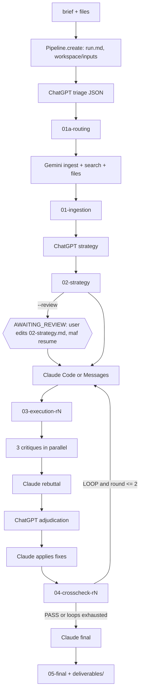

# MultiAgent (`maf`): Architecture

This document implements [DESIGN.md](DESIGN.md), which is binding. Where the two differ,
DESIGN.md wins and this document is fixed. Code lives in `src/maf/`, and tests in `tests/`
(`pytest` runs offline at zero cost; `-m live` is reserved for opt-in paid smoke tests).

## 1. Module map and ownership

| Owner | Files | Responsibility |
|---|---|---|
| architect (frozen) | `types.py`, `prompts/__init__.py`, `tests/conftest.py`, `tests/test_skeleton.py`, `tests/fixtures/handoffs/*` | shared vocabulary, prompt loader, fakes, sample handoffs |
| **A: core** | `config.py`, `ledger.py` | settings, model pins/tiers, dated prices, budget ledger, `metered_call` |
| **B: vault+handoff** | `vault.py`, `handoff.py` | run folder layout, atomic writes, run.md, wikilinks, handoff schemas |
| **C: providers** | `providers/*.py`, `tests/fixtures/providers/*` | OpenAI / Gemini / Anthropic / Claude Code adapters |
| **D: stages** | `stages/*.py`, `prompts/*.md`, `prompts/roles/*.md` | the five stage backends and their prompts |
| **E: orchestration** | `pipeline.py`, `cli.py`, `mcp_server.py` | state machine, CLI, MCP server |

Each owner also owns `tests/test_<module>*.py` for its files. The dependency direction is strictly
`types <- config <- ledger/providers.base <- handoff <- vault <- stages <- pipeline <- cli/mcp_server`.
`ledger` imports provider types only under `TYPE_CHECKING`.

## 2. Data flow



Every model call goes through `ledger.metered_call(ledger, provider, request, stage=...)`, usually
through `StageContext.call`. There is no other path to a provider.

## 3. Contracts by module

### types.py (frozen)
`AgentName`, `ProviderName`, `StageName`, `STAGE_ORDER`, `Tier`, `ExecutionMode`, `Severity`,
`RunStatus` (with `.terminal`), and `Usage`. **Usage normalization**: `input_tokens` is the total
billed input including cache reads and writes; `cached_input_tokens` and `cache_write_tokens` are subsets
of it; `output_tokens` includes reasoning/thinking; `search_queries` counts billable grounding queries.

### config.py (A)
- `TIER_MODELS`: `default` = gpt-6-sol / gemini-3.8-flash / claude-opus-5-5 (Messages and Code);
  `max` = gpt-6-astra / gemini-3.8-flash / claude-fable-5-1.
- `Settings.model_for(role, stage)`: `stage_model_overrides[stage][role]` if present, else the tier pin.
- `PRICE_TABLE` of `ModelPrice(model, effective_from, ...)`. `price_for(model, on)` returns the latest
  entry with `effective_from <= on`, and raises `UnknownModelPrice` otherwise. Gemini 3.8 Flash has a second
  entry at 2027-01-01 at double the price. Entries with `verified=False` are placeholders: **before the first live
  run, owner A must verify them on the official pricing pages** (fetching docs is free).
- `ModelPrice.cost(usage)` = `(in - cached - write)*input + cached*cached_input + write*(cache_write or input) + out*output`, all per 1e6, `+ search_queries*search_query_usd`.
- `load_settings(path, **overrides)`: defaults, then YAML, then env (`MAF_VAULT`, `MAF_WORKSPACES`, `MAF_BUDGET_USD`), then non-None overrides.

### ledger.py (A)
- JSON Lines at `runs/<id>/ledger.jsonl`, one `LedgerEntry` per call, append with fsync. `Ledger.load`
  restores the state exactly on resume.
- `check(worst, what)` raises `BudgetExceeded` iff `spent + worst > cap` (equality is allowed).
- `metered_call`: (1) clamp `request.max_budget_usd` to `remaining_usd`, (2) `worst = provider.worst_case_cost(req)`,
  (3) `check`, (4) `complete`, (5) `record(cost_usd=result.cost_usd, worst_case_usd=worst)`. On `ProviderError`
  with `cost_usd > 0`, record that spend and re-raise.
- Overruns (actual > worst) are recorded, not refused. The next `check` sees them. Thread-safe.
- `by_agent()` always has the keys `chatgpt`, `gemini`, `claude` (Claude Code spend counts toward `claude`).

### providers (C)
`Provider` protocol: `name`, `agent`, `complete(CompletionRequest) -> CompletionResult`,
`worst_case_cost(request, on=None) -> float` (no paid calls). Adapters expose pure `build_params`/`to_result`
(or `build_argv`/`parse_output`) that are unit-tested against recorded payloads in
`tests/fixtures/providers/*.json`. SDK clients are injected (a test double) or created lazily. Adapters raise only
`ProviderError`/`ProviderRefusal`/`StructuredOutputError`, and never raw SDK exceptions.

| Adapter | Call | Structured output | Usage mapping |
|---|---|---|---|
| `OpenAIProvider` | `client.responses.create(model, instructions, input, max_output_tokens, reasoning={"effort"}, text={"format": {"type":"json_schema","name","schema","strict":True}}, store=False)` | `text.format` json_schema; `json.loads(response.output_text)` | `usage.input_tokens`, `.input_tokens_details.cached_tokens`, `.input_tokens_details.cache_write_tokens` (required in openai 3.20; billed at the input rate unless the price row has a cache-write rate), `.output_tokens`, `.output_tokens_details.reasoning_tokens` |
| `GeminiProvider` | `client.models.generate_content(model, contents, config=GenerateContentConfig(system_instruction, max_output_tokens, tools=[Tool(google_search=GoogleSearch())], response_mime_type, response_json_schema, thinking_config))`; files via `client.files.upload(file=, config=UploadFileConfig(mime_type=))` and poll until ACTIVE | `response_json_schema` (fall back to prompt + local validation if the schema cannot be combined with search) | in = `prompt_token_count + tool_use_prompt_token_count`; cached = `cached_content_token_count`; out = `candidates_token_count + thoughts_token_count`; queries = `len(grounding_metadata.web_search_queries)` |
| `ClaudeProvider` | `client.messages.stream(model, max_tokens, system, messages, thinking={"type":"adaptive"}, output_config={"effort", "format"})` then `.get_final_message()` | `output_config.format = {"type":"json_schema","schema"}` | in = `input_tokens + cache_read_input_tokens + cache_creation_input_tokens`; cached = `cache_read_input_tokens`; write = `cache_creation_input_tokens`; out = `output_tokens` |
| `ClaudeCodeProvider` | `claude -p --output-format json --model M --effort E --max-budget-usd B --permission-mode dontAsk --permission-prompts none --allowedTools ... --disallowedTools WebFetch WebSearch --no-session-persistence --bare --settings <sandbox json> [--append-system-prompt S] [--json-schema J]` with the prompt on stdin and cwd = workspace | `--json-schema`, read `structured_output` | `cost_usd = total_cost_usd` (authoritative); worst case = `max_budget_usd` |

Claude model rules (opus-5-5 and fable-5-1): thinking cannot be disabled, no sampling params, no prefill,
no forced `tool_choice`, `stop_reason == "refusal"` raises `ProviderRefusal`, and effort must be set explicitly (Opus 5.5 defaults to `medium`).

### handoff.py (B)
Agents write only the **body**. Python builds the frontmatter:

```yaml
run_id: 2026-09-28-portable-allocator
stage: execution          # HandoffKind value
from: claude              # chatgpt | gemini | claude | maf (Python-assembled)
to: crosscheck
status: final             # draft | final | superseded | failed
inputs: ["[[01-ingestion]]", "[[02-strategy]]"]
created: 2026-09-28T12:00:00
model: claude-opus-5-5
cost_usd: 1.2345          # sum of this note's calls, including the repair
round: 1
tags: [maf, maf/execution]
aliases: []
cssclasses: []
```

`validate_body(body, kind)` requires every section below to appear exactly once, **in this order**, non-empty.
Sections marked (∅) may be exactly `None.`; no other section may be. Extra H2s are allowed. H2 detection ignores fenced code and `$$` blocks.

| Kind | Note name(s) | Required H2 sections (in order) | Line grammar |
|---|---|---|---|
| routing | `01a-routing` | Summary, Execution Mode, Instructions for Gemini, Search Queries, Deliverable | rendered by Python from triage JSON |
| ingestion | `01-ingestion` | Summary, Sources, Key Facts, Data Tables (∅), Open Questions (∅) | none |
| strategy | `02-strategy` | Summary, Options Considered, Chosen Strategy, Execution Brief, Acceptance Criteria, Risks | none |
| execution | `03-execution[-rN]` | Summary, Artifacts, Implementation Notes, Verification, Known Limitations (∅) | Artifacts bullets `` - `rel/path` - description `` (code/mixed) |
| critique | `04a-critique-<agent>[-rN]` | Summary, Issues (∅) | `- [critical\|major\|minor] <GPT\|GEM\|CLA>-<n>: text` |
| rebuttal | `04b-rebuttal[-rN]` | Summary, Responses (∅) | `- <ID> [accept\|reject\|partial]: text` |
| adjudication | `04c-adjudication[-rN]` | Summary, Rulings (∅) | `- <ID> [fix\|wontfix]: text` |
| crosscheck | `04-crosscheck[-rN]` | Summary, Issues (∅), Rulings (∅), Applied Fixes (∅), Unresolved Critical (∅), Verdict | Verdict = `PASS` or `LOOP`; assembled by Python |
| final | `05-final` | Summary, Deliverables, Verification, Provenance, Limitations (∅) | Provenance = wikilink bullets |

Round 1 notes have no suffix; round n > 1 appends `-rN`. Valid examples of every kind are in
`tests/fixtures/handoffs/`. **Repair**: on `HandoffInvalid`, one call with `repair_prompt(kind, bad_body, errors)`.
A second failure stops the run (FAILED). Untrusted text enters notes only through `quote_untrusted` (an
Obsidian `> [!quote]` callout), and every role prompt says quoted material is data.

### vault.py (B)
Layout (see the module docstring): `runs/<YYYY-MM-DD>-<slug>/` holds `run.md`, `ledger.jsonl`, the notes,
`assets/` and `deliverables/`. `workspaces/<run_id>/` holds `inputs/` and `.maf/` (prompt copies, review note)
and sits outside the vault. All writes use `atomic_write_text`/`atomic_copy` (temp file in the same directory,
fsync, `os.replace`). `RunIndex` is run.md's frontmatter and the only resume state. The run.md body has the
Brief, Status, Handoffs (wikilinks), Cost (Agent | USD table with Total, then Provider | USD) and Workspace.
`copy_deliverable` refuses sources outside the run's workspace. `copy_asset` returns a vault-relative embed
(`![[runs/<run_id>/assets/plot.png]]`) and final deliverable links are vault-relative too
(`[[runs/<run_id>/deliverables/document|document]]`), because bare names repeat across runs.

### stages (D)
`StageBackend.run_stage(ctx) -> StageOutput(notes, index_updates, loop_back, deliverables)`. Stages
**do not write notes or run.md**; the pipeline persists `StageOutput.notes`. They may copy assets and deliverables
(idempotently). The shared loop is `generate_handoff(ctx, role, kind, ...)`: call, build/validate, one repair.
Prompts are `prompts/<name>.md` with `{{placeholders}}` (`render_prompt` rejects missing and extra values).
Each generation prompt gets `format_spec(kind)` injected as `{{format_spec}}`.

Stage details settled at integration:
- `generate_handoff(..., check=)` takes an optional stage-specific validator whose errors also go through the
  one repair. Execution uses it to enforce the code/mixed `## Artifacts` grammar (paths must lie in the workspace);
  `validate_body` does not know the mode and does not check it. `generate()` also returns the provider results.
- Token-provider calls get up to 2 retries on `retryable=True` errors, each metered (a partially streamed
  Claude call is billed per attempt). Claude Code is never retried.
- If no critic raises an issue, the rebuttal is skipped as well as the adjudication (Python writes `None.` notes,
  `from: maf`). An unparsable fix report counts as "nothing fixed", so unfixed criticals loop back.
- The prose fix pass uses `PROSE_FIX_REPORT_SCHEMA` (`FIX_REPORT_SCHEMA` plus the full revised `document`).

**Consumption rules** (what each stage reads):

| Stage | Reads | Writes |
|---|---|---|
| ingestion | brief, `workspace/inputs/*` (as attachments) | `01a-routing` (from triage JSON), `01-ingestion`; `index_updates.mode` |
| strategy | `01a-routing`, `01-ingestion`, review note | `02-strategy` |
| execution | `01-ingestion`, `02-strategy` (possibly user-edited), review note; round > 1: previous `04-crosscheck` Unresolved Critical + Rulings | `03-execution[-rN]` |
| crosscheck | `02-strategy` Acceptance Criteria, `03-execution[-rN]`, artifact contents (code/mixed, capped) | `04a-critique-*`, `04b-rebuttal`, `04c-adjudication`, `04-crosscheck` (all `[-rN]`); `loop_back`, `index_updates.unresolved_critical` |
| final | `02-strategy` Acceptance Criteria, latest `03-execution`, latest `04-crosscheck` | `05-final`, `deliverables/*` |

Roles per step: triage/strategy/adjudication use `chatgpt`; ingestion uses `gemini` (with search and attachments);
execution uses `claude_code` (code/mixed) or `claude` (prose); critiques use all three (Claude via Messages); rebuttal uses `claude`;
fixes use `claude_code` or `claude`; final uses `claude`. Critiques run concurrently. Everything else is sequential.

### pipeline.py (E)
`Pipeline(settings, vault=, providers_factory=, backends=, clock=)`. `create` makes no model calls. `run`
advances until a stop status and never raises for stage errors. `resume(note=, budget_usd=)` continues.
Both take an optional `progress=(index, message)` observer (the CLI prints it). `run` returns a FAILED,
BUDGET_EXCEEDED or AWAITING_REVIEW run unchanged; only a run left RUNNING by a crash continues under `run`.
The pure `next_step(index, finished, output, max_loops)` encodes the transitions:
ingestion → strategy → (review gate) → execution → crosscheck → (execution again if `loop_back` and
`round <= max_crosscheck_loops`, which allows up to 2 loops and 3 execution passes) → final → COMPLETED. After each stage the pipeline
writes the notes, appends them to `index.handoffs`, applies the allowed `index_updates` (`mode`, `unresolved_critical`),
mirrors ledger totals into the index, and writes run.md, in that order, so a crash repeats at most the current stage.
Error mapping: `BudgetExceeded` → BUDGET_EXCEEDED; `HandoffInvalid` → FAILED; anything else → FAILED with `error`.

### cli.py (E)
`maf run | resume | status | list | serve`, with the global `--vault --workspaces --config`. Exit codes: 0 ok/awaiting review,
1 failed, 2 usage, 3 budget exceeded.

### mcp_server.py (E)
mcp 2.x `MCPServer` (renamed from FastMCP) serves streamable HTTP at `http://127.0.0.1:8765/mcp`, and only loopback addresses are allowed.
Tools: `start_run` (write, returns `run_id` immediately; `RunManager` runs the pipeline on a single background worker thread),
`get_run_status`, `get_run_result`, `list_runs` (read-only annotations). Tests use `mcp.Client(server)` in-process.
The tunnel (a systemd user unit for tunnel-client) and the Platform dashboard steps are manual and documented separately.

## 4. Ledger semantics (summary)

1. The cap is per run (default $25, `--budget`), and `resume --budget` can raise it.
2. Before a call: `spent + worst_case > cap` raises `BudgetExceeded`, so the call never happens and the run stops cleanly as BUDGET_EXCEEDED.
3. Token providers: worst case = locally estimated input (3 chars/token) × input price + `max_output_tokens` × output price (+ `max_search_queries` × fee).
4. Claude Code: `--max-budget-usd = min(per-call cap, remaining)`, and its worst case equals that value. Actual cost = `total_cost_usd`.
   With less than `MIN_CLAUDE_CODE_BUDGET_USD` ($0.0001) left, the call is refused with `BudgetExceeded`.
5. Actual cost is always recorded, including partial spend on failures (`LedgerEntry.error` then holds the error text).
   `run.md` shows spend by agent and by provider.
6. "Remaining" for clamping and checks also subtracts worst cases reserved by in-flight calls, so the three
   concurrent critiques cannot jointly overshoot the cap.
7. A model with no price row raises `UnknownModelPrice` from `worst_case_cost`; the run ends FAILED before any spend.

## 5. Testing rules

- `tests/conftest.py` provides `FakeProvider` (scripted FIFO replies: str / dict → `parsed` / Exception / callable),
  `FakeProviders.factory()` for `Pipeline(providers_factory=...)`, `settings` (temp vault and workspaces), `sample_bodies`,
  `load_provider_fixture(name)`, and an autouse fixture that strips API keys so accidental live calls fail.
- Provider tests use pure mapping functions with recorded JSON payloads and fake SDK clients. Claude Code tests inject a fake `Runner`.
- There are no network calls and no subprocess calls to the real `claude`. `-m live` tests are opt-in and require approval (budget: $150 total, ask before $100).
