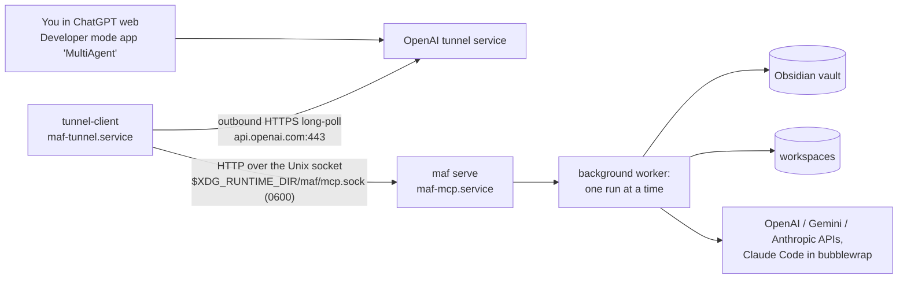

# ChatGPT app: maf over the OpenAI Secure MCP Tunnel

This implements the "ChatGPT integration" section of [DESIGN.md](DESIGN.md). From a ChatGPT chat you can start maf
runs and inspect them. The pipeline itself runs on this machine, and nothing listens on a public port.

Quick start: `scripts/chatgpt-setup-wizard.sh` walks you through every step, including the ones only you can do in
the OpenAI Platform and ChatGPT. The rest of this page explains what the wizard sets up and why.

## Architecture



- **maf-mcp.service** runs `maf serve --host 127.0.0.1 --port 8765 --uds %t/maf/mcp.sock` from the project venv. It
  is an MCP server (streamable HTTP, mcp 2.2) with four tools. It listens on a Unix socket, mode 0600, in
  `$XDG_RUNTIME_DIR/maf` (0700, created by systemd, removed when maf stops), not on a TCP port. `--host`/`--port` only
  name the Host header it accepts. `maf serve` without `--uds` (by hand) listens on loopback TCP and refuses anything
  else.
- **maf-tunnel.service** runs `tunnel-client run` (OpenAI's open-source client, pinned v0.0.15). It long-polls
  `https://api.openai.com/v1/tunnels/<id>/poll`, relays each MCP request to maf and posts the answer back. Its upstream
  is `--mcp.server-url url=http://127.0.0.1:8765/mcp,unix-socket=%t/maf/mcp.sock`: it dials the socket and sends
  `Host: 127.0.0.1:8765`. It makes outbound connections only: no inbound port, no router or firewall change.
- The tunnel restarts on its own (`Restart=always`) and never touches maf, so a tunnel restart does not interrupt a
  running pipeline. Starting the tunnel starts maf serve (`Requires=`/`After=`), and stopping or restarting maf stops or
  restarts the tunnel. Starting maf alone does not start the tunnel again: start `maf-tunnel`.
- Inside the pipeline, "ChatGPT" means the OpenAI API (your `OPENAI_API_KEY`). The ChatGPT app only launches and
  inspects runs.

### Tools and the asynchronous pattern

ChatGPT gives each tool call a hard limit of about one minute. OpenAI staff stated this; it is not configurable and
not in the official docs. A maf run takes many minutes, so tools never wait for one:

| Tool | Kind | Returns |
|---|---|---|
| `start_run(brief, files?, budget_usd?, tier?)` | write (ChatGPT asks you to confirm, unless you told it to remember) | `run_id` and `pending`, immediately. The run is created on disk (no model calls yet) and queued on a single worker. Refused beyond the MCP limits (security model, item 4). |
| `get_run_status(run_id)` | read-only | status, stage, round, spend (total and per agent), open criticals, unmet criteria, error, handoff notes |
| `get_run_result(run_id)` | read-only | the 05-final report (up to 60,000 characters), deliverable paths (up to 200), the vault folder |
| `list_runs(limit?)` | read-only | the newest runs |

So you start a run, then ask for its status now and then, and fetch the result once it is `completed` or
`completed_with_issues`. The server's instructions tell ChatGPT this. They also explain that `completed_with_issues`
means "not verified" (open critical issues, or unmet acceptance criteria such as `clean-room`, `source-audit` or
`lint`).

Runs execute one at a time in the background. A second `start_run` waits as `pending` until the first one finishes.
A third is refused while two MCP runs are queued or running (`mcp_max_pending_runs`).

## Security model

What stands between the internet and your machine:

1. **No network listener for maf.** maf-mcp serves on a 0600 Unix socket inside your 0700 runtime directory
   (`/run/user/<uid>`), so only processes running as you can connect: not the host's other accounts, and not a
   container started with `--network host`. maf has no login of its own, and a loopback TCP port would be open to all
   of them (they send `Host: 127.0.0.1:8765` and no `Origin`, which passes the DNS-rebinding check in item 7).
   `maf serve` by hand, without `--uds`, listens on loopback TCP only and refuses any other address. tunnel-client's
   health/admin UI listens on 127.0.0.1:8766. The tunnel connects outbound to api.openai.com:443 and nothing else.
2. **Only your tunnel reaches maf from outside.** Requests arrive through the tunnel you created in your Platform
   organization. Tunnel apps are private, developer-mode apps and cannot be published. Tunnel permissions are
   organization-level RBAC. In a shared organization, anyone granted Tunnels Read + Use on this tunnel could create a
   ChatGPT app on it, so keep the tunnel in your personal org or restrict those roles. The app uses "No
   Authentication": the tunnel is the gate.
3. **Runs need your confirmation, until you tell ChatGPT to remember it.** `start_run` has `readOnlyHint=false`, so
   ChatGPT shows a confirmation before a call. If you let it remember approval for the conversation, it calls
   `start_run` without asking for the rest of that conversation, also when a prompt injection steers it: text from a
   page ChatGPT read, or from a `get_run_result`, whose report can quote web pages the run fetched. A new
   conversation asks again. The three read tools never ask. Item 4 bounds what remembered approval can spend; decline
   "remember" if you want a click per run.
4. **Spend limits for MCP runs.** They hold with or without a confirmation click:
   - Per run: an MCP client can never set a budget above `mcp_max_budget_usd`, $5 by default. A `start_run` without
     `budget_usd` gets the lower of `budget_usd` and that ceiling. `mcp_max_budget_usd: null` makes `budget_usd` ($25
     by default) the ceiling.
   - Queue: at most `mcp_max_pending_runs` (2) MCP runs queued or running in maf serve; more are refused.
   - Per day: `start_run` refuses a run whose budget would take the MCP spend of the last 24 hours above
     `mcp_daily_budget_usd` ($25). A queued or running MCP run counts with its whole budget, a finished or stopped one
     with what it spent. CLI runs do not count.

   Every run is also bounded by maf's hard per-run ledger cap. Only the CLI can go higher (`maf resume --budget`).
   For example, in `~/.config/maf/config.yaml`:

   ```yaml
   mcp_max_budget_usd: 5
   mcp_max_pending_runs: 2
   mcp_daily_budget_usd: 15
   ```

   maf reserves each call's worst case before making it, so a run needs headroom above what it actually spends. On
   the default tier the Gemini ingestion call reserves about $0.75 (output limit plus search fees) and every Claude
   call about $1.30 (64k output tokens at $20 per million), so a budget below about $2 usually ends
   `budget_exceeded` before the final report. A live `start_run` with `budget_usd` 0.60 stopped at ingestion after
   spending $0.0043; the one-page TLSF briefing completed on a $2 budget and spent $0.75.

5. **Input files only from the inbox.** `files` must be absolute paths that resolve inside `mcp_inbox`
   (`~/MultiAgent/inbox` by default; `null` disables files over MCP). maf refuses:
   - relative paths and missing files;
   - symlinks that resolve outside the inbox;
   - hidden files and directories;
   - pseudo-files;
   - empty files.

   Every refusal is the same message, `not an allowed inbox file: <the path you gave>`. The confinement check runs
   before any existence check, so a caller learns nothing about files outside the inbox: not whether they exist, not
   where a symlink points. The details go to maf's debug log only. The default inbox is inside the repo checkout;
   `.gitignore` keeps it out of commits, and `maf chatgpt setup` creates it with mode 0700. The review gate is off for
   MCP runs.
6. **Strict run ids.** A `run_id` becomes a path component, so only `[A-Za-z0-9._-]` is accepted, and `..` is
   refused.
7. **DNS-rebinding protection pinned to exactly what tunnel-client sends.** tunnel-client sends
   `Host: 127.0.0.1:8765` (the host:port of its configured URL; forwarded headers cannot change it) and no `Origin`.
   maf accepts Host `127.0.0.1:8765` or `localhost:8765` only. Any other port or name gets `421`, so a DNS-rebinding
   page is refused. Any `Origin` header gets `403` unless you list it in `mcp_allowed_origins`, and browsers always
   send one on POST. This is stricter than mcp's own loopback default, which accepts any port and every
   `http://localhost:*` page, and skips the check entirely for 127.0.0.2. No browser can reach the Unix socket at
   all; the check stays on there as a second layer, and it guards `maf serve` on TCP.
8. **Keys are split and private.** `~/.config/maf/tunnel.env` (0600) holds only the tunnel id and a *Restricted*
   runtime key (Tunnels: Read + Use). `~/.config/maf/maf.env` (0600) holds the provider keys, which only maf serve
   reads. tunnel-client falls back to `OPENAI_API_KEY` when its own key is missing. So the tunnel unit unsets every
   provider key (`UnsetEnvironment=`), and the wizard and `maf chatgpt status` start tunnel-client without them.
   `maf chatgpt setup` never overwrites an env file, and `status` prints keys as set/missing only, masking any key
   that shows up in a log line. Claude Code never gets the keys as environment variables (see ARCHITECTURE.md).
   Neither env file is inside the repo. Keep the provider keys only in `maf.env`, not as `export` lines in
   `~/.bashrc`; to have them in your shell too, load that file from `~/.bashrc`:
   `set -a; . ~/.config/maf/maf.env; set +a`.
9. **Claude Code stays sandboxed, with a deny list.** Runs started from ChatGPT use the same bubblewrap sandbox as CLI
   runs: writes only to the run's workspace, no network. Sandboxed commands can read the rest of the filesystem except
   `SENSITIVE_READ_PATHS` (`maf.providers.claude_code`): key stores (`~/.ssh`, `~/.gnupg`, `~/.config` with maf's env
   files, `~/.netrc`, `~/.pypirc`, `~/.npmrc`, `~/.pgpass`...), shell startup files and histories (`~/.bashrc`,
   `~/.profile`, `~/.bash_history`...), browser and mail profiles, and the vault.
10. **Keys are masked on the way out.** `get_run_status` and `get_run_result` mask maf's own key values and anything
    shaped like an OpenAI, Anthropic or Google key in `final_markdown`, `error` and `unmet_criteria`. The source audit
    masks the same in the documents it sends to Gemini, because Gemini fetches the URLs it finds there from outside
    the sandbox, and a "reference" could carry a key to someone else's server.

What this does not protect against:

- **Processes running as you.** They can connect to the socket, and they could already run `maf` itself.
- **A compromised ChatGPT account, or a prompt injection with remembered approval.** Either can start runs, within
  the limits of item 4, and read every run's report with `list_runs`/`get_run_result`, including CLI runs.
- **Files outside the deny list.** A brief can make a run read any other file a sandboxed command can read (other
  workspaces, documents in your home) and put it in the report that `get_run_result` returns to ChatGPT. Keep
  secrets under a denied path, such as `~/.config`.

### systemd hardening, and why some options are missing

The limits below were measured on this host (Ubuntu 24.04, systemd 255,
`kernel.apparmor_restrict_unprivileged_userns=1`). I ran bubblewrap and tunnel-client in transient user units
(`systemd-run --user -p ...`).

- **maf-mcp.service** starts Claude Code, whose Bash sandbox is bubblewrap. bwrap needs unprivileged user namespaces.
  - Set: `NoNewPrivileges`, `RestrictSUIDSGID`, `RestrictRealtime`, `UMask=0077`, `LimitCORE=0`. With these, bwrap
    works. It is not setuid here, and it sets no_new_privs on the commands it sandboxes anyway.
  - Not set:
    - `RestrictNamespaces=`: bwrap fails with "No permissions to create new namespace".
    - `ProtectSystem=`, `ProtectHome=`, `PrivateTmp=`, `PrivateDevices=`, `ProtectKernel*=`: in a *user* unit these
      imply `PrivateUsers=yes`, and bwrap then fails the same way. Tested for ProtectSystem, ProtectHome, PrivateTmp
      and PrivateUsers.
    - `MemoryDenyWriteExecute=`: JIT runtimes, including Claude Code's.
    - `SystemCallArchitectures=native`: 32-bit test binaries.
    - `PrivateNetwork=`: maf needs the provider APIs.
  - If your bwrap is setuid (`stat -c %A /usr/bin/bwrap` shows an `s`), remove `NoNewPrivileges` with a drop-in.
- **maf-tunnel.service** runs a static Go binary that needs only outbound HTTPS and loopback.
  - Set: `NoNewPrivileges`, `ProtectSystem=strict`, `ProtectHome=read-only`, `PrivateTmp`, `ProtectKernelTunables`,
    `ProtectControlGroups`, `RestrictNamespaces`, `RestrictRealtime`, `RestrictSUIDSGID`, `LockPersonality`,
    `MemoryDenyWriteExecute`, `SystemCallArchitectures=native`, `RestrictAddressFamilies=AF_UNIX AF_INET AF_INET6`,
    `UMask=0077`, `LimitCORE=0`. tunnel-client v0.0.15 ran under all of them.
  - Left out: `PrivateDevices=`, `ProtectKernelModules=`, `ProtectKernelLogs=` and `ProtectClock=` drop
    capabilities, which a user manager cannot do (the unit fails with `218/CAPABILITIES`). `ProtectHostname=` is
    ignored in a user unit.

## Setup

### Prerequisites

- maf works from the CLI (`.venv/bin/maf list`), and this repo is at `~/MultiAgent`. Otherwise `maf chatgpt setup`
  writes the real paths into the units.
- A ChatGPT plan with Developer mode on the web. OpenAI's developer docs list Pro, Plus, Business, Enterprise and Edu.
  Some Help Center wording reportedly limits full (write) MCP to Business/Enterprise/Edu. If `start_run` is missing
  or blocked on a personal plan, that is the reason.
- An OpenAI Platform organization where you can use Tunnels. The docs speak of rollouts with "self-serve tunnel
  access", so some orgs may not have it yet.
- `curl`, `unzip`, `sha256sum`, systemd user sessions.

### Guided: the wizard

```bash
scripts/chatgpt-setup-wizard.sh
```

It has 11 stages. Each one pauses for you, and secrets are read with hidden input.

1. Install tunnel-client and the units.
2. Platform tunnel permissions.
3. Create the tunnel and paste its id.
4. Create a Restricted runtime key and paste it.
5. Provider keys: it can copy the ones your shell exports.
6. Start maf serve, or offer to restart it if it already runs and the provider keys or its unit changed (a running
   service keeps the environment it started with). Then run `tunnel-client doctor` with the unit's exact flags and
   check the key against the control plane (`admin tunnels get`). doctor v0.0.15 probes the MCP URL over TCP and
   ignores `unix-socket=`, so its `mcp_server_reachable` and `oauth_metadata` checks fail; the wizard says so, and
   `maf chatgpt status` checks maf over the socket in stage 7.
7. Enable and restart the tunnel (a restart, so a running tunnel-client picks up an edited `tunnel.env`; runs
   continue), wait for a successful poll, and offer to enable linger.
8. ChatGPT Developer mode.
9. Create the app with Connection → Tunnel. If maf refused an `Origin`, the wizard offers to allow exactly that origin,
   in the config file maf-mcp reads (its `--config`, else `~/.config/maf/config.yaml`).
10. Test prompts.
11. Troubleshooting.

It is safe to re-run: it offers already-saved values as defaults and restarts what changed, so a corrected key
reaches the running units.

### By hand

1. **Install tunnel-client** (pinned v0.0.15, SHA-256 checked against both a pinned hash and the release's
   `SHA256SUMS.txt`; it refuses to install on any mismatch; idempotent):

   ```bash
   scripts/install-tunnel-client.sh            # → ~/.local/bin/tunnel-client
   scripts/install-tunnel-client.sh --provenance   # also verifies the SLSA attestation (needs gh >= 2.49)
   ```

   Ubuntu's gh 2.45 has no `gh attestation`, so `--provenance` needs a newer gh. To upgrade, check that the release
   publishes a new version, then run `--version vX.Y.Z --sha256 <hash from a trusted source>`.
2. **Install the units and env templates:**

   ```bash
   .venv/bin/maf chatgpt setup      # [--health-port N] [--tunnel-client PATH] [--no-reload]
   ```

   This writes `~/.config/maf/tunnel.env` and `~/.config/maf/maf.env` as 0600 templates (only if they are missing)
   and creates `mcp_inbox` (0700). It renders `maf-mcp.service` and `maf-tunnel.service` into
   `~/.config/systemd/user/`, with the port from your config, and runs `systemctl --user daemon-reload`. Settings
   sources you give setup reach the service: `maf --config FILE chatgpt setup` (or `MAF_CONFIG`, and likewise
   `--vault`/`MAF_VAULT`, `--workspaces`/`MAF_WORKSPACES`) puts them into the unit's `ExecStart`, and
   `MAF_BUDGET_USD` into an `Environment=` line. A re-run that leaves out a source the installed unit has is refused
   rather than silently pointing the service at other settings (the wizard passes the unit's own sources on). A
   re-run keeps the installed tunnel-client path and health port unless you pass `--tunnel-client`/`--health-port`. If a changed unit is running, setup says so: it keeps the old
   definition until restarted. `contrib/systemd/` holds the same units for the default layout. Customize with
   `systemctl --user edit <unit>`, because a drop-in survives re-running setup.
3. **Platform, tunnel.** Open <https://platform.openai.com/settings/organization/tunnels>.
   - If it says "Tunnels access required", an org owner grants you Tunnels Read + Manage (to create) and Read + Use
     (to run and select) under Settings → Organization → People → Roles. Grants can take up to 30 minutes.
   - Click **Create tunnel**. Name it e.g. `maf local`, and under Organization IDs enter your org id. Add a ChatGPT
     workspace id only if the dialog asks for one.
   - Create it and copy the `tunnel_…` id (`tunnel_` plus 32 hex characters). It becomes active after 25-30 s.
4. **Platform, runtime key.** Open <https://platform.openai.com/settings/organization/api-keys>.
   - Choose **Create new secret key**, then **Restricted**, and set **Tunnels: Read + Use** with nothing else.
   - Never use an "All" key or an admin key.
5. **Fill in the env files** (`KEY=value`, no quotes):
   - `maf.env`: `OPENAI_API_KEY`, `GEMINI_API_KEY`, `ANTHROPIC_API_KEY`. Services do not read `~/.bashrc`.
   - `tunnel.env`: `CONTROL_PLANE_TUNNEL_ID` and `CONTROL_PLANE_API_KEY` from steps 3 and 4.

   To check the key and the tunnel together (this keeps the key off the command line and away from your shell's
   `OPENAI_API_KEY`):
   `(unset OPENAI_API_KEY; set -a; . ~/.config/maf/tunnel.env; set +a; ~/.local/bin/tunnel-client admin tunnels get "$CONTROL_PLANE_TUNNEL_ID")`
6. **Start and persist:**

   ```bash
   systemctl --user enable maf-mcp.service maf-tunnel.service
   systemctl --user restart maf-mcp.service maf-tunnel.service   # restart, not start: see below
   loginctl enable-linger        # start the units at boot without a login, and keep them running after logout
   .venv/bin/maf chatgpt status
   ```

   A running unit keeps the env files it started with, and `enable --now` or `start` does nothing to a running unit.
   So after editing `tunnel.env`, run `systemctl --user restart maf-tunnel` (runs continue), and after editing
   `maf.env` or maf's config, `systemctl --user restart maf-mcp` (it restarts the tunnel too; an in-flight run stops at
   its next stage boundary). Without linger, your user's systemd starts the units only once you log in and stops them
   when you log out, so after a reboot ChatGPT cannot reach maf until you log in.
7. **ChatGPT, Developer mode.** Settings → Security and login → Developer mode on. Enterprise and Edu workspaces need
   an admin to allow it first.
8. **ChatGPT, app.** Open <https://chatgpt.com/plugins> and click **+**.
   - Name `MultiAgent`. Under **Connection**, choose **Tunnel**, then pick your tunnel or paste its id.
   - Set **Authentication** to **No Authentication**, then create.
   - tunnel-client must be running and ready at this point: ChatGPT lists the tools through it.
   - The app appears under Drafts. After a maf update that changes tools, click **Refresh** on the app's page.

   (UI labels come from OpenAI's docs and screenshots and may have moved.)

### Try it

Open a new chat, then **+** → **Developer mode** → **MultiAgent**, and send:

- `Use the MultiAgent app's list_runs tool to list my maf runs.` This is read-only, so there is no confirmation and
  no cost.
- `Use MultiAgent start_run with brief "Write a 300-word plain-language note on what a tokamak is" and budget_usd 3.`
  ChatGPT asks you to confirm, then returns a `run_id`. The run spends real money, up to $3 (a note like this
  usually costs under $1, but a smaller budget stops early; see the spend ceiling above).
- `Check that run with get_run_status.` Repeat this until it is completed, then ask for `get_run_result`.

Locally, `maf list`, `maf status RUN_ID` and `journalctl --user -u maf-mcp -f` show the same run.

## Operating

| Task | Command |
|---|---|
| Everything at a glance | `maf chatgpt status` (exit 0 = ready) |
| Logs | `journalctl --user -u maf-mcp -u maf-tunnel -f` |
| tunnel-client admin UI, metrics | <http://127.0.0.1:8766/ui>, `/metrics`, `/health?details=true` |
| Restart the tunnel only, e.g. after editing `tunnel.env` | `systemctl --user restart maf-tunnel` (runs continue) |
| Apply an edited `maf.env` or maf config | `systemctl --user restart maf-mcp` (restarts the tunnel too; see below) |
| Stop maf | `systemctl --user stop --no-block maf-mcp` (stops the tunnel too; see below) |
| Start again after a stop | `systemctl --user start maf-tunnel` (starts maf-mcp too; starting maf-mcp alone leaves the tunnel stopped) |
| Resume a run stopped by a restart | `maf resume RUN_ID` |

`maf chatgpt status` checks:

- both units (state, restarts, last result) and their last journal lines, with secrets masked;
- which keys are set, and the env files' modes;
- a local MCP `initialize` + `tools/list` round trip over the socket of the installed maf-mcp unit (with
  `Host: 127.0.0.1:8765`), or against `http://127.0.0.1:8765/mcp` if the unit serves TCP;
- tunnel-client's `/readyz`, plus `tunnel-client health --require-control-plane-poll`. tunnel-client v0.0.15
  reports `/readyz` 200 even while every control-plane poll is refused with 401, so readiness alone proves nothing
  about the key;
- linger.

It also prints fixes for recognizable log lines.

**Stopping and restarting maf serve.** SIGTERM reaches maf only (`KillMode=mixed`), not the Claude Code session it
may be running. maf stops serving at once, and the in-flight run stops at its **next stage boundary**, marked failed
with "interrupted". Queued runs never start. `maf resume RUN_ID` continues either kind. A stage that runs Claude Code
can take an hour or more, so `TimeoutStopSec=2h`; after that systemd kills the whole group. `systemctl --user stop`
blocks until then, which is why `--no-block` helps. At system shutdown, the user manager's own stop timeout applies
instead.

When maf serve starts, it first takes its socket (a second server on the same socket or port exits at once, touching
no run), then marks failed the runs a dead process left behind, so ChatGPT does not poll them forever:

- a `running` run whose lock is free: at once (only the process advancing a run writes `running`, under its lock);
- a `pending` run queued by a maf serve (it records `<boot id>:<pid>` in run.md): at once if that process is gone,
  never while it runs;
- a `pending` run without that record (a CLI run about to start, or one queued by an older maf): once run.md has not
  changed for 2 minutes.

A crash restart (`Restart=on-failure`) therefore fails the dead server's queue right away. Exit code 2 (a bad config,
a non-loopback host, bad arguments) is not restarted (`RestartPreventExitStatus=2`): the unit stays failed with the
reason as the last journal line.

**Config knobs** (`~/.config/maf/config.yaml`, or the file you gave `maf chatgpt setup`). maf reads them at start, so
apply a change with `systemctl --user restart maf-mcp`:

- `mcp_port`: after changing it, re-run `maf chatgpt setup`, which rewrites both units, then restart maf-mcp (a
  running unit keeps the old port until then, and `maf chatgpt status` probes the new one).
- `mcp_max_budget_usd`, `mcp_max_pending_runs`, `mcp_daily_budget_usd` (security model, item 4)
- `mcp_inbox`
- `mcp_allowed_origins`

### Alternative: stdio instead of HTTP

`maf serve --stdio` serves the same tools over stdin/stdout, and tunnel-client can spawn maf itself. This avoids HTTP
entirely, so Host and Origin checks do not apply. It is the fallback if the Origin question below ever becomes a
problem.

tunnel-client starts the child with its own full environment. So the provider keys must not come from there: if
tunnel-client saw your shell's `OPENAI_API_KEY` and no `CONTROL_PLANE_API_KEY`, it would send the provider key to the
control plane (security model, item 8), and under `maf-tunnel.service` (`UnsetEnvironment=`) maf would get no keys at
all. Instead, tunnel-client gets only `tunnel.env`, and maf loads `maf.env` itself with `--env-file` (it refuses a
file that group or others can read, and drops tunnel-client's `CONTROL_PLANE_*` variables from its own environment):

```bash
systemctl --user stop --no-block maf-tunnel maf-mcp   # one tunnel-client per tunnel id, and one maf serve per vault
(
  set -a; . ~/.config/maf/tunnel.env; set +a          # CONTROL_PLANE_TUNNEL_ID and CONTROL_PLANE_API_KEY
  exec env -u OPENAI_API_KEY -u OPENAI_ADMIN_KEY -u GEMINI_API_KEY -u GOOGLE_API_KEY -u ANTHROPIC_API_KEY \
    ~/.local/bin/tunnel-client run \
    --mcp.command "$HOME/MultiAgent/.venv/bin/maf serve --stdio --env-file $HOME/.config/maf/maf.env" \
    --health.listen-addr 127.0.0.1:8766
)
```

Stop both units first, as the first line does: only one tunnel-client may run per tunnel id, and with two maf serve
processes on one vault each would allow its own `mcp_max_pending_runs`.

It is not the default, for three reasons:

- maf then lives and dies with tunnel-client, so a tunnel restart interrupts the running stage.
- Only one tunnel-client may run per tunnel id, even during a restart.
- tunnel-client, not systemd, supervises maf.

Tested end to end with tunnel-client's local `dev proxy --mcp-command`, not with `run` and a real control plane.

## Troubleshooting

| Symptom | Cause and fix |
|---|---|
| `maf chatgpt status`: "control-plane poll: NOT confirmed", journal `poll failed; backing off` with 401/403 | The key is not a Restricted key with Tunnels Read + Use in the tunnel's org, the tunnel id is wrong, or a role grant is still propagating (up to 30 min). Check with `tunnel-client admin tunnels get <id>` using only the runtime key. tunnel-client retries forever with the key it started with and logs `poller recovered` when it works: after editing `tunnel.env`, `systemctl --user restart maf-tunnel`. |
| maf journal: `Invalid Origin header: https://…`, ChatGPT reports an error on every call | The tunnel forwarded an `Origin` header. Whether production ChatGPT does this is undocumented, and it was not seen in local tests. Add exactly that origin, e.g. `mcp_allowed_origins: ["https://chatgpt.com"]`, then `systemctl --user restart maf-mcp`. Never disable the protection. |
| maf journal: `Invalid Host header` | The tunnel's MCP URL is not `http://127.0.0.1:<mcp_port>/mcp`. Re-run `maf chatgpt setup`, because `status` warns when the two differ. |
| The tunnel is missing from ChatGPT's tunnel list | Wait 30 s after creating it and check your Tunnels Read + Use role. Paste the tunnel id by hand. For Business workspaces, the tunnel may need your workspace id. |
| App creation fails | tunnel-client must be ready while you create the app: `maf chatgpt status`. |
| Tools are missing or outdated in ChatGPT | App settings → Refresh. start_run missing on a personal plan: see Prerequisites. |
| "tool call timed out" | No maf tool should take more than a second. Look for `POST /mcp` latency in the maf journal and a busy disk. The 1-minute limit is ChatGPT's. |
| After a maf restart, ChatGPT's next call fails with an unknown session | maf keeps MCP sessions in memory, so a restart drops them. Start a new chat or Refresh the app. This behaviour is untested with production ChatGPT. |
| Runs fail with `OPENAI_API_KEY is not set` | Fill in `~/.config/maf/maf.env`, then `systemctl --user restart maf-mcp`: a running maf keeps the environment it started with, even though `maf chatgpt status` reads the file and shows the key as set. |
| `start_run` refused: `MCP run(s) are already queued or running` or `above mcp_daily_budget_usd` | The MCP limits (security model, item 4). Wait for a run to finish, use a smaller `budget_usd`, raise the limit in the config (then restart maf-mcp), or run from the CLI. |
| `tunnel-client doctor`: `mcp_server_reachable` and `oauth_metadata` FAIL, `connection refused` | Expected: maf listens on a Unix socket, which `tunnel-client run` dials (`unix-socket=` in the unit), but doctor v0.0.15 probes the URL over TCP. `maf chatgpt status` checks maf over the socket. |
| `install-tunnel-client.sh` exits 137 | Something SIGKILLed a step. On the dev host (CrowdStrike Falcon running), `mktemp -d` of a hidden directory was killed about half the time. The installer avoids that now; rerun it, since it is idempotent. |
| Units stop when you log out, or ChatGPT cannot reach maf after a reboot until you log in | `loginctl enable-linger`: it starts your user's systemd, and with it the enabled units, at boot, and keeps it running after logout. |

## Verification status

Verified locally, on 2026-09-29, with tunnel-client v0.0.15, mcp 2.2.0 and uvicorn 0.54. All runs used a temporary
vault, workspaces and HOME, on non-default ports.

- Release download from GitHub. The zip SHA-256 matched the pinned hash and `SHA256SUMS.txt`, and the binary reports
  `0.0.15+a390c168…`. A tampered zip was refused, and so was a forged zip with a matching forged checksum file.
- HTTP upstream through `tunnel-client dev proxy`, which uses an in-process fake control plane: initialize,
  tools/list, list_runs and a refused `get_run_status("../../etc")`.
- Host and Origin policy against a real `maf serve`:
  - 200 for Host `127.0.0.1:<port>` and `localhost:<port>`.
  - 421 for another port, a bare IP or a foreign name.
  - 403 for `Origin: https://chatgpt.com`, `http://localhost:6274` and `null`.
  - 200 for an origin listed in `mcp_allowed_origins`; other origins stayed refused.
- stdio mode end to end through `dev proxy --mcp-command "maf serve --stdio"`.
- `tunnel-client run` under the unit's full hardening set, loading `tunnel.env` via `EnvironmentFile=`, against a
  local fake control plane that answered 401:
  - the Bearer key arrived, and the unit stayed active;
  - maf saw the startup probe and OAuth metadata discovery;
  - `OPENAI_API_KEY` was absent from the process environment;
  - `/readyz` said ready while `health --require-control-plane-poll` failed. `maf chatgpt status` reports that as
    not ready.
- `tunnel-client doctor` accepts the unit's exact flags and passes against maf.
- SIGTERM with an open MCP session: maf serve exited 0 within a second.
- bwrap under each hardening option in transient user units (results above). Units pass `systemd-analyze --user
  verify`.
- The wizard, traced with stubbed systemctl/journalctl/loginctl/tunnel-client:
  - values land in the right 0600 files, and no secret appears in its output;
  - tunnel-client never sees a provider key;
  - the Origin fix edits config.yaml.

Verified on 2026-09-29 after moving maf-mcp to a Unix socket (temporary vault and socket, nominal port 18765, no
provider keys in the environment, no `start_run` that could spend):

- `maf serve --uds`: the socket is 0600 in a 0700 directory, no TCP port is open, SIGTERM removes the socket, a second
  server on the same socket exits 1 before recovering any run, and a bad config exits 2.
- `mcp_health` over the socket (initialize + tools/list); a wrong Host header is still refused over the socket.
- tunnel-client v0.0.15 `dev proxy --mcp-server-url url=http://127.0.0.1:18765/mcp,unix-socket=<socket>`: session
  initialized, tools/list, `list_runs`, a refused `get_run_status("../../etc")` and a refused `/etc/hostname` input
  file. The same under maf-tunnel's full hardening set in a transient user unit, with the socket in
  `/run/user/<uid>`.
- `tunnel-client doctor` with the unit's flags fails exactly `mcp_server_reachable,oauth_metadata` (it ignores
  `unix-socket=`), which the wizard reports as expected.
- The rendered units, with `--config` and `MAF_BUDGET_USD`, pass `systemd-analyze --user verify`.

Assumed, or checkable only with your accounts:

- the Platform and ChatGPT UI steps and labels, which come from OpenAI's docs and screenshots;
- whether a Plus/Pro personal account gets write tools;
- whether production ChatGPT or tunnel-service forwards an `Origin` header;
- tunnel-service's per-command timeout;
- how ChatGPT recovers MCP sessions after a maf restart;
- `admin tunnels get` and a real control-plane poll with a real key;
- systemd units enabled for real in your session. They were verified with `systemd-analyze` and transient units,
  not installed;
- `tunnel-client run` against the real control plane with the Unix-socket upstream (the run path uses the same
  transport code as `dev proxy`, and its startup probe retries while the socket does not exist yet);
- a live Claude Code sandbox preflight with the extended deny list (it costs money; the list had missing paths and
  plain files before, and those passed).
